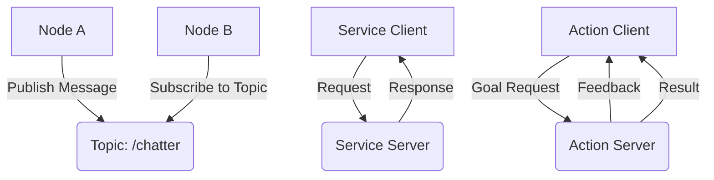

# Week 1: Introduction to ROS 2 Architecture

This week introduces the fundamental concepts of ROS 2 (Robot Operating System 2), which serves as the nervous system for humanoid robots. You'll learn about the architecture, communication patterns, and how to build distributed robotic systems.

## Learning Objectives

By the end of this week, you will be able to:

- Understand ROS 2 architecture and distributed computing principles
- Identify and describe the key components: nodes, topics, services, and actions
- Explain communication patterns and message passing in ROS 2
- Set up the development environment for ROS 2

## 1.1 ROS 2 Fundamentals and Distributed Computing

ROS 2 (Robot Operating System 2) is not an operating system but rather a middleware framework that provides services designed for a heterogeneous computer cluster. It offers hardware abstraction, device drivers, libraries, visualizers, message-passing, package management, and more for the development of robot applications.

### Key Concepts

**Middleware**: Software that provides common services and capabilities to applications beyond what's offered by the operating system. In ROS 2, this is provided by the Data Distribution Service (DDS).

**Distributed Computing**: ROS 2 enables multiple processes (potentially running on different machines) to communicate and coordinate their actions by passing messages.

**Nodes**: Processes that perform computation. Nodes are combined together into a graph and communicate with one another using topics, services, or actions.

### Architecture Components

1. **Nodes**: The fundamental unit of execution in ROS 2
2. **DDS Implementation**: Provides the underlying communication layer
3. **Client Libraries**: rclcpp (C++), rclpy (Python), and others
4. **ROS 2 Core**: Provides system-level services like parameter management and introspection

## 1.2 Nodes, Topics, Services, and Actions

### Nodes

A node is a process that performs computation. In ROS 2, nodes are designed to be modular and lightweight. Each node can publish to or subscribe to multiple topics, provide or use multiple services, and execute multiple actions.

```python
# Example of a simple ROS 2 node in Python
import rclpy
from rclpy.node import Node

class MinimalNode(Node):
    def __init__(self):
        super().__init__('minimal_node')
        self.get_logger().info('Hello from minimal node!')

def main(args=None):
    rclpy.init(args=args)
    node = MinimalNode()
    rclpy.spin(node)
    node.destroy_node()
    rclpy.shutdown()

if __name__ == '__main__':
    main()
```

### Topics and Messages

Topics are named buses over which nodes exchange messages. Messages are data structures that are passed between nodes. The communication is asynchronous and loosely coupled.

**Publisher-Subscriber Pattern**: Publishers send messages to topics without knowing who will receive them. Subscribers receive messages from topics without knowing who sent them.

### Services

Services provide a request-response pattern for communication. A service client sends a request and waits for a response from a service server.

### Actions

Actions are used for long-running tasks that may take some time to complete. They provide feedback during execution and can be canceled.

## 1.3 Communication Patterns and Message Passing

ROS 2 uses the DDS (Data Distribution Service) standard for communication. DDS provides:

- **Discovery**: Nodes automatically discover each other on the network
- **Transport**: Supports multiple transport protocols (UDP, TCP, shared memory)
- **Quality of Service (QoS)**: Configurable policies for reliability, durability, etc.

### Quality of Service (QoS) Settings

QoS settings allow you to configure how messages are delivered:

- **Reliability**: Best effort or reliable delivery
- **Durability**: Volatile or transient local
- **History**: Keep last N messages or keep all messages

## 1.4 Setting up the Development Environment

### Prerequisites

Before starting, ensure you have:

- Ubuntu 22.04 LTS (or WSL2 on Windows)
- ROS 2 Humble Hawksbill installed
- Python 3.8 or higher
- Basic knowledge of Linux command line

### Installation Verification

```bash
# Check ROS 2 installation
ros2 --version

# Source the ROS 2 environment
source /opt/ros/humble/setup.bash

# Verify environment
printenv | grep -i ros
```

### Creating Your First Workspace

```bash
# Create a workspace directory
mkdir -p ~/ros2_ws/src
cd ~/ros2_ws

# Build the workspace
colcon build

# Source the workspace
source install/setup.bash
```

## 1.5 Practical Exercise: Hello World with ROS 2 Nodes

Let's create our first ROS 2 package and nodes:

### Creating a Package

```bash
cd ~/ros2_ws/src
ros2 pkg create --build-type ament_python my_robot_tutorials
cd my_robot_tutorials
```

### Creating a Publisher Node

Create `my_robot_tutorials/my_robot_tutorials/talker.py`:

```python
import rclpy
from rclpy.node import Node
from std_msgs.msg import String

class Talker(Node):
    def __init__(self):
        super().__init__('talker')
        self.publisher = self.create_publisher(String, 'chatter', 10)
        timer_period = 0.5  # seconds
        self.timer = self.create_timer(timer_period, self.timer_callback)
        self.i = 0

    def timer_callback(self):
        msg = String()
        msg.data = f'Hello World: {self.i}'
        self.publisher.publish(msg)
        self.get_logger().info(f'Publishing: "{msg.data}"')
        self.i += 1

def main(args=None):
    rclpy.init(args=args)
    talker = Talker()
    rclpy.spin(talker)
    talker.destroy_node()
    rclpy.shutdown()

if __name__ == '__main__':
    main()
```

### Creating a Subscriber Node

Create `my_robot_tutorials/my_robot_tutorials/listener.py`:

```python
import rclpy
from rclpy.node import Node
from std_msgs.msg import String

class Listener(Node):
    def __init__(self):
        super().__init__('listener')
        self.subscription = self.create_subscription(
            String,
            'chatter',
            self.listener_callback,
            10)
        self.subscription  # prevent unused variable warning

    def listener_callback(self, msg):
        self.get_logger().info(f'I heard: "{msg.data}"')

def main(args=None):
    rclpy.init(args=args)
    listener = Listener()
    rclpy.spin(listener)
    listener.destroy_node()
    rclpy.shutdown()

if __name__ == '__main__':
    main()
```

### Running the Nodes

```bash
# Terminal 1: Run the publisher
ros2 run my_robot_tutorials talker

# Terminal 2: Run the subscriber
ros2 run my_robot_tutorials listener
```

## 1.6 Flowchart: ROS 2 Node Interaction Patterns



## Summary

This week covered the foundational concepts of ROS 2 architecture, including nodes, topics, services, and actions. You learned about the distributed computing principles underlying ROS 2 and created your first ROS 2 nodes with publisher-subscriber communication.

## Next Week Preview

Next week, we'll dive deeper into Python integration with rclpy and develop more complex nodes with services and parameters.