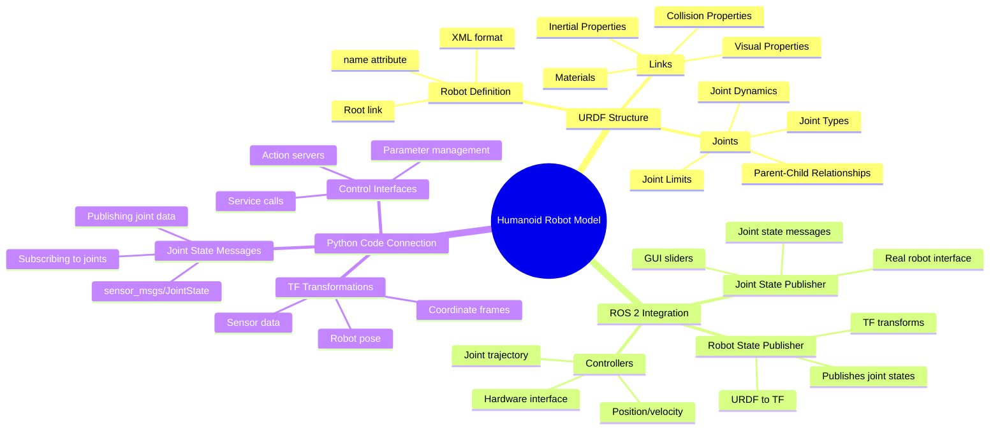

# Week 3: URDF and Robot Modeling

This week focuses on Unified Robot Description Format (URDF) for describing humanoid robots. You'll learn to create robot models with links, joints, and proper kinematic chains for humanoid robots.

## Learning Objectives

By the end of this week, you will be able to:

- Understand URDF structure and XML syntax
- Create links and joints for humanoid robot models
- Define visual and collision properties
- Implement joint limits and dynamics
- Create a complete humanoid robot URDF model

## 3.1 Understanding URDF Structure and XML Syntax

URDF (Unified Robot Description Format) is an XML format for representing a robot model in ROS. It describes the robot's physical and visual properties, including links, joints, and their relationships.

### Basic URDF Structure

```xml
<?xml version="1.0"?>
<robot name="my_robot">
  <!-- Links define rigid bodies -->
  <link name="base_link">
    <visual>
      <geometry>
        <box size="1.0 0.5 0.2"/>
      </geometry>
    </visual>
    <collision>
      <geometry>
        <box size="1.0 0.5 0.2"/>
      </geometry>
    </collision>
    <inertial>
      <mass value="1.0"/>
      <inertia ixx="1.0" ixy="0.0" ixz="0.0" iyy="1.0" iyz="0.0" izz="1.0"/>
    </inertial>
  </link>

  <!-- Joints define relationships between links -->
  <joint name="base_to_wheel" type="continuous">
    <parent link="base_link"/>
    <child link="wheel_link"/>
    <origin xyz="0.5 0 0" rpy="0 0 0"/>
  </joint>

  <link name="wheel_link">
    <visual>
      <geometry>
        <cylinder radius="0.1" length="0.05"/>
      </geometry>
    </visual>
  </link>
</robot>
```

### Key URDF Elements

- **`<robot>`**: Root element containing the entire robot description
- **`<link>`**: Represents a rigid body with visual, collision, and inertial properties
- **`<joint>`**: Defines the connection between two links with a specific type
- **`<visual>`**: Defines how the link appears in visualizations
- **`<collision>`**: Defines the collision geometry for physics simulation
- **`<inertial>`**: Defines the mass and inertial properties for dynamics

## 3.2 Creating Links and Joints for Humanoid Robots

### Link Definition

A link represents a rigid body in the robot. For humanoid robots, links typically represent body parts like torso, head, arms, and legs.

```xml
<link name="torso">
  <visual>
    <origin xyz="0 0 0.5" rpy="0 0 0"/>
    <geometry>
      <box size="0.3 0.2 1.0"/>
    </geometry>
    <material name="light_grey">
      <color rgba="0.7 0.7 0.7 1.0"/>
    </material>
  </visual>
  <collision>
    <origin xyz="0 0 0.5" rpy="0 0 0"/>
    <geometry>
      <box size="0.3 0.2 1.0"/>
    </geometry>
  </collision>
  <inertial>
    <origin xyz="0 0 0.5" rpy="0 0 0"/>
    <mass value="5.0"/>
    <inertia ixx="0.2" ixy="0.0" ixz="0.0" iyy="0.3" iyz="0.0" izz="0.1"/>
  </inertial>
</link>
```

### Joint Types for Humanoid Robots

Different joint types are used to simulate different types of movement in humanoid robots:

- **`revolute`**: Rotational joint with limited range of motion (e.g., elbow, knee)
- **`continuous`**: Rotational joint with unlimited range of motion (e.g., wheel)
- **`prismatic`**: Linear sliding joint (e.g., telescoping arm)
- **`fixed`**: No movement between links (e.g., sensor mounting)
- **`floating`**: 6-DOF joint (rarely used)
- **`planar`**: Movement in a plane (rarely used)

```xml
<!-- Example of different joint types -->
<joint name="left_elbow_joint" type="revolute">
  <parent link="left_upper_arm"/>
  <child link="left_lower_arm"/>
  <origin xyz="0 0 -0.3" rpy="0 0 0"/>
  <axis xyz="0 1 0"/>
  <limit lower="-2.356" upper="0" effort="100" velocity="1.0"/>
  <dynamics damping="0.1" friction="0.0"/>
</joint>

<joint name="torso_head_joint" type="revolute">
  <parent link="torso"/>
  <child link="head"/>
  <origin xyz="0 0 1.0" rpy="0 0 0"/>
  <axis xyz="0 1 0"/>
  <limit lower="-0.5" upper="0.5" effort="10" velocity="2.0"/>
</joint>
```

## 3.3 Visual and Collision Properties

### Visual Properties

Visual properties define how the robot appears in simulation and visualization tools. They include geometry, material, and origin.

```xml
<visual>
  <origin xyz="0 0 0" rpy="0 0 0"/>
  <geometry>
    <!-- Different geometry types -->
    <box size="1.0 0.5 0.2"/>           <!-- Box -->
    <cylinder radius="0.1" length="0.5"/> <!-- Cylinder -->
    <sphere radius="0.2"/>               <!-- Sphere -->
    <mesh filename="package://my_robot/meshes/link.stl"/> <!-- Mesh -->
  </geometry>
  <material name="red">
    <color rgba="1.0 0.0 0.0 1.0"/>
  </material>
</visual>
```

### Collision Properties

Collision properties define the shape used for collision detection and physics simulation. They can be simpler than visual geometry for performance.

```xml
<collision>
  <origin xyz="0 0 0" rpy="0 0 0"/>
  <geometry>
    <!-- Often simplified for performance -->
    <box size="0.9 0.4 0.15"/>  <!-- Slightly smaller than visual -->
  </geometry>
</collision>
```

### Inertial Properties

Inertial properties are crucial for physics simulation, defining how the robot responds to forces.

```xml
<inertial>
  <origin xyz="0 0 0" rpy="0 0 0"/>
  <mass value="1.0"/>
  <inertia ixx="0.1" ixy="0.0" ixz="0.0" iyy="0.1" iyz="0.0" izz="0.1"/>
</inertial>
```

## 3.4 Joint Limits and Dynamics

### Joint Limits

Joint limits define the range of motion for revolute and prismatic joints:

```xml
<joint name="shoulder_joint" type="revolute">
  <parent link="torso"/>
  <child link="upper_arm"/>
  <origin xyz="0.15 0 0.8" rpy="0 0 0"/>
  <axis xyz="0 1 0"/>
  <!-- Limits: lower, upper, effort, velocity -->
  <limit lower="-1.57" upper="1.57" effort="50" velocity="2.0"/>
  <dynamics damping="0.5" friction="0.1"/>
</joint>
```

### Dynamics Parameters

- **Damping**: Resistance to motion (like viscosity)
- **Friction**: Resistance to motion when starting from rest

## 3.5 Complete Humanoid Robot URDF Model

Here's a simplified but complete humanoid robot model:

```xml
<?xml version="1.0"?>
<robot name="simple_humanoid" xmlns:xacro="http://www.ros.org/wiki/xacro">
  <!-- Materials -->
  <material name="blue">
    <color rgba="0.0 0.0 0.8 1.0"/>
  </material>
  <material name="red">
    <color rgba="0.8 0.0 0.0 1.0"/>
  </material>
  <material name="white">
    <color rgba="1.0 1.0 1.0 1.0"/>
  </material>
  <material name="black">
    <color rgba="0.1 0.1 0.1 1.0"/>
  </material>

  <!-- Base link -->
  <link name="base_link">
    <inertial>
      <mass value="10.0"/>
      <origin xyz="0 0 0"/>
      <inertia ixx="1.0" ixy="0.0" ixz="0.0" iyy="1.0" iyz="0.0" izz="1.0"/>
    </inertial>
  </link>

  <!-- Torso -->
  <joint name="torso_joint" type="fixed">
    <parent link="base_link"/>
    <child link="torso"/>
    <origin xyz="0 0 0.2" rpy="0 0 0"/>
  </joint>

  <link name="torso">
    <visual>
      <origin xyz="0 0 0.5" rpy="0 0 0"/>
      <geometry>
        <box size="0.3 0.3 1.0"/>
      </geometry>
      <material name="white"/>
    </visual>
    <collision>
      <origin xyz="0 0 0.5" rpy="0 0 0"/>
      <geometry>
        <box size="0.3 0.3 1.0"/>
      </geometry>
    </collision>
    <inertial>
      <mass value="5.0"/>
      <origin xyz="0 0 0.5"/>
      <inertia ixx="0.2" ixy="0.0" ixz="0.0" iyy="0.3" iyz="0.0" izz="0.1"/>
    </inertial>
  </link>

  <!-- Head -->
  <joint name="neck_joint" type="revolute">
    <parent link="torso"/>
    <child link="head"/>
    <origin xyz="0 0 1.05" rpy="0 0 0"/>
    <axis xyz="0 1 0"/>
    <limit lower="-0.5" upper="0.5" effort="10" velocity="2.0"/>
  </joint>

  <link name="head">
    <visual>
      <origin xyz="0 0 0.1" rpy="0 0 0"/>
      <geometry>
        <sphere radius="0.15"/>
      </geometry>
      <material name="white"/>
    </visual>
    <collision>
      <origin xyz="0 0 0.1" rpy="0 0 0"/>
      <geometry>
        <sphere radius="0.15"/>
      </geometry>
    </collision>
    <inertial>
      <mass value="1.0"/>
      <origin xyz="0 0 0.1"/>
      <inertia ixx="0.01" ixy="0.0" ixz="0.0" iyy="0.01" iyz="0.0" izz="0.01"/>
    </inertial>
  </link>

  <!-- Left Arm -->
  <joint name="left_shoulder_joint" type="revolute">
    <parent link="torso"/>
    <child link="left_upper_arm"/>
    <origin xyz="0.2 0 0.7" rpy="0 0 0"/>
    <axis xyz="0 1 0"/>
    <limit lower="-1.57" upper="1.57" effort="30" velocity="2.0"/>
  </joint>

  <link name="left_upper_arm">
    <visual>
      <origin xyz="0 0 -0.15" rpy="1.57 0 0"/>
      <geometry>
        <cylinder radius="0.05" length="0.3"/>
      </geometry>
      <material name="blue"/>
    </visual>
    <collision>
      <origin xyz="0 0 -0.15" rpy="1.57 0 0"/>
      <geometry>
        <cylinder radius="0.05" length="0.3"/>
      </geometry>
    </collision>
    <inertial>
      <mass value="0.8"/>
      <origin xyz="0 0 -0.15"/>
      <inertia ixx="0.01" ixy="0.0" ixz="0.0" iyy="0.01" iyz="0.0" izz="0.001"/>
    </inertial>
  </link>

  <joint name="left_elbow_joint" type="revolute">
    <parent link="left_upper_arm"/>
    <child link="left_lower_arm"/>
    <origin xyz="0 0 -0.3" rpy="0 0 0"/>
    <axis xyz="0 1 0"/>
    <limit lower="-2.356" upper="0" effort="20" velocity="2.0"/>
  </joint>

  <link name="left_lower_arm">
    <visual>
      <origin xyz="0 0 -0.15" rpy="1.57 0 0"/>
      <geometry>
        <cylinder radius="0.04" length="0.3"/>
      </geometry>
      <material name="blue"/>
    </visual>
    <collision>
      <origin xyz="0 0 -0.15" rpy="1.57 0 0"/>
      <geometry>
        <cylinder radius="0.04" length="0.3"/>
      </geometry>
    </collision>
    <inertial>
      <mass value="0.6"/>
      <origin xyz="0 0 -0.15"/>
      <inertia ixx="0.008" ixy="0.0" ixz="0.0" iyy="0.008" iyz="0.0" izz="0.001"/>
    </inertial>
  </link>

  <!-- Right Arm (similar to left, mirrored) -->
  <joint name="right_shoulder_joint" type="revolute">
    <parent link="torso"/>
    <child link="right_upper_arm"/>
    <origin xyz="-0.2 0 0.7" rpy="0 0 0"/>
    <axis xyz="0 1 0"/>
    <limit lower="-1.57" upper="1.57" effort="30" velocity="2.0"/>
  </joint>

  <link name="right_upper_arm">
    <visual>
      <origin xyz="0 0 -0.15" rpy="1.57 0 0"/>
      <geometry>
        <cylinder radius="0.05" length="0.3"/>
      </geometry>
      <material name="red"/>
    </visual>
    <collision>
      <origin xyz="0 0 -0.15" rpy="1.57 0 0"/>
      <geometry>
        <cylinder radius="0.05" length="0.3"/>
      </geometry>
    </collision>
    <inertial>
      <mass value="0.8"/>
      <origin xyz="0 0 -0.15"/>
      <inertia ixx="0.01" ixy="0.0" ixz="0.0" iyy="0.01" iyz="0.0" izz="0.001"/>
    </inertial>
  </link>

  <joint name="right_elbow_joint" type="revolute">
    <parent link="right_upper_arm"/>
    <child link="right_lower_arm"/>
    <origin xyz="0 0 -0.3" rpy="0 0 0"/>
    <axis xyz="0 1 0"/>
    <limit lower="-2.356" upper="0" effort="20" velocity="2.0"/>
  </joint>

  <link name="right_lower_arm">
    <visual>
      <origin xyz="0 0 -0.15" rpy="1.57 0 0"/>
      <geometry>
        <cylinder radius="0.04" length="0.3"/>
      </geometry>
      <material name="red"/>
    </visual>
    <collision>
      <origin xyz="0 0 -0.15" rpy="1.57 0 0"/>
      <geometry>
        <cylinder radius="0.04" length="0.3"/>
      </geometry>
    </collision>
    <inertial>
      <mass value="0.6"/>
      <origin xyz="0 0 -0.15"/>
      <inertia ixx="0.008" ixy="0.0" ixz="0.0" iyy="0.008" iyz="0.0" izz="0.001"/>
    </inertial>
  </link>

  <!-- Left Leg -->
  <joint name="left_hip_joint" type="revolute">
    <parent link="torso"/>
    <child link="left_thigh"/>
    <origin xyz="0.1 0 0" rpy="0 0 0"/>
    <axis xyz="0 1 0"/>
    <limit lower="-1.57" upper="1.57" effort="50" velocity="1.5"/>
  </joint>

  <link name="left_thigh">
    <visual>
      <origin xyz="0 0 -0.25" rpy="1.57 0 0"/>
      <geometry>
        <cylinder radius="0.06" length="0.5"/>
      </geometry>
      <material name="blue"/>
    </visual>
    <collision>
      <origin xyz="0 0 -0.25" rpy="1.57 0 0"/>
      <geometry>
        <cylinder radius="0.06" length="0.5"/>
      </geometry>
    </collision>
    <inertial>
      <mass value="1.5"/>
      <origin xyz="0 0 -0.25"/>
      <inertia ixx="0.03" ixy="0.0" ixz="0.0" iyy="0.03" iyz="0.0" izz="0.002"/>
    </inertial>
  </link>

  <joint name="left_knee_joint" type="revolute">
    <parent link="left_thigh"/>
    <child link="left_shin"/>
    <origin xyz="0 0 -0.5" rpy="0 0 0"/>
    <axis xyz="0 1 0"/>
    <limit lower="0" upper="2.356" effort="40" velocity="1.5"/>
  </joint>

  <link name="left_shin">
    <visual>
      <origin xyz="0 0 -0.25" rpy="1.57 0 0"/>
      <geometry>
        <cylinder radius="0.05" length="0.5"/>
      </geometry>
      <material name="blue"/>
    </visual>
    <collision>
      <origin xyz="0 0 -0.25" rpy="1.57 0 0"/>
      <geometry>
        <cylinder radius="0.05" length="0.5"/>
      </geometry>
    </collision>
    <inertial>
      <mass value="1.2"/>
      <origin xyz="0 0 -0.25"/>
      <inertia ixx="0.025" ixy="0.0" ixz="0.0" iyy="0.025" iyz="0.0" izz="0.002"/>
    </inertial>
  </link>

  <!-- Right Leg -->
  <joint name="right_hip_joint" type="revolute">
    <parent link="torso"/>
    <child link="right_thigh"/>
    <origin xyz="-0.1 0 0" rpy="0 0 0"/>
    <axis xyz="0 1 0"/>
    <limit lower="-1.57" upper="1.57" effort="50" velocity="1.5"/>
  </joint>

  <link name="right_thigh">
    <visual>
      <origin xyz="0 0 -0.25" rpy="1.57 0 0"/>
      <geometry>
        <cylinder radius="0.06" length="0.5"/>
      </geometry>
      <material name="red"/>
    </visual>
    <collision>
      <origin xyz="0 0 -0.25" rpy="1.57 0 0"/>
      <geometry>
        <cylinder radius="0.06" length="0.5"/>
      </geometry>
    </collision>
    <inertial>
      <mass value="1.5"/>
      <origin xyz="0 0 -0.25"/>
      <inertia ixx="0.03" ixy="0.0" ixz="0.0" iyy="0.03" iyz="0.0" izz="0.002"/>
    </inertial>
  </link>

  <joint name="right_knee_joint" type="revolute">
    <parent link="right_thigh"/>
    <child link="right_shin"/>
    <origin xyz="0 0 -0.5" rpy="0 0 0"/>
    <axis xyz="0 1 0"/>
    <limit lower="0" upper="2.356" effort="40" velocity="1.5"/>
  </joint>

  <link name="right_shin">
    <visual>
      <origin xyz="0 0 -0.25" rpy="1.57 0 0"/>
      <geometry>
        <cylinder radius="0.05" length="0.5"/>
      </geometry>
      <material name="red"/>
    </visual>
    <collision>
      <origin xyz="0 0 -0.25" rpy="1.57 0 0"/>
      <geometry>
        <cylinder radius="0.05" length="0.5"/>
      </geometry>
    </collision>
    <inertial>
      <mass value="1.2"/>
      <origin xyz="0 0 -0.25"/>
      <inertia ixx="0.025" ixy="0.0" ixz="0.0" iyy="0.025" iyz="0.0" izz="0.002"/>
    </inertial>
  </link>
</robot>
```

## 3.6 URDF with Xacro for Complex Models

Xacro (XML Macros) allows you to create more complex and maintainable URDF files:

```xml
<?xml version="1.0"?>
<robot xmlns:xacro="http://www.ros.org/wiki/xacro" name="humanoid_with_xacro">

  <!-- Properties -->
  <xacro:property name="M_PI" value="3.1415926535897931" />
  <xacro:property name="base_width" value="0.3" />
  <xacro:property name="base_length" value="0.5" />
  <xacro:property name="base_height" value="0.2" />

  <!-- Macro for creating a simple link -->
  <xacro:macro name="simple_link" params="name xyz size mass color">
    <link name="${name}">
      <visual>
        <origin xyz="${xyz}"/>
        <geometry>
          <box size="${size}"/>
        </geometry>
        <material name="${color}">
          <color rgba="0.8 0.8 0.8 1.0"/>
        </material>
      </visual>
      <collision>
        <origin xyz="${xyz}"/>
        <geometry>
          <box size="${size}"/>
        </geometry>
      </collision>
      <inertial>
        <mass value="${mass}"/>
        <origin xyz="${xyz}"/>
        <inertia ixx="1.0" ixy="0.0" ixz="0.0" iyy="1.0" iyz="0.0" izz="1.0"/>
      </inertial>
    </link>
  </xacro:macro>

  <!-- Use the macro -->
  <xacro:simple_link name="base_link" xyz="0 0 0" size="0.5 0.3 0.2" mass="2.0" color="base_color"/>

  <!-- Macro for creating an arm -->
  <xacro:macro name="arm" params="side parent_link position">
    <joint name="${side}_shoulder_joint" type="revolute">
      <parent link="${parent_link}"/>
      <child link="${side}_upper_arm"/>
      <origin xyz="${position}" rpy="0 0 0"/>
      <axis xyz="0 1 0"/>
      <limit lower="-1.57" upper="1.57" effort="30" velocity="2.0"/>
    </joint>

    <link name="${side}_upper_arm">
      <visual>
        <origin xyz="0 0 -0.15" rpy="1.57 0 0"/>
        <geometry>
          <cylinder radius="0.05" length="0.3"/>
        </geometry>
      </visual>
      <collision>
        <origin xyz="0 0 -0.15" rpy="1.57 0 0"/>
        <geometry>
          <cylinder radius="0.05" length="0.3"/>
        </geometry>
      </collision>
      <inertial>
        <mass value="0.8"/>
        <origin xyz="0 0 -0.15"/>
        <inertia ixx="0.01" ixy="0.0" ixz="0.0" iyy="0.01" iyz="0.0" izz="0.001"/>
      </inertial>
    </link>
  </xacro:macro>

  <!-- Use the arm macro -->
  <xacro:arm side="left" parent_link="base_link" position="0.2 0 0"/>
  <xacro:arm side="right" parent_link="base_link" position="-0.2 0 0"/>

</robot>
```

## 3.7 Practical Exercise: Creating a Simple Humanoid URDF

Create a simplified humanoid model with basic kinematic chains for arms and legs:

1. Create a file called `simple_humanoid.urdf` in your robot package
2. Define the basic structure with torso, head, arms, and legs
3. Add appropriate joints with realistic limits
4. Include visual and collision properties

### Testing Your URDF Model

You can test your URDF model using the following command:

```bash
# Check URDF syntax
check_urdf /path/to/your/robot.urdf

# Visualize in RViz
ros2 run rviz2 rviz2

# Use robot state publisher to publish the model
ros2 run robot_state_publisher robot_state_publisher --ros-args -p robot_description:='$(cat your_robot.urdf)'
```

## 3.8 Mind Map: Connecting ROS 2 Concepts, Python Code, and URDF



## Summary

This week covered URDF (Unified Robot Description Format) for modeling humanoid robots. You learned to create links and joints with appropriate visual, collision, and inertial properties. You also explored Xacro macros for creating more complex and maintainable robot models. These skills are essential for simulating and controlling humanoid robots in ROS 2.

## Next Module Preview

In Module 2, we'll explore physics simulation using Gazebo and high-fidelity visualization with Unity, building on the robot models you created this week.