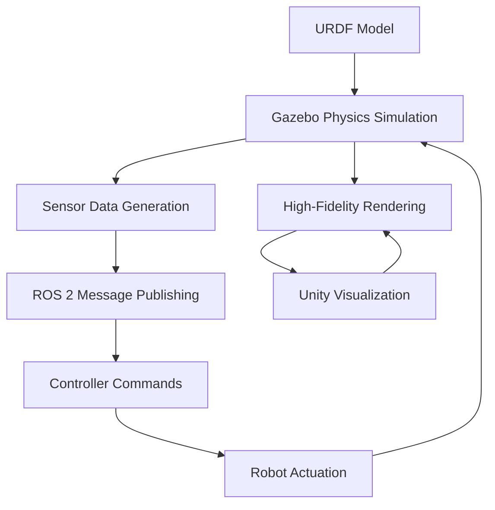

# Week 4: Physics Simulation in Gazebo

This week focuses on physics simulation in Gazebo, a powerful 3D simulation environment for robotics. You'll learn to import URDF models, configure physical properties, integrate sensors, and develop control interfaces for humanoid robots.

## Learning Objectives

By the end of this week, you will be able to:

- Set up Gazebo simulation environments for humanoid robots
- Import and configure URDF models in Gazebo
- Configure physical properties and contacts
- Integrate various sensors (LiDAR, cameras, IMUs)
- Develop control interfaces and plugins for robot simulation

## 4.1 Gazebo Fundamentals and Physics Engine

Gazebo is a 3D simulation environment that provides physics simulation, realistic rendering, and sensor simulation for robotics applications. It's built on the Open Dynamics Engine (ODE) and supports multiple physics engines.

### Key Components of Gazebo

- **Physics Engine**: Handles collision detection, contact simulation, and dynamics
- **Rendering Engine**: Provides realistic visualization using OGRE
- **Sensor Simulation**: Models various sensors like cameras, LiDAR, IMUs
- **Plugin System**: Extensible architecture for custom behaviors
- **Transport System**: Message passing for communication

### Gazebo vs. Gazebo Classic vs. Ignition Gazebo

- **Gazebo Classic**: The original version (versions 1-11), being phased out
- **Ignition Gazebo**: The newer modular version (part of Ignition Robotics)
- **Gazebo Garden**: The latest version in the Ignition family (recommended)

## 4.2 Importing URDF Models into Gazebo

### Basic URDF Integration

To use your URDF model in Gazebo, you need to add Gazebo-specific tags to your URDF file. Here's how to extend the humanoid URDF from Module 1:

```xml
<?xml version="1.0"?>
<robot name="simple_humanoid" xmlns:xacro="http://www.ros.org/wiki/xacro">
  <!-- Include your existing URDF content here -->

  <!-- Gazebo-specific tags for simulation -->
  <gazebo reference="base_link">
    <material>Gazebo/Blue</material>
    <mu1>0.2</mu1>
    <mu2>0.2</mu2>
    <kp>1000000.0</kp>
    <kd>1.0</kd>
  </gazebo>

  <!-- Gazebo plugin for joint state publishing -->
  <gazebo>
    <plugin name="joint_state_publisher" filename="libgazebo_ros_joint_state_publisher.so">
      <update_rate>30</update_rate>
      <joint_name>left_shoulder_joint</joint_name>
      <joint_name>right_shoulder_joint</joint_name>
      <joint_name>left_elbow_joint</joint_name>
      <joint_name>right_elbow_joint</joint_name>
    </plugin>
  </gazebo>

  <!-- Gazebo plugin for controlling joints -->
  <gazebo>
    <plugin name="position_controllers" filename="libgazebo_ros_joint_position.so">
      <robotNamespace>/simple_humanoid</robotNamespace>
      <jointName>left_shoulder_joint</jointName>
      <topicName>left_shoulder_position</topicName>
    </plugin>
  </gazebo>
</robot>
```

### Gazebo-Specific Tags

- **`<gazebo reference="link_name">`**: Applies properties to a specific link
- **`<material>`**: Sets the visual material for rendering
- **`<mu1>`, `<mu2>`**: Friction coefficients
- **`<kp>`, `<kd>`**: Spring stiffness and damping coefficients
- **`<plugin>`**: Adds functionality through plugins

## 4.3 Configuring Physical Properties and Contacts

### Material Properties

```xml
<gazebo reference="left_foot">
  <mu1>0.8</mu1>  <!-- Primary friction coefficient -->
  <mu2>0.8</mu2>  <!-- Secondary friction coefficient -->
  <kp>1000000.0</kp>  <!-- Contact stiffness -->
  <kd>1000000.0</kd>  <!-- Contact damping -->
  <minDepth>0.001</minDepth>  <!-- Penetration depth before contact force -->
  <maxVel>10.0</maxVel>  <!-- Maximum contact correction velocity -->
</gazebo>
```

### Collision Properties

```xml
<link name="left_foot">
  <collision>
    <origin xyz="0 0 0" rpy="0 0 0"/>
    <geometry>
      <box size="0.2 0.1 0.05"/>
    </geometry>
    <surface>
      <friction>
        <ode>
          <mu>0.8</mu>
          <mu2>0.8</mu2>
          <fdir1>0 0 1</fdir1>
          <slip1>0.0</slip1>
          <slip2>0.0</slip2>
        </ode>
      </friction>
      <bounce>
        <restitution_coefficient>0.01</restitution_coefficient>
        <threshold>100000</threshold>
      </bounce>
      <contact>
        <ode>
          <soft_cfm>0</soft_cfm>
          <soft_erp>0.2</soft_erp>
          <kp>1e+10</kp>
          <kd>1</kd>
          <max_vel>100.0</max_vel>
          <min_depth>0.001</min_depth>
        </ode>
      </contact>
    </surface>
  </collision>
</link>
```

## 4.4 Sensor Integration (LiDAR, Cameras, IMUs)

### LiDAR Sensor Integration

```xml
<gazebo reference="laser_link">
  <sensor name="laser" type="ray">
    <pose>0 0 0 0 0 0</pose>
    <visualize>true</visualize>
    <update_rate>10</update_rate>
    <ray>
      <scan>
        <horizontal>
          <samples>720</samples>
          <resolution>1</resolution>
          <min_angle>-1.570796</min_angle>
          <max_angle>1.570796</max_angle>
        </horizontal>
      </scan>
      <range>
        <min>0.1</min>
        <max>30.0</max>
        <resolution>0.01</resolution>
      </range>
    </ray>
    <plugin name="laser_controller" filename="libgazebo_ros_laser.so">
      <topicName>/scan</topicName>
      <frameName>laser_link</frameName>
    </plugin>
  </sensor>
</gazebo>
```

### Camera Sensor Integration

```xml
<gazebo reference="camera_link">
  <sensor name="camera" type="camera">
    <update_rate>30</update_rate>
    <camera name="head">
      <horizontal_fov>1.3962634</horizontal_fov>
      <image>
        <width>640</width>
        <height>480</height>
        <format>R8G8B8</format>
      </image>
      <clip>
        <near>0.1</near>
        <far>100</far>
      </clip>
    </camera>
    <plugin name="camera_controller" filename="libgazebo_ros_camera.so">
      <frame_name>camera_link</frame_name>
      <topic_name>/camera/image_raw</topic_name>
      <hack_baseline>0.07</hack_baseline>
    </plugin>
  </sensor>
</gazebo>
```

### IMU Sensor Integration

```xml
<gazebo reference="imu_link">
  <sensor name="imu" type="imu">
    <always_on>true</always_on>
    <update_rate>100</update_rate>
    <visualize>false</visualize>
    <imu>
      <angular_velocity>
        <x>
          <noise type="gaussian">
            <mean>0.0</mean>
            <stddev>2e-4</stddev>
          </noise>
        </x>
        <y>
          <noise type="gaussian">
            <mean>0.0</mean>
            <stddev>2e-4</stddev>
          </noise>
        </y>
        <z>
          <noise type="gaussian">
            <mean>0.0</mean>
            <stddev>2e-4</stddev>
          </noise>
        </z>
      </angular_velocity>
      <linear_acceleration>
        <x>
          <noise type="gaussian">
            <mean>0.0</mean>
            <stddev>1.7e-2</stddev>
          </noise>
        </x>
        <y>
          <noise type="gaussian">
            <mean>0.0</mean>
            <stddev>1.7e-2</stddev>
          </noise>
        </y>
        <z>
          <noise type="gaussian">
            <mean>0.0</mean>
            <stddev>1.7e-2</stddev>
          </noise>
        </z>
      </linear_acceleration>
    </imu>
    <plugin name="imu_controller" filename="libgazebo_ros_imu.so">
      <topicName>/imu/data</topicName>
      <bodyName>imu_link</bodyName>
      <frameName>imu_link</frameName>
      <serviceName>/imu/service</serviceName>
    </plugin>
  </sensor>
</gazebo>
```

## 4.5 Control Interfaces and Plugin Development

### Joint Control Plugins

Gazebo provides various plugins for controlling robot joints:

```xml
<!-- Position control plugin -->
<gazebo>
  <plugin name="gazebo_ros_control" filename="libgazebo_ros_control.so">
    <robotNamespace>/simple_humanoid</robotNamespace>
    <robotSimType>gazebo_ros_control/DefaultRobotHWSim</robotSimType>
  </plugin>
</gazebo>
```

### Creating a Custom Gazebo Plugin

Here's a simple example of a custom Gazebo plugin for humanoid control:

```cpp
#include <gazebo/gazebo.hh>
#include <gazebo/physics/physics.hh>
#include <gazebo/common/common.hh>
#include <stdio.h>

namespace gazebo
{
  class HumanoidControlPlugin : public ModelPlugin
  {
    public: void Load(physics::ModelPtr _parent, sdf::ElementPtr /*_sdf*/)
    {
      // Store the model pointer for convenience
      this->model = _parent;

      // Listen to the update event. This event is broadcast every
      // simulation iteration.
      this->updateConnection = event::Events::ConnectWorldUpdateBegin(
          std::bind(&HumanoidControlPlugin::OnUpdate, this));
    }

    // Called by the world update start event
    public: void OnUpdate()
    {
      // Apply a small linear velocity to the model
      this->model->SetLinearVel(math::Vector3(0.03, 0, 0));
    }

    // Pointer to the model
    private: physics::ModelPtr model;

    // Pointer to the update event connection
    private: event::ConnectionPtr updateConnection;
  };

  // Register this plugin with the simulator
  GZ_REGISTER_MODEL_PLUGIN(HumanoidControlPlugin)
}
```

### ROS 2 Integration with Gazebo

To integrate ROS 2 with Gazebo, you typically use:

1. **gazebo_ros_pkgs**: Provides ROS 2 interfaces for Gazebo
2. **robot_state_publisher**: Publishes TF transforms
3. **joint_state_publisher**: Publishes joint states
4. **Controller managers**: For hardware interfaces

## 4.6 Practical Exercise: Simulating a Walking Humanoid

Let's create a complete example that simulates a simple walking motion:

### Extended URDF with Gazebo Plugins

```xml
<?xml version="1.0"?>
<robot name="walking_humanoid" xmlns:xacro="http://www.ros.org/wiki/xacro">
  <!-- Include your humanoid model from Module 1 here -->

  <!-- Gazebo plugin for ROS control -->
  <gazebo>
    <plugin name="gazebo_ros_control" filename="libgazebo_ros_control.so">
      <robotNamespace>/walking_humanoid</robotNamespace>
      <controlPeriod>0.001</controlPeriod>
      <robotSimType>gazebo_ros_control/DefaultRobotHWSim</robotSimType>
    </plugin>
  </gazebo>

  <!-- Joint state publisher plugin -->
  <gazebo>
    <plugin name="joint_state_publisher" filename="libgazebo_ros_joint_state_publisher.so">
      <update_rate>30</update_rate>
      <joint_name>left_hip_joint</joint_name>
      <joint_name>left_knee_joint</joint_name>
      <joint_name>left_ankle_joint</joint_name>
      <joint_name>right_hip_joint</joint_name>
      <joint_name>right_knee_joint</joint_name>
      <joint_name>right_ankle_joint</joint_name>
    </plugin>
  </gazebo>

  <!-- Example of a simple controller configuration -->
  <ros2_control name="GazeboSystem" type="system">
    <hardware>
      <plugin>gazebo_ros2_control/GazeboSystem</plugin>
    </hardware>
    <joint name="left_hip_joint">
      <command_interface name="position"/>
      <state_interface name="position"/>
      <state_interface name="velocity"/>
    </joint>
    <!-- Add similar interfaces for other joints -->
  </ros2_control>
</robot>
```

### Launch File for Simulation

Create a launch file to start the simulation:

```python
from launch import LaunchDescription
from launch.actions import DeclareLaunchArgument, IncludeLaunchDescription
from launch.launch_description_sources import PythonLaunchDescriptionSource
from launch.substitutions import LaunchConfiguration, PathJoinSubstitution
from launch_ros.actions import Node
from launch_ros.substitutions import FindPackageShare

def generate_launch_description():
    # Launch configuration variables
    use_sim_time = LaunchConfiguration('use_sim_time')

    # Declare launch arguments
    declare_use_sim_time_cmd = DeclareLaunchArgument(
        'use_sim_time',
        default_value='true',
        description='Use simulation (Gazebo) clock if true'
    )

    # Start Gazebo
    gazebo = IncludeLaunchDescription(
        PythonLaunchDescriptionSource([
            PathJoinSubstitution([
                FindPackageShare('gazebo_ros'),
                'launch',
                'gazebo.launch.py'
            ])
        ])
    )

    # Robot State Publisher
    robot_state_publisher = Node(
        package='robot_state_publisher',
        executable='robot_state_publisher',
        name='robot_state_publisher',
        output='screen',
        parameters=[{
            'use_sim_time': use_sim_time,
            'robot_description': open('path/to/your/robot.urdf').read()
        }]
    )

    # Spawn robot in Gazebo
    spawn_entity = Node(
        package='gazebo_ros',
        executable='spawn_entity.py',
        arguments=['-topic', 'robot_description', '-entity', 'walking_humanoid'],
        output='screen'
    )

    # Create the launch description and populate
    ld = LaunchDescription()

    # Declare launch options
    ld.add_action(declare_use_sim_time_cmd)

    # Add nodes and launches
    ld.add_action(gazebo)
    ld.add_action(robot_state_publisher)
    ld.add_action(spawn_entity)

    return ld
```

### Running the Simulation

```bash
# Terminal 1: Start Gazebo
ros2 launch your_package simulation.launch.py

# Terminal 2: Send joint commands
ros2 topic pub /walking_humanoid/left_hip_joint/position std_msgs/msg/Float64 "data: 0.5"

# Terminal 3: Monitor joint states
ros2 topic echo /joint_states
```

## 4.7 Flowchart: Gazebo-Unity Simulation Pipeline



## Summary

This week covered physics simulation in Gazebo for humanoid robots. You learned to import URDF models, configure physical properties, integrate sensors, and develop control interfaces. These skills are essential for testing humanoid robot behaviors in a safe, controlled environment before deploying on real hardware.

## Next Week Preview

Next week, we'll explore high-fidelity visualization using Unity and learn how to integrate it with ROS 2 for enhanced simulation experiences.