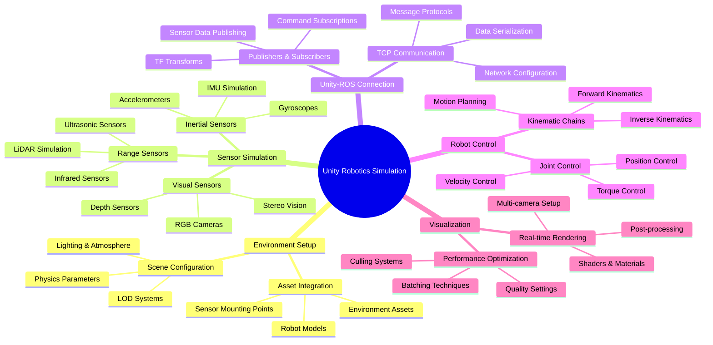

# Week 5: High-Fidelity Visualization in Unity

This week focuses on high-fidelity visualization using Unity for humanoid robot simulation. You'll learn to create realistic environments, integrate sensors, and connect Unity with ROS 2 for enhanced simulation experiences.

## Learning Objectives

By the end of this week, you will be able to:

- Set up Unity for robotics simulation with the Unity Robotics Hub
- Create realistic environments for humanoid robots
- Integrate sensor simulation in Unity
- Connect Unity with ROS 2 using the ROS TCP Connector
- Implement real-time visualization techniques

## 5.1 Unity Integration with ROS 2

### Unity Robotics Hub Setup

The Unity Robotics Hub provides tools and packages for robotics simulation in Unity:

1. **Unity ML-Agents Toolkit**: For reinforcement learning and AI training
2. **Unity ROS TCP Connector**: For communication between Unity and ROS
3. **Unity Robotics Simulation Framework**: For physics and sensor simulation

### Installing Unity Robotics Packages

1. Install Unity Hub and Unity 2021.3 LTS or later
2. Install the Unity Robotics Hub from the Unity Asset Store or GitHub
3. Import the ROS TCP Connector package
4. Configure the Unity project for robotics simulation

### Basic Unity-ROS Communication Setup

```csharp
using UnityEngine;
using Unity.Robotics.ROSTCPConnector;
using RosMessageTypes.Std;

public class UnityRobotController : MonoBehaviour
{
    ROSConnection ros;
    string rosIPAddress = "127.0.0.1"; // Default IP
    int rosPort = 10000; // Default port

    void Start()
    {
        // Get the ROS connection static instance
        ros = ROSConnection.instance;
        ros.RegisterPublisher<UInt8Msg>("unity_robot_command");
    }

    void SendCommandToROS()
    {
        // Create a message
        UInt8Msg command = new UInt8Msg();
        command.data = 1; // Example command

        // Send the message
        ros.Publish("unity_robot_command", command);
    }
}
```

## 5.2 Creating Realistic Environments

### Environment Design Principles

When creating environments for humanoid robot simulation, consider:

- **Realistic Physics**: Proper mass, friction, and collision properties
- **Appropriate Scale**: Environments should match real-world dimensions
- **Interactive Elements**: Furniture, doors, and other objects the robot can interact with
- **Lighting**: Realistic lighting conditions for computer vision tasks
- **Texturing**: High-quality textures for visual realism

### Creating a Humanoid-Friendly Environment

```csharp
using UnityEngine;

public class EnvironmentBuilder : MonoBehaviour
{
    public GameObject floorPrefab;
    public GameObject wallPrefab;
    public GameObject furniturePrefab;
    public GameObject obstaclePrefab;

    [Header("Environment Parameters")]
    public Vector2Int gridSize = new Vector2Int(10, 10);
    public float cellSize = 2.0f;

    void Start()
    {
        BuildEnvironment();
    }

    void BuildEnvironment()
    {
        // Create floor
        GameObject floor = Instantiate(floorPrefab, Vector3.zero, Quaternion.identity);
        floor.transform.localScale = new Vector3(gridSize.x * cellSize, 1, gridSize.y * cellSize);

        // Create walls around perimeter
        CreateWalls();

        // Add furniture and obstacles
        AddFurniture();
    }

    void CreateWalls()
    {
        // Create four walls around the environment
        float length = gridSize.x * cellSize;
        float width = gridSize.y * cellSize;

        // North wall
        Instantiate(wallPrefab, new Vector3(0, 0, width / 2), Quaternion.Euler(0, 90, 0))
            .transform.localScale = new Vector3(1, 2, length);

        // South wall
        Instantiate(wallPrefab, new Vector3(0, 0, -width / 2), Quaternion.Euler(0, 90, 0))
            .transform.localScale = new Vector3(1, 2, length);

        // East wall
        Instantiate(wallPrefab, new Vector3(length / 2, 0, 0), Quaternion.identity)
            .transform.localScale = new Vector3(1, 2, width);

        // West wall
        Instantiate(wallPrefab, new Vector3(-length / 2, 0, 0), Quaternion.identity)
            .transform.localScale = new Vector3(1, 2, width);
    }

    void AddFurniture()
    {
        // Add tables, chairs, etc. at random positions
        for (int i = 0; i < 5; i++)
        {
            Vector3 pos = new Vector3(
                Random.Range(-gridSize.x * cellSize / 2 + 2, gridSize.x * cellSize / 2 - 2),
                0,
                Random.Range(-gridSize.y * cellSize / 2 + 2, gridSize.y * cellSize / 2 - 2)
            );
            Instantiate(furniturePrefab, pos, Quaternion.identity);
        }
    }
}
```

### Lighting and Atmospheric Effects

```csharp
using UnityEngine;

public class EnvironmentLighting : MonoBehaviour
{
    [Header("Lighting Configuration")]
    public Light mainLight;
    public Color dayLightColor = new Color(1.0f, 0.95f, 0.8f, 1.0f);
    public float dayIntensity = 1.0f;
    public AnimationCurve intensityOverTime;

    [Header("Atmospheric Effects")]
    public float fogDensity = 0.01f;
    public Color fogColor = Color.gray;

    void Start()
    {
        SetupLighting();
        SetupAtmosphere();
    }

    void SetupLighting()
    {
        if (mainLight != null)
        {
            mainLight.color = dayLightColor;
            mainLight.intensity = dayIntensity;
            mainLight.shadows = LightShadows.Soft;
        }
    }

    void SetupAtmosphere()
    {
        RenderSettings.fog = true;
        RenderSettings.fogMode = FogMode.ExponentialSquared;
        RenderSettings.fogDensity = fogDensity;
        RenderSettings.fogColor = fogColor;
    }

    // Example of dynamic lighting changes
    void Update()
    {
        if (mainLight != null)
        {
            float timeOfDay = (Mathf.Sin(Time.time * 0.1f) + 1) / 2; // 0-1 cycle
            mainLight.intensity = intensityOverTime.Evaluate(timeOfDay) * dayIntensity;
        }
    }
}
```

## 5.3 Sensor Simulation in Unity

### Camera Sensor Simulation

```csharp
using UnityEngine;
using Unity.Robotics.ROSTCPConnector;
using RosMessageTypes.Sensor;
using System.Collections;

public class UnityCameraSensor : MonoBehaviour
{
    ROSConnection ros;
    Camera sensorCamera;
    public string topicName = "/unity_camera/image_raw";
    public int imageWidth = 640;
    public int imageHeight = 480;
    public int publishRate = 30; // Hz

    RenderTexture renderTexture;
    Texture2D tempTexture;

    void Start()
    {
        ros = ROSConnection.instance;
        sensorCamera = GetComponent<Camera>();

        // Create render texture for camera
        renderTexture = new RenderTexture(imageWidth, imageHeight, 24);
        sensorCamera.targetTexture = renderTexture;

        tempTexture = new Texture2D(imageWidth, imageHeight, TextureFormat.RGB24, false);

        // Start coroutine to publish images at desired rate
        StartCoroutine(PublishImages());
    }

    IEnumerator PublishImages()
    {
        float delay = 1.0f / publishRate;

        while (true)
        {
            yield return new WaitForSeconds(delay);
            PublishCameraImage();
        }
    }

    void PublishCameraImage()
    {
        // Copy render texture to regular texture
        RenderTexture.active = renderTexture;
        tempTexture.ReadPixels(new Rect(0, 0, imageWidth, imageHeight), 0, 0);
        tempTexture.Apply();

        // Convert texture to ROS message format
        byte[] imageData = tempTexture.EncodeToJPG();

        // Create ROS Image message
        ImageMsg imageMsg = new ImageMsg
        {
            header = new std_msgs.HeaderMsg
            {
                stamp = new builtin_interfaces.TimeMsg
                {
                    sec = (int)Time.time,
                    nanosec = (uint)((Time.time % 1) * 1e9)
                },
                frame_id = "unity_camera_optical_frame"
            },
            height = (uint)imageHeight,
            width = (uint)imageWidth,
            encoding = "rgb8",
            is_bigendian = 0,
            step = (uint)(imageWidth * 3), // 3 bytes per pixel (RGB)
            data = imageData
        };

        // Publish the image
        ros.Publish(topicName, imageMsg);
    }
}
```

### LiDAR Sensor Simulation

```csharp
using UnityEngine;
using Unity.Robotics.ROSTCPConnector;
using RosMessageTypes.Sensor;
using System.Collections.Generic;

public class UnityLidarSensor : MonoBehaviour
{
    ROSConnection ros;
    public string topicName = "/unity_lidar/scan";
    public float scanRange = 20.0f;
    public int numberOfRays = 720;
    public float fieldOfView = 270f; // degrees
    public int publishRate = 10; // Hz

    void Start()
    {
        ros = ROSConnection.instance;
        InvokeRepeating("PublishLidarScan", 0, 1.0f / publishRate);
    }

    void PublishLidarScan()
    {
        // Calculate ray directions
        float angleIncrement = fieldOfView / numberOfRays * Mathf.Deg2Rad;
        float startAngle = -fieldOfView / 2 * Mathf.Deg2Rad;

        List<float> ranges = new List<float>();

        for (int i = 0; i < numberOfRays; i++)
        {
            float angle = startAngle + i * angleIncrement;

            // Calculate ray direction in world space
            Vector3 rayDirection = new Vector3(
                Mathf.Cos(angle) * Mathf.Cos(transform.eulerAngles.x * Mathf.Deg2Rad),
                Mathf.Sin(angle) * Mathf.Cos(transform.eulerAngles.x * Mathf.Deg2Rad),
                Mathf.Sin(transform.eulerAngles.y * Mathf.Deg2Rad)
            ).normalized;

            // Perform raycast
            RaycastHit hit;
            if (Physics.Raycast(transform.position, transform.TransformDirection(rayDirection), out hit, scanRange))
            {
                ranges.Add(hit.distance);
            }
            else
            {
                ranges.Add(scanRange); // No obstacle detected
            }
        }

        // Create ROS LaserScan message
        LaserScanMsg scanMsg = new LaserScanMsg
        {
            header = new std_msgs.HeaderMsg
            {
                stamp = new builtin_interfaces.TimeMsg
                {
                    sec = (int)Time.time,
                    nanosec = (uint)((Time.time % 1) * 1e9)
                },
                frame_id = "unity_lidar_frame"
            },
            angle_min = startAngle,
            angle_max = startAngle + fieldOfView * Mathf.Deg2Rad,
            angle_increment = angleIncrement,
            time_increment = 0,
            scan_time = 1.0f / publishRate,
            range_min = 0.1f,
            range_max = scanRange,
            ranges = ranges.ToArray(),
            intensities = new float[ranges.Count] // Optional intensity data
        };

        // Publish the scan
        ros.Publish(topicName, scanMsg);
    }
}
```

### IMU Sensor Simulation

```csharp
using UnityEngine;
using Unity.Robotics.ROSTCPConnector;
using RosMessageTypes.Sensor;

public class UnityImuSensor : MonoBehaviour
{
    ROSConnection ros;
    public string topicName = "/unity_imu/data";
    public int publishRate = 100; // Hz

    Rigidbody robotRigidbody;

    void Start()
    {
        ros = ROSConnection.instance;
        robotRigidbody = GetComponentInParent<Rigidbody>();
        InvokeRepeating("PublishImuData", 0, 1.0f / publishRate);
    }

    void PublishImuData()
    {
        // Get orientation from Unity (convert to ROS coordinate system)
        Quaternion unityOrientation = transform.rotation;
        // Convert Unity (left-handed) to ROS (right-handed) coordinate system
        Quaternion rosOrientation = new Quaternion(
            unityOrientation.z,   // x -> z
            -unityOrientation.x,  // y -> -x
            -unityOrientation.y,  // z -> -y
            unityOrientation.w    // w -> w
        );

        // Get angular velocity
        Vector3 angularVelocity = robotRigidbody.angularVelocity;
        // Convert to ROS coordinate system
        Vector3 rosAngularVelocity = new Vector3(
            -angularVelocity.y,  // x -> -y
            -angularVelocity.z,  // y -> -z
            angularVelocity.x    // z -> x
        );

        // Get linear acceleration
        Vector3 linearAcceleration = robotRigidbody.velocity;
        // Convert to ROS coordinate system
        Vector3 rosLinearAcceleration = new Vector3(
            -linearAcceleration.y,  // x -> -y
            -linearAcceleration.z,  // y -> -z
            linearAcceleration.x    // z -> x
        );

        // Create ROS IMU message
        ImuMsg imuMsg = new ImuMsg
        {
            header = new std_msgs.HeaderMsg
            {
                stamp = new builtin_interfaces.TimeMsg
                {
                    sec = (int)Time.time,
                    nanosec = (uint)((Time.time % 1) * 1e9)
                },
                frame_id = "unity_imu_frame"
            },
            orientation = new geometry_msgs.QuaternionMsg
            {
                x = rosOrientation.x,
                y = rosOrientation.y,
                z = rosOrientation.z,
                w = rosOrientation.w
            },
            angular_velocity = new geometry_msgs.Vector3Msg
            {
                x = rosAngularVelocity.x,
                y = rosAngularVelocity.y,
                z = rosAngularVelocity.z
            },
            linear_acceleration = new geometry_msgs.Vector3Msg
            {
                x = rosLinearAcceleration.x,
                y = rosLinearAcceleration.y,
                z = rosLinearAcceleration.z
            }
        };

        // Publish the IMU data
        ros.Publish(topicName, imuMsg);
    }
}
```

## 5.4 Physics Simulation Differences from Gazebo

### Unity Physics vs. Gazebo Physics

| Feature | Unity Physics | Gazebo Physics |
|---------|---------------|----------------|
| Engine | PhysX | ODE, Bullet, DART |
| Real-time | Yes (with limitations) | Yes (with higher fidelity) |
| Collision Detection | Continuous and discrete | Continuous |
| Constraints | Joint components | SDF joint definitions |
| Performance | Optimized for real-time | Optimized for accuracy |

### Unity Physics Configuration for Robotics

```csharp
using UnityEngine;

public class UnityPhysicsConfig : MonoBehaviour
{
    [Header("Physics Parameters for Robotics")]
    public float gravity = -9.81f;
    public float defaultSolverIterations = 8;
    public float defaultSolverVelocityIterations = 1;
    public float sleepThreshold = 0.005f;
    public float bounceThreshold = 2.0f;

    void Start()
    {
        ConfigurePhysics();
    }

    void ConfigurePhysics()
    {
        // Set gravity
        Physics.gravity = new Vector3(0, gravity, 0);

        // Set solver parameters
        Physics.defaultSolverIterations = defaultSolverIterations;
        Physics.defaultSolverVelocityIterations = defaultSolverVelocityIterations;

        // Set sleep threshold (objects become kinematic when below this energy)
        Physics.sleepThreshold = sleepThreshold;

        // Set bounce threshold (minimum velocity for bounce)
        Physics.bounceThreshold = bounceThreshold;
    }
}
```

## 5.5 Real-Time Visualization Techniques

### Optimized Rendering for Robotics

```csharp
using UnityEngine;

public class OptimizedRobotRendering : MonoBehaviour
{
    [Header("Rendering Optimization")]
    public bool useLOD = true;
    public int renderQueue = 2000;
    public bool useOcclusionCulling = true;

    [Header("Robot-specific Optimization")]
    public SkinnedMeshRenderer[] robotMeshes;
    public bool optimizeForRealtime = true;

    void Start()
    {
        SetupOptimizedRendering();
    }

    void SetupOptimizedRendering()
    {
        // Configure robot meshes for real-time performance
        foreach (var mesh in robotMeshes)
        {
            if (optimizeForRealtime)
            {
                // Reduce draw calls by batching where possible
                mesh.updateWhenOffscreen = false;

                // Use lower quality when far away (if using LOD)
                if (useLOD)
                {
                    ConfigureLODForMesh(mesh);
                }
            }
        }
    }

    void ConfigureLODForMesh(SkinnedMeshRenderer mesh)
    {
        // Implementation would depend on your specific LOD system
        // This is a placeholder for LOD configuration
    }

    // Dynamic batching for multiple robots
    void Update()
    {
        if (optimizeForRealtime)
        {
            // Update any real-time optimization parameters
            OptimizeForRealtime();
        }
    }

    void OptimizeForRealtime()
    {
        // Example: Adjust rendering quality based on performance
        if (Time.frameTime > 0.016f) // If frame time > 60 FPS target
        {
            // Reduce quality settings temporarily
            QualitySettings.lodBias = 0.5f; // Lower LOD quality
        }
        else
        {
            QualitySettings.lodBias = 1.0f; // Normal LOD quality
        }
    }
}
```

### Multi-Camera Setup for Robotics

```csharp
using UnityEngine;

public class RobotCameraSystem : MonoBehaviour
{
    [Header("Camera Configuration")]
    public Camera mainCamera;      // Main view
    public Camera headCamera;      // Robot head/eye view
    public Camera thirdPersonCam;  // External view
    public Camera sensorCam;       // Dedicated sensor view

    [Header("Camera Parameters")]
    public float headCamFOV = 90f;
    public float mainCamFOV = 60f;
    public Vector3 headCamOffset = new Vector3(0, 0.1f, 0.1f);

    void Start()
    {
        SetupCameras();
    }

    void SetupCameras()
    {
        // Configure head camera (first-person view)
        if (headCamera != null)
        {
            headCamera.fieldOfView = headCamFOV;
            headCamera.transform.localPosition = headCamOffset;
            headCamera.transform.localRotation = Quaternion.identity;
        }

        // Configure main camera (third-person view)
        if (mainCamera != null)
        {
            mainCamera.fieldOfView = mainCamFOV;
        }

        // Set up camera layers for different purposes
        SetupCameraLayers();
    }

    void SetupCameraLayers()
    {
        // Configure what each camera renders
        // Example: Head camera only renders environment, not the robot itself
        if (headCamera != null)
        {
            headCamera.cullingMask = LayerMask.GetMask("Environment", "Objects") &
                                   ~LayerMask.GetMask("Robot");
        }
    }
}
```

## 5.6 Practical Exercise: Creating a Unity-ROS Connected Humanoid Simulation

### Complete Unity Scene Setup

1. **Create the Robot Prefab**:
   - Import or create a humanoid robot model
   - Add Rigidbody components with appropriate mass
   - Add joint constraints for realistic movement
   - Add sensor components (cameras, LiDAR, IMU)

2. **Setup ROS Connection**:
   - Add ROS TCP Connector to the scene
   - Configure IP and port settings
   - Create publishers and subscribers for robot control

3. **Implement Control System**:
   - Create Unity scripts for receiving commands from ROS
   - Implement joint control for the humanoid robot
   - Add sensor data publishing to ROS

### Example Control Script

```csharp
using UnityEngine;
using Unity.Robotics.ROSTCPConnector;
using RosMessageTypes.Std;
using RosMessageTypes.Sensor;
using System.Collections.Generic;

public class UnityHumanoidController : MonoBehaviour
{
    ROSConnection ros;

    [Header("Robot Configuration")]
    public List<ConfigurableJoint> joints;
    public Dictionary<string, ConfigurableJoint> jointMap = new Dictionary<string, ConfigurableJoint>();

    [Header("ROS Topics")]
    public string jointCommandTopic = "/unity_joint_commands";
    public string jointStateTopic = "/unity_joint_states";

    void Start()
    {
        ros = ROSConnection.instance;

        // Map joint names to actual joints
        SetupJointMap();

        // Subscribe to joint commands from ROS
        ros.Subscribe<Float32MultiArrayMsg>(jointCommandTopic, OnJointCommandReceived);

        // Start publishing joint states
        InvokeRepeating("PublishJointStates", 0, 0.033f); // ~30 Hz
    }

    void SetupJointMap()
    {
        // Example mapping - adjust based on your robot's joint names
        for (int i = 0; i < joints.Count; i++)
        {
            string jointName = joints[i].name; // Or get from a separate name array
            jointMap[jointName] = joints[i];
        }
    }

    void OnJointCommandReceived(Float32MultiArrayMsg msg)
    {
        // Process joint commands received from ROS
        if (msg.data.Length == joints.Count)
        {
            for (int i = 0; i < joints.Count; i++)
            {
                // Set joint target position (for position control)
                JointDrive drive = joints[i].angularXDrive;
                drive.target = msg.data[i];
                joints[i].angularXDrive = drive;
            }
        }
    }

    void PublishJointStates()
    {
        // Create joint state message
        JointStateMsg stateMsg = new JointStateMsg();
        stateMsg.name = new string[joints.Count];
        stateMsg.position = new double[joints.Count];
        stateMsg.velocity = new double[joints.Count];
        stateMsg.effort = new double[joints.Count];

        for (int i = 0; i < joints.Count; i++)
        {
            stateMsg.name[i] = joints[i].name;
            stateMsg.position[i] = joints[i].jointPosition.x; // Simplified - actual implementation depends on joint type
            stateMsg.velocity[i] = joints[i].jointVelocity.x; // Simplified
            stateMsg.effort[i] = 0.0; // Simplified
        }

        stateMsg.header = new std_msgs.HeaderMsg
        {
            stamp = new builtin_interfaces.TimeMsg
            {
                sec = (int)Time.time,
                nanosec = (uint)((Time.time % 1) * 1e9)
            },
            frame_id = "unity_robot"
        };

        ros.Publish(jointStateTopic, stateMsg);
    }
}
```

## 5.7 Mind Map: Connecting Simulation, Sensors, and Robot Model



## Summary

This week covered high-fidelity visualization using Unity for humanoid robot simulation. You learned to create realistic environments, implement sensor simulation, connect Unity with ROS 2, and apply real-time visualization techniques. Unity provides an excellent platform for creating visually impressive simulations that complement the physics-focused Gazebo simulations.

## Next Module Preview

In Module 3, we'll explore NVIDIA Isaac for photorealistic simulation and AI-powered robot control, building on the simulation foundations established in this module.