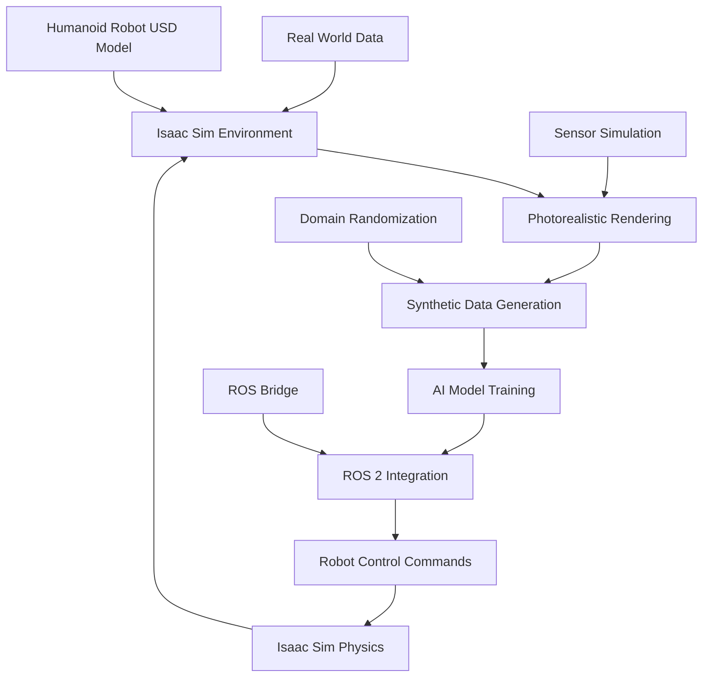

# Week 6: Isaac Sim Fundamentals

This week introduces NVIDIA Isaac Sim, a powerful robotics simulation application based on NVIDIA Omniverse. You'll learn about Isaac Sim's architecture, installation, photorealistic simulation capabilities, and how to integrate it with ROS 2 for advanced humanoid robot development.

## Learning Objectives

By the end of this week, you will be able to:

- Install and configure NVIDIA Isaac Sim
- Understand Isaac Sim's architecture and Omniverse integration
- Create photorealistic simulation environments
- Generate synthetic data for AI training
- Integrate Isaac Sim with ROS 2

## 6.1 Introduction to NVIDIA Isaac Ecosystem

### Overview of Isaac Platform

The NVIDIA Isaac platform is a comprehensive solution for developing, simulating, and deploying AI-powered robots. It consists of:

- **Isaac Sim**: High-fidelity simulation environment based on Omniverse
- **Isaac ROS**: Hardware-accelerated perception and navigation packages
- **Isaac Apps**: Pre-built applications for common robotics tasks
- **Isaac Lab**: Framework for robot learning research
- **Omniverse**: NVIDIA's simulation and collaboration platform

### Isaac Sim Architecture

Isaac Sim leverages the power of NVIDIA Omniverse to provide:

- **PhysX GPU-accelerated physics**: Realistic physics simulation leveraging GPU compute
- **RTX real-time ray tracing**: Photorealistic rendering for computer vision training
- **USD (Universal Scene Description)**: Scalable scene representation and composition
- **Multi-GPU support**: Distributed simulation across multiple GPUs
- **Extension framework**: Python and C++ extensibility

## 6.2 Isaac Sim Installation and Setup

### System Requirements

**Minimum Requirements:**
- NVIDIA GPU with Compute Capability 6.0 or higher (Pascal architecture or newer)
- 8GB VRAM (16GB+ recommended for complex scenes)
- Ubuntu 20.04 LTS or 22.04 LTS
- 16GB system RAM (32GB+ recommended)
- 100GB+ free disk space

**Recommended Requirements:**
- NVIDIA RTX 3080 or higher
- 24GB+ VRAM
- 32GB+ system RAM
- NVMe SSD for fast asset loading

### Installation Process

1. **Install NVIDIA GPU Drivers**
   ```bash
   sudo apt update
   sudo apt install nvidia-driver-535
   ```

2. **Install Isaac Sim**
   - Download from NVIDIA Developer website (requires registration)
   - Extract and run the installer
   - Follow the installation wizard

3. **Verify Installation**
   ```bash
   # Launch Isaac Sim
   ./isaac-sim/python.sh

   # Or from Docker (if using containerized version)
   docker run --gpus all -it --rm \
     --net=host \
     -e "ACCEPT_EULA=Y" \
     -e "PRIVACY_CONSENT=Y" \
     nvcr.io/nvidia/isaac-sim:latest
   ```

### Initial Configuration

After installation, configure Isaac Sim for your development environment:

1. **Set up Omniverse Account**: Create an account on developer.nvidia.com
2. **Configure Extensions**: Enable necessary extensions in Window > Extensions
3. **Set up Asset Paths**: Configure paths for robot models and environments

## 6.3 Photorealistic Simulation Environments

### USD (Universal Scene Description) Fundamentals

USD is a scalable scene description format that enables:

- **Scene Composition**: Layering and combining multiple assets
- **Variant Selection**: Different configurations of the same asset
- **Animation**: Keyframe and procedural animation
- **Material Definition**: Physically-based materials (PBR)

### Creating Photorealistic Environments

```python
# Example Python script to create a photorealistic environment in Isaac Sim
import omni
from pxr import Gf, UsdGeom, Sdf, UsdLux, UsdShade
import carb

def create_photorealistic_environment():
    """Create a photorealistic indoor environment for humanoid robot simulation"""

    stage = omni.usd.get_context().get_stage()

    # Create ground plane
    ground_path = Sdf.Path("/World/ground")
    ground = UsdGeom.Mesh.Define(stage, ground_path)
    ground.CreatePointsAttr([(-10, 0, -10), (10, 0, -10), (10, 0, 10), (-10, 0, 10)])
    ground.CreateFaceVertexIndicesAttr([0, 1, 2, 0, 2, 3])
    ground.CreateFaceVertexCountsAttr([3, 3])

    # Create photorealistic material
    material_path = Sdf.Path("/World/Looks/ground_material")
    material = UsdShade.Material.Define(stage, material_path)

    # Add PBR shader
    shader_path = Sdf.Path("/World/Shaders/ground_shader")
    shader = UsdShade.Shader.Define(stage, shader_path)
    shader.CreateIdAttr("OmniPBR")

    # Set realistic material properties
    shader.CreateInput("diffuse_color", Sdf.ValueTypeNames.Color3f).Set((0.7, 0.7, 0.7))
    shader.CreateInput("roughness", Sdf.ValueTypeNames.Float).Set(0.3)
    shader.CreateInput("metallic", Sdf.ValueTypeNames.Float).Set(0.0)

    material.CreateSurfaceOutput().ConnectToSource(shader.ConnectableAPI(), "out")

    # Bind material to ground
    UsdShade.MaterialBindingAPI(ground).Bind(material)

    # Add dome light for realistic illumination
    dome_light_path = Sdf.Path("/World/domeLight")
    dome_light = UsdLux.DomeLight.Define(stage, dome_light_path)
    dome_light.CreateIntensityAttr(1000)
    dome_light.CreateTextureFileAttr("path/to/hdri/environment.hdr")

    print("Photorealistic environment created successfully!")

# Execute the function
create_photorealistic_environment()
```

### Lighting and Environment Setup

```python
def setup_advanced_lighting():
    """Set up advanced lighting for photorealistic rendering"""

    stage = omni.usd.get_context().get_stage()

    # Create multiple light sources for realistic illumination
    # Key light (main light source)
    key_light = UsdLux.DistantLight.Define(stage, Sdf.Path("/World/keyLight"))
    key_light.CreateIntensityAttr(3000)
    key_light.CreateColorAttr(Gf.Vec3f(1.0, 0.98, 0.9))
    key_light.AddRotateXOp().Set(-45)
    key_light.AddRotateYOp().Set(30)

    # Fill light (softens shadows)
    fill_light = UsdLux.DistantLight.Define(stage, Sdf.Path("/World/fillLight"))
    fill_light.CreateIntensityAttr(1000)
    fill_light.CreateColorAttr(Gf.Vec3f(0.9, 0.95, 1.0))
    fill_light.AddRotateXOp().Set(-20)
    fill_light.AddRotateYOp().Set(-60)

    # Rim light (separates subject from background)
    rim_light = UsdLux.DistantLight.Define(stage, Sdf.Path("/World/rimLight"))
    rim_light.CreateIntensityAttr(1500)
    rim_light.CreateColorAttr(Gf.Vec3f(0.95, 1.0, 0.98))
    rim_light.AddRotateXOp().Set(-60)
    rim_light.AddRotateYOp().Set(120)

    print("Advanced lighting setup completed!")
```

## 6.4 Synthetic Data Generation

### Domain Randomization

Domain randomization is a technique used to generate diverse training data by varying environmental parameters:

```python
import random

def apply_domain_randomization():
    """Apply domain randomization to create diverse training data"""

    # Randomize lighting conditions
    def randomize_lighting():
        stage = omni.usd.get_context().get_stage()

        # Randomize key light properties
        key_light = UsdLux.DistantLight.Get(stage, Sdf.Path("/World/keyLight"))
        if key_light:
            # Random intensity (1000-5000)
            intensity = random.uniform(1000, 5000)
            key_light.GetIntensityAttr().Set(intensity)

            # Random color temperature (warm to cool)
            color_temp = random.uniform(0.8, 1.2)
            base_color = Gf.Vec3f(1.0, 0.98, 0.9)  # Slightly warm
            randomized_color = Gf.Vec3f(
                min(1.0, base_color[0] * color_temp),
                min(1.0, base_color[1] * color_temp),
                min(1.0, base_color[2] * color_temp)
            )
            key_light.GetColorAttr().Set(randomized_color)

    # Randomize material properties
    def randomize_materials():
        stage = omni.usd.get_context().get_stage()

        # Example: Randomize ground material roughness
        material = UsdShade.Material.Get(stage, Sdf.Path("/World/Looks/ground_material"))
        if material:
            shader = material.GetSurfaceOutput().GetConnectedSource().GetPrim()
            if shader:
                # Random roughness (0.1-0.8)
                roughness = random.uniform(0.1, 0.8)
                shader.GetPrim().GetAttribute("inputs:roughness").Set(roughness)

    # Randomize object positions
    def randomize_objects():
        # Example: Randomize furniture positions
        # This would involve getting references to objects and changing their transforms
        pass

    # Apply all randomizations
    randomize_lighting()
    randomize_materials()
    randomize_objects()

    print("Domain randomization applied!")

# Example of generating multiple variations
def generate_training_variations(num_variations=100):
    """Generate multiple scene variations for training data"""

    for i in range(num_variations):
        # Apply domain randomization
        apply_domain_randomization()

        # Capture synthetic data
        capture_synthetic_data(f"variation_{i:03d}")

        print(f"Generated variation {i+1}/{num_variations}")

def capture_synthetic_data(variation_name):
    """Capture synthetic data for training"""
    # This would involve:
    # 1. Rendering RGB images
    # 2. Generating depth maps
    # 3. Creating segmentation masks
    # 4. Capturing pose information
    pass
```

### Sensor Data Generation

```python
from omni.isaac.sensor import Camera
import numpy as np

def setup_synthetic_sensors():
    """Set up synthetic sensors for data generation"""

    # Create RGB camera
    camera = Camera(
        prim_path="/World/Robot/sensors/camera",
        frequency=30,
        resolution=(640, 480)
    )

    # Configure camera properties for photorealistic rendering
    camera.post_process_lights = True
    camera.focal_length = 24.0  # mm
    camera.focus_distance = 100.0  # cm
    camera.f_stop = 1.4

    # Create depth sensor
    depth_camera = Camera(
        prim_path="/World/Robot/sensors/depth_camera",
        frequency=30,
        resolution=(640, 480)
    )

    # Enable depth data generation
    depth_camera.add_ground_truth_to_frame({"/World/GroundTruth/depth"})

    # Create semantic segmentation sensor
    segmentation_camera = Camera(
        prim_path="/World/Robot/sensors/segmentation_camera",
        frequency=30,
        resolution=(640, 480)
    )

    # Enable semantic segmentation
    segmentation_camera.add_ground_truth_to_frame({"/World/GroundTruth/semantic"})

    print("Synthetic sensors configured for data generation!")

def generate_synthetic_dataset():
    """Generate a complete synthetic dataset"""

    # Setup sensors
    setup_synthetic_sensors()

    # Define data collection parameters
    num_episodes = 1000
    frames_per_episode = 300  # 10 seconds at 30 FPS

    for episode in range(num_episodes):
        # Randomize environment
        apply_domain_randomization()

        for frame in range(frames_per_episode):
            # Step simulation
            omni.timeline.get_timeline_interface().play()

            # Capture all sensor data
            rgb_data = capture_rgb_image()
            depth_data = capture_depth_data()
            segmentation_data = capture_segmentation_data()

            # Save data with appropriate annotations
            save_training_data(rgb_data, depth_data, segmentation_data, episode, frame)

        print(f"Completed episode {episode+1}/{num_episodes}")

    print("Synthetic dataset generation completed!")

def capture_rgb_image():
    """Capture RGB image from synthetic camera"""
    # Implementation would capture rendered image
    return np.random.rand(480, 640, 3)  # Placeholder

def capture_depth_data():
    """Capture depth data from synthetic depth sensor"""
    # Implementation would capture depth information
    return np.random.rand(480, 640)  # Placeholder

def capture_segmentation_data():
    """Capture semantic segmentation data"""
    # Implementation would capture segmentation masks
    return np.random.randint(0, 10, (480, 640))  # Placeholder

def save_training_data(rgb, depth, segmentation, episode, frame):
    """Save captured data for training"""
    # Implementation would save data in appropriate format
    pass
```

## 6.5 Integration with ROS 2

### Isaac Sim ROS Bridge

Isaac Sim provides seamless integration with ROS 2 through the Isaac ROS bridge:

```python
# Example: ROS 2 publisher for Isaac Sim data
import rclpy
from rclpy.node import Node
from sensor_msgs.msg import Image, CameraInfo, PointCloud2
from geometry_msgs.msg import Twist
import numpy as np

class IsaacSimROSBridge(Node):
    def __init__(self):
        super().__init__('isaac_sim_ros_bridge')

        # Publishers for different sensor types
        self.rgb_pub = self.create_publisher(Image, '/isaac_sim/camera/rgb', 10)
        self.depth_pub = self.create_publisher(Image, '/isaac_sim/camera/depth', 10)
        self.cmd_vel_sub = self.create_subscription(
            Twist, '/cmd_vel', self.cmd_vel_callback, 10
        )

        # Timer for publishing sensor data
        self.timer = self.create_timer(0.033, self.publish_sensor_data)  # ~30 Hz

        self.get_logger().info('Isaac Sim ROS Bridge initialized')

    def cmd_vel_callback(self, msg):
        """Handle velocity commands from ROS 2"""
        # This would interface with the robot in Isaac Sim
        linear_vel = msg.linear.x
        angular_vel = msg.angular.z

        # Apply the command to the simulated robot
        self.apply_robot_command(linear_vel, angular_vel)

    def apply_robot_command(self, linear_vel, angular_vel):
        """Apply command to simulated robot in Isaac Sim"""
        # Implementation would interface with Isaac Sim physics
        pass

    def publish_sensor_data(self):
        """Publish sensor data from Isaac Sim to ROS 2"""
        # Get sensor data from Isaac Sim
        rgb_image = self.get_rgb_image()
        depth_image = self.get_depth_image()

        # Convert to ROS 2 Image messages
        rgb_msg = self.convert_to_ros_image(rgb_image, 'rgb8')
        depth_msg = self.convert_to_ros_image(depth_image, '32FC1')

        # Publish messages
        self.rgb_pub.publish(rgb_msg)
        self.depth_pub.publish(depth_msg)

    def get_rgb_image(self):
        """Get RGB image from Isaac Sim camera"""
        # Implementation would get image from Isaac Sim
        return np.random.randint(0, 255, (480, 640, 3), dtype=np.uint8)

    def get_depth_image(self):
        """Get depth image from Isaac Sim depth sensor"""
        # Implementation would get depth from Isaac Sim
        return np.random.random((480, 640)).astype(np.float32)

    def convert_to_ros_image(self, image_array, encoding):
        """Convert numpy array to ROS Image message"""
        from sensor_msgs.msg import Image
        import numpy as np

        msg = Image()
        msg.height = image_array.shape[0]
        msg.width = image_array.shape[1]
        msg.encoding = encoding
        msg.is_bigendian = False
        msg.step = image_array.shape[1] * image_array.dtype.itemsize

        if len(image_array.shape) == 3:
            msg.step = image_array.shape[1] * image_array.shape[2]

        msg.data = image_array.tobytes()
        return msg

def main(args=None):
    rclpy.init(args=args)
    bridge = IsaacSimROSBridge()
    rclpy.spin(bridge)
    bridge.destroy_node()
    rclpy.shutdown()

if __name__ == '__main__':
    main()
```

### Loading Robots into Isaac Sim

```python
def load_humanoid_robot_to_isaac_sim(urdf_path, position=(0, 0, 1), orientation=(0, 0, 0, 1)):
    """Load a humanoid robot from URDF into Isaac Sim"""

    # Isaac Sim can import URDF files directly
    from omni.isaac.core.utils.nucleus import get_assets_root_path
    from omni.isaac.core.utils.stage import add_reference_to_stage

    # Method 1: Direct URDF import (if supported)
    try:
        # Import URDF directly
        robot_path = add_reference_to_stage(
            usd_path=urdf_path,
            prim_path="/World/Robot"
        )

        # Set initial position and orientation
        from omni.isaac.core.utils.transformations import set_world_translation, set_world_rotation
        set_world_translation(np.array(position), robot_path)
        set_world_rotation(np.array(orientation), robot_path)

    except Exception as e:
        print(f"Direct URDF import failed: {e}")
        print("Consider converting URDF to USD format first")

    # Method 2: Using Omniverse Asset Converter
    # This would involve converting URDF to USD format first

    print(f"Humanoid robot loaded from {urdf_path}")

def setup_robot_controllers(robot_prim_path):
    """Setup controllers for the humanoid robot in Isaac Sim"""

    # Import Isaac Sim's controller modules
    from omni.isaac.core.utils.types import ArticulationAction
    from omni.isaac.core.articulations import Articulation

    # Get the robot articulation
    robot = Articulation(prim_path=robot_prim_path)

    # Setup joint position controllers
    joint_names = robot.dof_names  # Get all joint names

    print(f"Robot has {len(joint_names)} joints: {joint_names}")

    # Example: Set up position control for all joints
    for joint_name in joint_names:
        # Configure joint for position control
        pass

    return robot
```

## 6.6 Practical Exercise: Loading a Humanoid Robot in Isaac Sim

Let's create a complete example of setting up a humanoid robot in Isaac Sim:

### Complete Setup Script

```python
# main_isaac_sim_setup.py
import omni
from omni.isaac.core import World
from omni.isaac.core.articulations import Articulation
from omni.isaac.core.utils.stage import add_reference_to_stage
from omni.isaac.core.utils.nucleus import get_assets_root_path
from omni.isaac.core.utils.viewports import set_camera_view
import numpy as np
import carb

def setup_humanoid_simulation():
    """Complete setup for humanoid robot simulation in Isaac Sim"""

    # Create world instance
    world = World(stage_units_in_meters=1.0)

    # Set up camera view
    set_camera_view(eye=np.array([2.5, 2.5, 2.5]), target=np.array([0, 0, 1.0]))

    # Create ground plane
    world.scene.add_default_ground_plane()

    # Load humanoid robot (example using a simple humanoid)
    # In practice, you would load your URDF-converted robot
    asset_path = "path/to/your/humanoid_robot.usd"  # Convert URDF to USD first

    # Add robot to stage
    add_reference_to_stage(
        usd_path=asset_path,
        prim_path="/World/Robot"
    )

    # Get robot articulation
    robot = world.scene.add(
        Articulation(
            prim_path="/World/Robot",
            name="humanoid_robot",
            position=np.array([0, 0, 1.0]),
            orientation=np.array([1, 0, 0, 0])
        )
    )

    # Reset the world to initialize everything
    world.reset()

    # Main simulation loop
    for i in range(1000):  # Run for 1000 steps
        # Get robot joint positions
        joint_positions = robot.get_joint_positions()

        # Apply some simple control (e.g., move arms)
        if i > 100:  # Wait for initialization
            # Example: Simple joint position control
            target_positions = np.zeros_like(joint_positions)
            # Set some target positions for demonstration
            target_positions[:len(target_positions)//2] = 0.1 * np.sin(i * 0.01)

            robot.apply_articulation_actions(
                ArticulationAction(joint_positions=target_positions)
            )

        world.step(render=True)

        if i % 100 == 0:
            print(f"Simulation step: {i}")

    # Cleanup
    world.clear()
    print("Humanoid simulation completed!")

# Execute the setup
if __name__ == "__main__":
    setup_humanoid_simulation()
```

## 6.7 Flowchart: Isaac Simulation and ROS Integration Pipeline



## Summary

This week covered the fundamentals of NVIDIA Isaac Sim, including installation, photorealistic simulation capabilities, synthetic data generation, and ROS 2 integration. Isaac Sim provides a powerful platform for creating realistic training data and testing humanoid robots in photorealistic environments with GPU-accelerated physics and rendering.

## Next Week Preview

Next week, we'll dive deeper into Isaac ROS packages, focusing on VSLAM (Visual Simultaneous Localization and Mapping) and perception pipelines for humanoid robots.