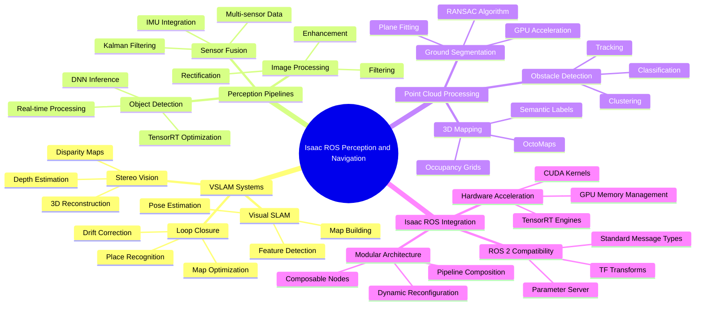

# Week 7: Isaac ROS Packages

This week focuses on Isaac ROS packages, which provide hardware-accelerated perception and navigation capabilities for robotics applications. You'll learn about VSLAM (Visual Simultaneous Localization and Mapping), perception pipelines, sensor fusion, and point cloud processing for humanoid robots.

## Learning Objectives

By the end of this week, you will be able to:

- Understand Isaac ROS package architecture and capabilities
- Implement VSLAM for humanoid robot localization and mapping
- Create perception pipelines using Isaac ROS packages
- Process point clouds and perform sensor fusion
- Integrate Isaac ROS with existing ROS 2 systems

## 7.1 Understanding Isaac ROS Package Architecture

### Overview of Isaac ROS

Isaac ROS is a collection of hardware-accelerated packages that leverage NVIDIA's GPU computing capabilities to accelerate robotics perception and navigation tasks. Key features include:

- **CUDA acceleration**: GPU-accelerated algorithms for real-time performance
- **TensorRT optimization**: Optimized neural network inference
- **Hardware integration**: Direct integration with NVIDIA hardware
- **ROS 2 compatibility**: Standard ROS 2 interfaces and message types
- **Modular design**: Independent, composable packages

### Core Isaac ROS Packages

1. **Isaac ROS Visual SLAM**: GPU-accelerated visual SLAM
2. **Isaac ROS Stereo Dense Reconstruction**: 3D reconstruction from stereo cameras
3. **Isaac ROS AprilTag**: High-performance AprilTag detection
4. **Isaac ROS DNN Inference**: GPU-accelerated deep learning inference
5. **Isaac ROS Image Pipeline**: Hardware-accelerated image processing
6. **Isaac ROS Point Cloud**: GPU-accelerated point cloud operations
7. **Isaac ROS ISAAC ROS Manipulator**: GPU-accelerated manipulation algorithms

### Package Dependencies and Requirements

```yaml
# Example Isaac ROS package dependencies
dependencies:
  - nvidia-isaa-ros-visual-slam
  - nvidia-isaac-ros-point-cloud
  - nvidia-isaac-ros-dnn-inference
  - nvidia-isaac-ros-apriltag
  - nvidia-isaac-ros-image-pipeline
```

## 7.2 VSLAM Implementation for Localization and Mapping

### Visual SLAM Fundamentals

Visual SLAM (Simultaneous Localization and Mapping) enables robots to construct a map of an unknown environment while simultaneously keeping track of their location within that map using visual sensors.

### Isaac ROS Visual SLAM Setup

```python
import rclpy
from rclpy.node import Node
from sensor_msgs.msg import Image, CameraInfo
from geometry_msgs.msg import PoseStamped
from nav_msgs.msg import Odometry
import cv2
import numpy as np

class IsaacVSLAMNode(Node):
    def __init__(self):
        super().__init__('isaac_vsalm_node')

        # Publishers for VSLAM outputs
        self.odom_pub = self.create_publisher(Odometry, '/visual_odom', 10)
        self.pose_pub = self.create_publisher(PoseStamped, '/visual_pose', 10)
        self.map_pub = self.create_publisher(OccupancyGrid, '/visual_map', 10)

        # Subscribers for camera data
        self.left_image_sub = self.create_subscription(
            Image, '/camera/left/image_rect_color', self.left_image_callback, 10
        )
        self.right_image_sub = self.create_subscription(
            Image, '/camera/right/image_rect_color', self.right_image_callback, 10
        )
        self.left_info_sub = self.create_subscription(
            CameraInfo, '/camera/left/camera_info', self.left_info_callback, 10
        )
        self.right_info_sub = self.create_subscription(
            CameraInfo, '/camera/right/camera_info', self.right_info_callback, 10
        )

        # Initialize VSLAM algorithm
        self.initialize_vsalm()

        self.get_logger().info('Isaac ROS VSLAM node initialized')

    def initialize_vsalm(self):
        """Initialize the VSLAM algorithm with Isaac optimizations"""
        # This would typically interface with Isaac ROS Visual SLAM
        # which uses CUDA and TensorRT for acceleration
        self.vsalm_initialized = True
        self.camera_matrix = None
        self.distortion_coeffs = None
        self.previous_frame = None
        self.current_pose = np.eye(4)  # 4x4 transformation matrix

    def left_info_callback(self, msg):
        """Process left camera calibration info"""
        self.camera_matrix = np.array(msg.k).reshape(3, 3)
        self.distortion_coeffs = np.array(msg.d)

    def right_info_callback(self, msg):
        """Process right camera calibration info"""
        # Stereo calibration data for depth estimation
        pass

    def left_image_callback(self, msg):
        """Process left camera image for VSLAM"""
        # Convert ROS image to OpenCV format
        image = self.ros_image_to_cv2(msg)

        # Process with Isaac ROS Visual SLAM
        if self.vsalm_initialized:
            pose_update = self.process_vsalm_frame(image)
            if pose_update is not None:
                self.publish_odometry(pose_update)

    def right_image_callback(self, msg):
        """Process right camera image for stereo depth"""
        # Convert ROS image to OpenCV format
        image = self.ros_image_to_cv2(msg)

        # Use for stereo depth estimation with left image
        if self.previous_frame is not None:
            depth_map = self.compute_stereo_depth(self.previous_frame, image)
            # Process depth for 3D mapping

    def process_vsalm_frame(self, current_frame):
        """Process a frame through VSLAM algorithm"""
        if self.previous_frame is None:
            self.previous_frame = current_frame
            return None

        # Feature detection and matching (GPU accelerated in Isaac ROS)
        # This is a simplified representation - Isaac ROS does this much faster
        kp1, desc1 = self.extract_features(self.previous_frame)
        kp2, desc2 = self.extract_features(current_frame)

        # Match features
        matches = self.match_features(desc1, desc2)

        if len(matches) >= 10:  # Minimum matches for reliable pose estimation
            # Estimate pose change
            pose_change = self.estimate_pose_change(kp1, kp2, matches)

            # Update current pose
            self.current_pose = self.update_pose(self.current_pose, pose_change)

            # Update previous frame
            self.previous_frame = current_frame

            return self.current_pose
        else:
            self.previous_frame = current_frame
            return None

    def extract_features(self, image):
        """Extract features from image (GPU accelerated in Isaac ROS)"""
        # In Isaac ROS, this would use GPU-accelerated feature extraction
        gray = cv2.cvtColor(image, cv2.COLOR_BGR2GRAY)

        # Using ORB as example (Isaac ROS uses optimized versions)
        orb = cv2.ORB_create()
        kp, desc = orb.detectAndCompute(gray, None)

        return kp, desc

    def match_features(self, desc1, desc2):
        """Match features between two frames (GPU accelerated in Isaac ROS)"""
        # In Isaac ROS, this uses GPU-accelerated matching
        bf = cv2.BFMatcher(cv2.NORM_HAMMING, crossCheck=True)
        matches = bf.match(desc1, desc2)
        matches = sorted(matches, key=lambda x: x.distance)

        return matches

    def estimate_pose_change(self, kp1, kp2, matches):
        """Estimate pose change from matched features"""
        if len(matches) >= 10:
            src_pts = np.float32([kp1[m.queryIdx].pt for m in matches]).reshape(-1, 1, 2)
            dst_pts = np.float32([kp2[m.trainIdx].pt for m in matches]).reshape(-1, 1, 2)

            # Estimate essential matrix
            E, mask = cv2.findEssentialMat(src_pts, dst_pts, self.camera_matrix,
                                          method=cv2.RANSAC, prob=0.999, threshold=1.0)

            if E is not None:
                # Decompose essential matrix to get rotation and translation
                _, R, t, _ = cv2.recoverPose(E, src_pts, dst_pts, self.camera_matrix)

                # Create transformation matrix
                pose_change = np.eye(4)
                pose_change[:3, :3] = R
                pose_change[:3, 3] = t.flatten()

                return pose_change

        return np.eye(4)

    def update_pose(self, current_pose, pose_change):
        """Update the current pose with the pose change"""
        return np.dot(current_pose, pose_change)

    def compute_stereo_depth(self, left_img, right_img):
        """Compute depth map from stereo images (GPU accelerated in Isaac ROS)"""
        # In Isaac ROS, this uses GPU-accelerated stereo matching
        gray_left = cv2.cvtColor(left_img, cv2.COLOR_BGR2GRAY)
        gray_right = cv2.cvtColor(right_img, cv2.COLOR_BGR2GRAY)

        # Using SGBM as example (Isaac ROS uses optimized versions)
        stereo = cv2.StereoSGBM_create(
            minDisparity=0,
            numDisparities=16*10,  # Must be divisible by 16
            blockSize=5,
            P1=8 * 3 * 5**2,
            P2=32 * 3 * 5**2,
            disp12MaxDiff=1,
            uniquenessRatio=15,
            speckleWindowSize=0,
            speckleRange=2,
            preFilterCap=63,
            mode=cv2.STEREO_SGBM_MODE_SGBM_3WAY
        )

        disparity = stereo.compute(gray_left, gray_right).astype(np.float32) / 16.0
        return disparity

    def publish_odometry(self, pose):
        """Publish odometry information"""
        odom_msg = Odometry()
        odom_msg.header.stamp = self.get_clock().now().to_msg()
        odom_msg.header.frame_id = 'odom'
        odom_msg.child_frame_id = 'base_link'

        # Convert transformation matrix to pose
        odom_msg.pose.pose.position.x = pose[0, 3]
        odom_msg.pose.pose.position.y = pose[1, 3]
        odom_msg.pose.pose.position.z = pose[2, 3]

        # Convert rotation matrix to quaternion
        rotation_matrix = pose[:3, :3]
        quat = self.rotation_matrix_to_quaternion(rotation_matrix)
        odom_msg.pose.pose.orientation.x = quat[0]
        odom_msg.pose.pose.orientation.y = quat[1]
        odom_msg.pose.pose.orientation.z = quat[2]
        odom_msg.pose.pose.orientation.w = quat[3]

        self.odom_pub.publish(odom_msg)

    def rotation_matrix_to_quaternion(self, R):
        """Convert rotation matrix to quaternion"""
        trace = np.trace(R)
        if trace > 0:
            s = np.sqrt(trace + 1.0) * 2  # s = 4 * qw
            qw = 0.25 * s
            qx = (R[2, 1] - R[1, 2]) / s
            qy = (R[0, 2] - R[2, 0]) / s
            qz = (R[1, 0] - R[0, 1]) / s
        else:
            if R[0, 0] > R[1, 1] and R[0, 0] > R[2, 2]:
                s = np.sqrt(1.0 + R[0, 0] - R[1, 1] - R[2, 2]) * 2
                qw = (R[2, 1] - R[1, 2]) / s
                qx = 0.25 * s
                qy = (R[0, 1] + R[1, 0]) / s
                qz = (R[0, 2] + R[2, 0]) / s
            elif R[1, 1] > R[2, 2]:
                s = np.sqrt(1.0 + R[1, 1] - R[0, 0] - R[2, 2]) * 2
                qw = (R[0, 2] - R[2, 0]) / s
                qx = (R[0, 1] + R[1, 0]) / s
                qy = 0.25 * s
                qz = (R[1, 2] + R[2, 1]) / s
            else:
                s = np.sqrt(1.0 + R[2, 2] - R[0, 0] - R[1, 1]) * 2
                qw = (R[1, 0] - R[0, 1]) / s
                qx = (R[0, 2] + R[2, 0]) / s
                qy = (R[1, 2] + R[2, 1]) / s
                qz = 0.25 * s

        return [qx, qy, qz, qw]

    def ros_image_to_cv2(self, ros_image):
        """Convert ROS Image message to OpenCV image"""
        import numpy as np
        dtype = np.uint8
        if ros_image.encoding == "rgb8":
            dtype = np.uint8
            n_channels = 3
        elif ros_image.encoding == "rgba8":
            dtype = np.uint8
            n_channels = 4
        elif ros_image.encoding == "mono8":
            dtype = np.uint8
            n_channels = 1
        elif ros_image.encoding == "32FC1":
            dtype = np.float32
            n_channels = 1

        img_buf = np.asarray(ros_image.data, dtype=dtype)
        if n_channels == 1:
            cv2_img = img_buf.reshape(ros_image.height, ros_image.width)
        else:
            cv2_img = img_buf.reshape(ros_image.height, ros_image.width, n_channels)

        # Convert RGB to BGR if needed
        if ros_image.encoding.startswith("rgb"):
            cv2_img = cv2.cvtColor(cv2_img, cv2.COLOR_RGB2BGR)

        return cv2_img

def main(args=None):
    rclpy.init(args=args)
    node = IsaacVSLAMNode()
    rclpy.spin(node)
    node.destroy_node()
    rclpy.shutdown()

if __name__ == '__main__':
    main()
```

### Launch File for VSLAM

```xml
<!-- isaac_vsalm.launch.py -->
from launch import LaunchDescription
from launch_ros.actions import Node
from launch.actions import DeclareLaunchArgument
from launch.substitutions import LaunchConfiguration
from ament_index_python.packages import get_package_share_directory
import os

def generate_launch_description():
    # Launch arguments
    namespace = LaunchConfiguration('namespace')
    use_sim_time = LaunchConfiguration('use_sim_time')

    declare_namespace_cmd = DeclareLaunchArgument(
        'namespace',
        default_value='',
        description='Top-level namespace'
    )

    declare_use_sim_time_cmd = DeclareLaunchArgument(
        'use_sim_time',
        default_value='false',
        description='Use simulation (Gazebo) clock if true'
    )

    # Isaac ROS Visual SLAM node
    vsalm_node = Node(
        package='nvidia_isaac_ros_visual_slam',
        executable='visual_slam_node',
        name='visual_slam',
        parameters=[{
            'use_sim_time': use_sim_time,
            'enable_observations_view': True,
            'enable_slam_visualization': True,
            'enable_landmarks_view': True,
            'map_frame': 'map',
            'odom_frame': 'odom',
            'base_frame': 'base_link',
            'sub_camera_info0_topic_name': 'camera_info',
            'sub_image0_topic_name': 'image_rect_color',
            'enable_imu': False,  # Set to true if using IMU data
        }],
        remappings=[
            ('/visual_slam/image_rect_color', '/camera/image_rect_color'),
            ('/visual_slam/camera_info', '/camera/camera_info'),
        ]
    )

    # Create the launch description
    ld = LaunchDescription()

    # Declare launch options
    ld.add_action(declare_namespace_cmd)
    ld.add_action(declare_use_sim_time_cmd)

    # Add nodes
    ld.add_action(vsalm_node)

    return ld
```

## 7.3 Perception Pipelines and Sensor Fusion

### Isaac ROS Image Pipeline

The Isaac ROS Image Pipeline provides hardware-accelerated image processing:

```python
import rclpy
from rclpy.node import Node
from sensor_msgs.msg import Image, CameraInfo
from isaac_ros_managed_nitros_bridge_interfaces.msg import IsaacROSManagedNitrosBridge
from cv_bridge import CvBridge
import cv2
import numpy as np

class IsaacPerceptionPipeline(Node):
    def __init__(self):
        super().__init__('isaac_perception_pipeline')

        # Initialize CV bridge
        self.cv_bridge = CvBridge()

        # Image subscribers
        self.image_sub = self.create_subscription(
            Image, '/camera/image_raw', self.image_callback, 10
        )

        # Publishers for processed data
        self.detection_pub = self.create_publisher(Image, '/detections', 10)
        self.feature_pub = self.create_publisher(Image, '/features', 10)
        self.depth_pub = self.create_publisher(Image, '/depth', 10)

        # Initialize perception modules
        self.initialize_perception_modules()

        self.get_logger().info('Isaac Perception Pipeline initialized')

    def initialize_perception_modules(self):
        """Initialize different perception modules"""
        # Feature detection module
        self.feature_detector = cv2.ORB_create(nfeatures=1000)

        # Object detection module (would use Isaac ROS DNN Inference)
        # Initialize TensorRT engine for object detection
        self.object_detection_model = None  # Placeholder for TensorRT model

        # Initialize for depth processing if available
        self.depth_enabled = False

    def image_callback(self, msg):
        """Process incoming image through perception pipeline"""
        try:
            # Convert ROS image to OpenCV
            cv_image = self.cv_bridge.imgmsg_to_cv2(msg, desired_encoding='bgr8')

            # Process through different perception modules
            processed_image = self.process_perception_pipeline(cv_image)

            # Publish results
            self.publish_perception_results(processed_image, msg.header)

        except Exception as e:
            self.get_logger().error(f'Error processing image: {e}')

    def process_perception_pipeline(self, image):
        """Process image through complete perception pipeline"""
        # Step 1: Feature detection (GPU accelerated in Isaac ROS)
        features_img = self.detect_features(image.copy())

        # Step 2: Object detection (GPU accelerated in Isaac ROS)
        detections_img = self.detect_objects(image.copy())

        # Step 3: Combine results
        result_img = self.combine_perception_results(image, features_img, detections_img)

        return result_img

    def detect_features(self, image):
        """Detect features in image (GPU accelerated in Isaac ROS)"""
        # In Isaac ROS, this uses GPU-accelerated feature detection
        gray = cv2.cvtColor(image, cv2.COLOR_BGR2GRAY)
        keypoints = self.feature_detector.detect(gray, None)

        # Draw keypoints on image
        result_img = cv2.drawKeypoints(image, keypoints, None, color=(0, 255, 0))

        return result_img

    def detect_objects(self, image):
        """Detect objects in image using DNN (GPU accelerated in Isaac ROS)"""
        # In Isaac ROS, this uses TensorRT-accelerated inference
        result_img = image.copy()

        # Placeholder for object detection
        # In Isaac ROS, this would use nvidia_isaac_ros_dnn_inference package
        # to run optimized neural networks on GPU

        return result_img

    def combine_perception_results(self, original, features, detections):
        """Combine different perception results"""
        # Create a composite image showing all perception results
        height, width = original.shape[:2]
        composite = np.zeros((height, width*3, 3), dtype=np.uint8)

        composite[:, :width] = original
        composite[:, width:2*width] = features
        composite[:, 2*width:] = detections

        return composite

    def publish_perception_results(self, processed_image, header):
        """Publish perception results"""
        try:
            # Publish feature detection results
            feature_msg = self.cv_bridge.cv2_to_imgmsg(processed_image[:, :processed_image.shape[1]//3], encoding='bgr8')
            feature_msg.header = header
            self.feature_pub.publish(feature_msg)

            # Publish object detection results
            detection_msg = self.cv_bridge.cv2_to_imgmsg(processed_image[:, 2*processed_image.shape[1]//3:], encoding='bgr8')
            detection_msg.header = header
            self.detection_pub.publish(detection_msg)

        except Exception as e:
            self.get_logger().error(f'Error publishing perception results: {e}')

def main(args=None):
    rclpy.init(args=args)
    node = IsaacPerceptionPipeline()
    rclpy.spin(node)
    node.destroy_node()
    rclpy.shutdown()

if __name__ == '__main__':
    main()
```

### Sensor Fusion with Isaac ROS

```python
import rclpy
from rclpy.node import Node
from sensor_msgs.msg import Imu, Image, PointCloud2, LaserScan
from geometry_msgs.msg import PoseWithCovarianceStamped
from tf2_ros import TransformBroadcaster
import numpy as np
from scipy.spatial.transform import Rotation as R

class IsaacSensorFusionNode(Node):
    def __init__(self):
        super().__init__('isaac_sensor_fusion')

        # Initialize sensor data storage
        self.imu_data = None
        self.lidar_data = None
        self.camera_data = None
        self.odometry_data = None

        # Initialize pose estimates
        self.position = np.array([0.0, 0.0, 0.0])
        self.orientation = np.array([0.0, 0.0, 0.0, 1.0])  # quaternion
        self.velocity = np.array([0.0, 0.0, 0.0])
        self.angular_velocity = np.array([0.0, 0.0, 0.0])

        # Initialize covariance matrices
        self.position_cov = np.eye(3) * 0.1
        self.orientation_cov = np.eye(4) * 0.1

        # Subscribers for different sensors
        self.imu_sub = self.create_subscription(Imu, '/imu/data', self.imu_callback, 10)
        self.lidar_sub = self.create_subscription(LaserScan, '/scan', self.lidar_callback, 10)
        self.odom_sub = self.create_subscription(Odometry, '/wheel_odom', self.odom_callback, 10)

        # Publisher for fused pose
        self.pose_pub = self.create_publisher(PoseWithCovarianceStamped, '/fused_pose', 10)

        # TF broadcaster
        self.tf_broadcaster = TransformBroadcaster(self)

        # Timer for fusion updates
        self.fusion_timer = self.create_timer(0.033, self.perform_sensor_fusion)  # ~30 Hz

        self.get_logger().info('Isaac Sensor Fusion node initialized')

    def imu_callback(self, msg):
        """Process IMU data"""
        # Store IMU data for fusion
        self.imu_data = {
            'linear_acceleration': np.array([
                msg.linear_acceleration.x,
                msg.linear_acceleration.y,
                msg.linear_acceleration.z
            ]),
            'angular_velocity': np.array([
                msg.angular_velocity.x,
                msg.angular_velocity.y,
                msg.angular_velocity.z
            ]),
            'orientation': np.array([
                msg.orientation.x,
                msg.orientation.y,
                msg.orientation.z,
                msg.orientation.w
            ])
        }

    def lidar_callback(self, msg):
        """Process LIDAR data"""
        # Store LIDAR data for fusion
        self.lidar_data = {
            'ranges': np.array(msg.ranges),
            'intensities': np.array(msg.intensities),
            'angle_min': msg.angle_min,
            'angle_max': msg.angle_max,
            'angle_increment': msg.angle_increment
        }

    def odom_callback(self, msg):
        """Process odometry data"""
        # Store odometry data for fusion
        self.odometry_data = {
            'position': np.array([
                msg.pose.pose.position.x,
                msg.pose.pose.position.y,
                msg.pose.pose.position.z
            ]),
            'orientation': np.array([
                msg.pose.pose.orientation.x,
                msg.pose.pose.orientation.y,
                msg.pose.pose.orientation.z,
                msg.pose.pose.orientation.w
            ]),
            'linear_velocity': np.array([
                msg.twist.twist.linear.x,
                msg.twist.twist.linear.y,
                msg.twist.twist.linear.z
            ]),
            'angular_velocity': np.array([
                msg.twist.twist.angular.x,
                msg.twist.twist.angular.y,
                msg.twist.twist.angular.z
            ])
        }

    def perform_sensor_fusion(self):
        """Perform sensor fusion using Isaac-optimized algorithms"""
        # Initialize with odometry if available
        if self.odometry_data is not None:
            self.position = self.odometry_data['position']
            self.orientation = self.odometry_data['orientation']
            self.velocity = self.odometry_data['linear_velocity']
            self.angular_velocity = self.odometry_data['angular_velocity']

        # Fuse IMU data for orientation and angular velocity
        if self.imu_data is not None:
            # Update orientation using IMU data (complementary filter approach)
            self.orientation = self.fuse_imu_orientation(self.orientation, self.imu_data['orientation'])

            # Update angular velocity from IMU
            self.angular_velocity = self.imu_data['angular_velocity']

        # Fuse odometry and IMU for position and velocity
        if self.odometry_data is not None and self.imu_data is not None:
            # Use odometry for position with IMU correction
            self.position = self.fuse_position_with_imu(
                self.odometry_data['position'],
                self.imu_data['linear_acceleration']
            )

        # Publish fused results
        self.publish_fused_pose()

    def fuse_imu_orientation(self, current_orientation, imu_orientation):
        """Fuse current orientation with IMU orientation"""
        # In Isaac ROS, this would use optimized quaternion fusion
        # For simplicity, we'll use a basic complementary filter approach

        # Convert to rotation vectors for interpolation
        current_rot = R.from_quat(current_orientation)
        imu_rot = R.from_quat(imu_orientation)

        # Interpolate between current and IMU orientation (simple approach)
        # In Isaac ROS, this would be done with GPU-accelerated Kalman filtering
        fused_rot = current_rot  # Placeholder - would be properly fused in Isaac ROS

        return current_rot.as_quat()

    def fuse_position_with_imu(self, odometry_position, imu_acceleration):
        """Fuse odometry position with IMU acceleration"""
        # In Isaac ROS, this would use GPU-accelerated sensor fusion
        # For now, we'll return the odometry position
        return odometry_position

    def publish_fused_pose(self):
        """Publish the fused pose estimate"""
        pose_msg = PoseWithCovarianceStamped()
        pose_msg.header.stamp = self.get_clock().now().to_msg()
        pose_msg.header.frame_id = 'map'

        # Set position
        pose_msg.pose.pose.position.x = float(self.position[0])
        pose_msg.pose.pose.position.y = float(self.position[1])
        pose_msg.pose.pose.position.z = float(self.position[2])

        # Set orientation
        pose_msg.pose.pose.orientation.x = float(self.orientation[0])
        pose_msg.pose.pose.orientation.y = float(self.orientation[1])
        pose_msg.pose.pose.orientation.z = float(self.orientation[2])
        pose_msg.pose.pose.orientation.w = float(self.orientation[3])

        # Set covariance
        pose_msg.pose.covariance = np.zeros(36)  # Placeholder

        self.pose_pub.publish(pose_msg)

        # Broadcast transform
        t = TransformStamped()
        t.header.stamp = self.get_clock().now().to_msg()
        t.header.frame_id = 'map'
        t.child_frame_id = 'base_link'
        t.transform.translation.x = float(self.position[0])
        t.transform.translation.y = float(self.position[1])
        t.transform.translation.z = float(self.position[2])
        t.transform.rotation.x = float(self.orientation[0])
        t.transform.rotation.y = float(self.orientation[1])
        t.transform.rotation.z = float(self.orientation[2])
        t.transform.rotation.w = float(self.orientation[3])

        self.tf_broadcaster.sendTransform(t)

def main(args=None):
    rclpy.init(args=args)
    node = IsaacSensorFusionNode()
    rclpy.spin(node)
    node.destroy_node()
    rclpy.shutdown()

if __name__ == '__main__':
    main()
```

## 7.4 Point Cloud Processing

### Isaac ROS Point Cloud Operations

```python
import rclpy
from rclpy.node import Node
from sensor_msgs.msg import PointCloud2, PointField
from std_msgs.msg import Header
import numpy as np
import sensor_msgs_py.point_cloud2 as pc2
from visualization_msgs.msg import MarkerArray, Marker

class IsaacPointCloudProcessor(Node):
    def __init__(self):
        super().__init__('isaac_pointcloud_processor')

        # Point cloud subscriber
        self.pc_sub = self.create_subscription(
            PointCloud2, '/velodyne_points', self.pointcloud_callback, 10
        )

        # Publishers for processed data
        self.ground_pub = self.create_publisher(PointCloud2, '/ground_points', 10)
        self.obstacles_pub = self.create_publisher(PointCloud2, '/obstacle_points', 10)
        self.visualization_pub = self.create_publisher(MarkerArray, '/pointcloud_markers', 10)

        # Ground plane segmentation parameters
        self.ground_threshold = 0.2  # meters
        self.max_iterations = 100
        self.distance_threshold = 0.1

        self.get_logger().info('Isaac Point Cloud Processor initialized')

    def pointcloud_callback(self, msg):
        """Process incoming point cloud data"""
        try:
            # Convert PointCloud2 to numpy array
            points = self.pointcloud2_to_array(msg)

            if len(points) == 0:
                return

            # Segment ground plane using RANSAC (GPU accelerated in Isaac ROS)
            ground_points, obstacle_points = self.segment_ground_plane(points)

            # Publish segmented point clouds
            self.publish_segmented_pointclouds(ground_points, obstacle_points, msg.header)

            # Create visualization markers
            self.publish_visualization(ground_points, obstacle_points, msg.header)

        except Exception as e:
            self.get_logger().error(f'Error processing point cloud: {e}')

    def pointcloud2_to_array(self, cloud_msg):
        """Convert PointCloud2 message to numpy array"""
        points_list = []
        for point in pc2.read_points(cloud_msg, field_names=("x", "y", "z"), skip_nans=True):
            points_list.append([point[0], point[1], point[2]])

        return np.array(points_list)

    def segment_ground_plane(self, points):
        """Segment ground plane using RANSAC (GPU accelerated in Isaac ROS)"""
        # In Isaac ROS, this uses GPU-accelerated RANSAC
        # For this example, we'll implement a simplified version

        if len(points) < 100:
            return np.array([]), points  # Not enough points to segment

        # Simplified ground segmentation based on Z values
        # In Isaac ROS, this would use proper RANSAC plane fitting
        z_threshold = np.percentile(points[:, 2], 10) + self.ground_threshold

        ground_mask = points[:, 2] <= z_threshold
        ground_points = points[ground_mask]
        obstacle_points = points[~ground_mask]

        return ground_points, obstacle_points

    def publish_segmented_pointclouds(self, ground_points, obstacle_points, header):
        """Publish segmented point clouds"""
        # Publish ground points
        if len(ground_points) > 0:
            ground_cloud = self.array_to_pointcloud2(ground_points, header)
            self.ground_pub.publish(ground_cloud)

        # Publish obstacle points
        if len(obstacle_points) > 0:
            obstacle_cloud = self.array_to_pointcloud2(obstacle_points, header)
            self.obstacles_pub.publish(obstacle_cloud)

    def array_to_pointcloud2(self, points, header):
        """Convert numpy array to PointCloud2 message"""
        # Create PointCloud2 message
        fields = [
            PointField(name='x', offset=0, datatype=PointField.FLOAT32, count=1),
            PointField(name='y', offset=4, datatype=PointField.FLOAT32, count=1),
            PointField(name='z', offset=8, datatype=PointField.FLOAT32, count=1)
        ]

        # Convert points to list of tuples
        point_tuples = [tuple(point) for point in points]

        return pc2.create_cloud(header, fields, point_tuples)

    def publish_visualization(self, ground_points, obstacle_points, header):
        """Publish visualization markers for point clouds"""
        marker_array = MarkerArray()

        # Ground points marker
        if len(ground_points) > 0:
            ground_marker = Marker()
            ground_marker.header = header
            ground_marker.ns = "ground_points"
            ground_marker.id = 0
            ground_marker.type = Marker.SPHERE_LIST
            ground_marker.action = Marker.ADD
            ground_marker.pose.orientation.w = 1.0
            ground_marker.scale.x = 0.05
            ground_marker.scale.y = 0.05
            ground_marker.scale.z = 0.05
            ground_marker.color.r = 0.0
            ground_marker.color.g = 1.0
            ground_marker.color.b = 0.0
            ground_marker.color.a = 0.8

            for point in ground_points[:1000]:  # Limit to 1000 points for performance
                p = Point()
                p.x = float(point[0])
                p.y = float(point[1])
                p.z = float(point[2])
                ground_marker.points.append(p)

            marker_array.markers.append(ground_marker)

        # Obstacle points marker
        if len(obstacle_points) > 0:
            obstacle_marker = Marker()
            obstacle_marker.header = header
            obstacle_marker.ns = "obstacle_points"
            obstacle_marker.id = 1
            obstacle_marker.type = Marker.SPHERE_LIST
            obstacle_marker.action = Marker.ADD
            obstacle_marker.pose.orientation.w = 1.0
            obstacle_marker.scale.x = 0.05
            obstacle_marker.scale.y = 0.05
            obstacle_marker.scale.z = 0.05
            obstacle_marker.color.r = 1.0
            obstacle_marker.color.g = 0.0
            obstacle_marker.color.b = 0.0
            obstacle_marker.color.a = 0.8

            for point in obstacle_points[:1000]:  # Limit to 1000 points for performance
                p = Point()
                p.x = float(point[0])
                p.y = float(point[1])
                p.z = float(point[2])
                obstacle_marker.points.append(p)

            marker_array.markers.append(obstacle_marker)

        self.visualization_pub.publish(marker_array)

def main(args=None):
    rclpy.init(args=args)
    node = IsaacPointCloudProcessor()
    rclpy.spin(node)
    node.destroy_node()
    rclpy.shutdown()

if __name__ == '__main__':
    main()
```

## 7.5 Practical Exercise: Implementing SLAM with Isaac ROS

### Complete SLAM Implementation

Let's create a launch file that combines all Isaac ROS SLAM components:

```xml
<!-- isaac_ros_slam.launch.py -->
from launch import LaunchDescription
from launch_ros.actions import Node, ComposableNodeContainer
from launch_ros.descriptions import ComposableNode
from launch.actions import DeclareLaunchArgument
from launch.substitutions import LaunchConfiguration
from ament_index_python.packages import get_package_share_directory
import os

def generate_launch_description():
    # Launch arguments
    namespace = LaunchConfiguration('namespace')
    use_sim_time = LaunchConfiguration('use_sim_time')

    # Declare launch arguments
    declare_namespace_cmd = DeclareLaunchArgument(
        'namespace',
        default_value='',
        description='Top-level namespace'
    )

    declare_use_sim_time_cmd = DeclareLaunchArgument(
        'use_sim_time',
        default_value='false',
        description='Use simulation (Gazebo) clock if true'
    )

    # Isaac ROS Visual SLAM container
    visual_slam_container = ComposableNodeContainer(
        name='visual_slam_container',
        namespace='',
        package='rclcpp_components',
        executable='component_container_mt',
        composable_node_descriptions=[
            ComposableNode(
                package='nvidia_isaac_ros_visual_slam',
                plugin='nvidia::isaac_ros::visual_slam::VisualSlamNode',
                name='visual_slam',
                parameters=[{
                    'use_sim_time': use_sim_time,
                    'enable_observations_view': True,
                    'enable_slam_visualization': True,
                    'enable_landmarks_view': True,
                    'map_frame': 'map',
                    'odom_frame': 'odom',
                    'base_frame': 'base_link',
                    'sub_camera_info0_topic_name': 'camera_info',
                    'sub_image0_topic_name': 'image_rect_color',
                    'enable_imu': True,
                }],
                remappings=[
                    ('/visual_slam/image_rect_color', '/camera/image_rect_color'),
                    ('/visual_slam/camera_info', '/camera/camera_info'),
                    ('/visual_slam/imu', '/imu/data'),
                ]
            ),
            ComposableNode(
                package='nvidia_isaac_ros_image_proc',
                plugin='nvidia::isaac_ros::image_proc::RectifyNode',
                name='image_rectify_node',
                parameters=[{
                    'output_width': 1920,
                    'output_height': 1080,
                }],
                remappings=[
                    ('image_raw', '/camera/image_raw'),
                    ('camera_info', '/camera/camera_info'),
                    ('image_rect', '/camera/image_rect_color'),
                ]
            )
        ],
        output='screen'
    )

    # Isaac ROS Point Cloud container
    pointcloud_container = ComposableNodeContainer(
        name='pointcloud_container',
        namespace='',
        package='rclcpp_components',
        executable='component_container_mt',
        composable_node_descriptions=[
            ComposableNode(
                package='nvidia_isaac_ros_stereo_image_proc',
                plugin='nvidia::isaac_ros::stereo_image_proc::DisparityNode',
                name='disparity_node',
                parameters=[{
                    'use_sim_time': use_sim_time,
                    'output_qos': 'SENSOR_DATA',
                    'min_disparity': 0.0,
                    'max_disparity': 64.0,
                    'num_disparities': 64,
                    'stereo_algorithm': 0,  # 0 for SGM, 1 for CENSUS
                }],
                remappings=[
                    ('left/image_rect', '/camera/left/image_rect_color'),
                    ('left/camera_info', '/camera/left/camera_info'),
                    ('right/image_rect', '/camera/right/image_rect_color'),
                    ('right/camera_info', '/camera/right/camera_info'),
                ]
            ),
            ComposableNode(
                package='nvidia_isaac_ros_stereo_image_proc',
                plugin='nvidia::isaac_ros::stereo_image_proc::PointCloudNode',
                name='pointcloud_node',
                parameters=[{
                    'use_sim_time': use_sim_time,
                    'output_qos': 'SENSOR_DATA',
                    'scan_height': 1,
                }],
                remappings=[
                    ('left/image_rect', '/camera/left/image_rect_color'),
                    ('left/camera_info', '/camera/left/camera_info'),
                    ('disparity', '/disparity'),
                ]
            )
        ],
        output='screen'
    )

    # Create the launch description
    ld = LaunchDescription()

    # Declare launch options
    ld.add_action(declare_namespace_cmd)
    ld.add_action(declare_use_sim_time_cmd)

    # Add containers
    ld.add_action(visual_slam_container)
    ld.add_action(pointcloud_container)

    return ld
```

## 7.6 Mind Map: Linking AI Planning, Navigation, and Bipedal Control



## Summary

This week covered Isaac ROS packages, focusing on VSLAM, perception pipelines, sensor fusion, and point cloud processing. Isaac ROS provides hardware-accelerated algorithms that significantly improve the performance of perception and navigation tasks for humanoid robots, leveraging NVIDIA's GPU computing capabilities.

## Next Week Preview

Next week, we'll explore Nav2 integration with humanoid robots for path planning and bipedal movement control, building on the perception capabilities developed this week.