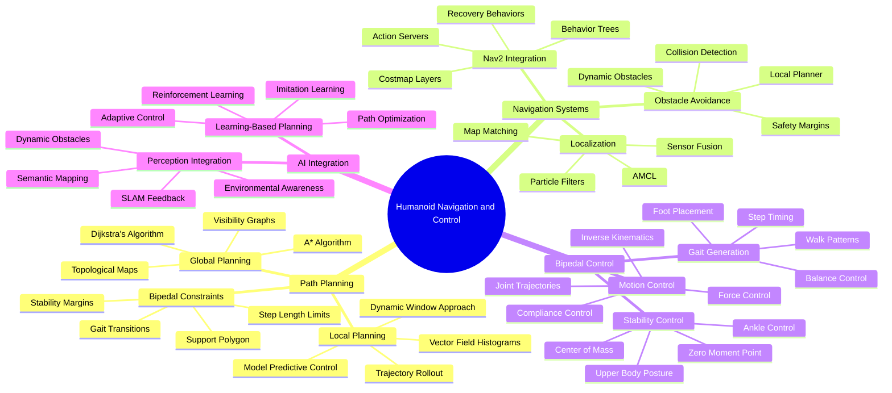

# Week 8: Navigation and Bipedal Control

This week focuses on implementing navigation and bipedal control for humanoid robots using Nav2 and specialized control algorithms. You'll learn about path planning for bipedal locomotion, obstacle avoidance, gait planning, and stability control.

## Learning Objectives

By the end of this week, you will be able to:

- Integrate Nav2 with humanoid robots for navigation
- Plan paths suitable for bipedal locomotion
- Implement obstacle avoidance in dynamic environments
- Develop gait planning and stability control algorithms
- Create complete navigation systems for humanoid robots

## 8.1 Nav2 Integration with Humanoid Robots

### Nav2 Overview for Humanoid Navigation

Navigation2 (Nav2) is the navigation stack for ROS 2, providing path planning, obstacle avoidance, and navigation capabilities. For humanoid robots, Nav2 requires special considerations due to their unique kinematics and locomotion patterns.

### Humanoid-Specific Nav2 Configuration

```yaml
# config/humanoid_nav2_params.yaml
amcl:
  ros__parameters:
    use_sim_time: True
    alpha1: 0.2
    alpha2: 0.2
    alpha3: 0.2
    alpha4: 0.2
    alpha5: 0.2
    base_frame_id: "base_footprint"  # Changed for humanoid
    beam_skip_distance: 0.5
    beam_skip_error_threshold: 0.9
    beam_skip_threshold: 0.3
    do_beamskip: false
    global_frame_id: "map"
    lambda_short: 0.1
    laser_likelihood_max_dist: 2.0
    laser_max_range: 100.0
    laser_min_range: -1.0
    laser_model_type: "likelihood_field"
    max_beams: 60
    max_particles: 2000
    min_particles: 500
    odom_frame_id: "odom"
    pf_err: 0.05
    pf_z: 0.99
    recovery_alpha_fast: 0.0
    recovery_alpha_slow: 0.0
    resample_interval: 1
    robot_model_type: "nav2_amcl::DifferentialMotionModel"
    save_pose_rate: 0.5
    sigma_hit: 0.2
    tf_broadcast: true
    transform_tolerance: 1.0
    update_min_a: 0.2
    update_min_d: 0.2
    z_hit: 0.5
    z_max: 0.05
    z_rand: 0.5
    z_short: 0.05

bt_navigator:
  ros__parameters:
    use_sim_time: True
    global_frame: "map"
    robot_base_frame: "base_footprint"  # Changed for humanoid
    odom_topic: "/odom"
    bt_loop_duration: 10
    default_server_timeout: 20
    enable_groot_monitoring: True
    groot_zmq_publisher_port: 1666
    groot_zmq_server_port: 1667
    # Specify the path where the BT XML files are located
    plugin_lib_names:
    - nav2_compute_path_to_pose_action_bt_node
    - nav2_compute_path_through_poses_action_bt_node
    - nav2_follow_path_action_bt_node
    - nav2_back_up_action_bt_node
    - nav2_spin_action_bt_node
    - nav2_wait_action_bt_node
    - nav2_clear_costmap_service_bt_node
    - nav2_is_stuck_condition_bt_node
    - nav2_have_feedback_condition_bt_node
    - nav2_have_approach_poses_condition_bt_node
    - nav2_reinitialize_global_localization_service_bt_node
    - nav2_rate_controller_bt_node
    - nav2_distance_controller_bt_node
    - nav2_speed_controller_bt_node
    - nav2_truncate_path_action_bt_node
    - nav2_truncate_path_local_action_bt_node
    - nav2_goal_updater_node_bt_node
    - nav2_recovery_node_bt_node
    - nav2_pipeline_sequence_bt_node
    - nav2_round_robin_node_bt_node
    - nav2_transform_available_condition_bt_node
    - nav2_time_expired_condition_bt_node
    - nav2_path_expiring_timer_condition
    - nav2_distance_traveled_condition_bt_node
    - nav2_single_trigger_bt_node
    - nav2_is_battery_low_condition_bt_node
    - nav2_navigate_through_poses_action_bt_node
    - nav2_navigate_to_pose_action_bt_node
    - nav2_remove_passed_goals_action_bt_node
    - nav2_planner_selector_bt_node
    - nav2_controller_selector_bt_node
    - nav2_goal_checker_selector_bt_node

controller_server:
  ros__parameters:
    use_sim_time: True
    controller_frequency: 20.0  # Lower for humanoid stability
    min_x_velocity_threshold: 0.01
    min_y_velocity_threshold: 0.01
    min_theta_velocity_threshold: 0.01
    progress_checker_plugin: "progress_checker"
    goal_checker_plugin: "goal_checker"
    controller_plugins: ["FollowPath"]

    # Humanoid-specific controller
    FollowPath:
      plugin: "nav2_mppi_controller::MPPIController"
      time_steps: 32
      model_dt: 0.05  # Adjusted for humanoid
      batch_size: 2048
      vx_std: 0.2
      vy_std: 0.25
      wz_std: 0.3
      vx_max: 0.3  # Reduced for humanoid safety
      vx_min: -0.1
      vy_max: 0.1
      wz_max: 0.3
      vx_samples: 21
      vy_samples: 11
      wz_samples: 15
      xy_goal_tolerance: 0.2
      yaw_goal_tolerance: 0.1
      state_reset_tol: 0.1
      ctrl_freq: 20.0
      prediction_time: 1.6
      transform_tolerance: 0.1
      goal_dist_tol: 0.2
      goal_angle_tol: 0.1
      motion_model: "DiffDrive"
      visualize: false
      collision_cost: 1.0
      goal_cost: 1.0
      path_cost: 0.5
      occ_cost: 0.5
      factor: 0.1

local_costmap:
  local_costmap:
    ros__parameters:
      update_frequency: 5.0
      publish_frequency: 2.0
      global_frame: "odom"
      robot_base_frame: "base_footprint"  # Changed for humanoid
      use_sim_time: True
      rolling_window: true
      width: 6
      height: 6
      resolution: 0.05  # Higher resolution for precise foot placement
      robot_radius: 0.3  # Humanoid-specific radius
      plugins: ["voxel_layer", "inflation_layer"]
      inflation_layer:
        plugin: "nav2_costmap_2d::InflationLayer"
        cost_scaling_factor: 3.0
        inflation_radius: 0.5  # Adjusted for humanoid
      voxel_layer:
        plugin: "nav2_costmap_2d::VoxelLayer"
        enabled: True
        publish_voxel_map: True
        origin_z: 0.0
        z_resolution: 0.2  # Taller voxels for humanoid
        z_voxels: 8
        max_obstacle_height: 2.0  # Humanoid height consideration
      always_send_full_costmap: True

global_costmap:
  global_costmap:
    ros__parameters:
      update_frequency: 1.0
      publish_frequency: 0.5
      global_frame: "map"
      robot_base_frame: "base_footprint"
      use_sim_time: True
      robot_radius: 0.3
      resolution: 0.05  # Higher resolution for humanoid navigation
      track_unknown_space: true
      plugins: ["static_layer", "obstacle_layer", "inflation_layer"]
      obstacle_layer:
        plugin: "nav2_costmap_2d::ObstacleLayer"
        enabled: True
        observation_sources: scan
        scan:
          topic: /scan
          max_obstacle_height: 2.0
          clearing: True
          marking: True
          data_type: "LaserScan"
      static_layer:
        plugin: "nav2_costmap_2d::StaticLayer"
        map_subscribe_transient_local: True
      inflation_layer:
        plugin: "nav2_costmap_2d::InflationLayer"
        cost_scaling_factor: 3.0
        inflation_radius: 1.0
      always_send_full_costmap: True

planner_server:
  ros__parameters:
    expected_planner_frequency: 20.0
    use_sim_time: True
    planner_plugins: ["GridBased"]
    GridBased:
      plugin: "nav2_navfn_planner::NavfnPlanner"
      tolerance: 0.5
      use_astar: false
      allow_unknown: true
```

### Humanoid Navigation Node

```python
import rclpy
from rclpy.node import Node
from nav2_msgs.action import NavigateToPose
from geometry_msgs.msg import PoseStamped, Point, Quaternion
from sensor_msgs.msg import LaserScan, Imu
from tf2_ros import TransformListener, Buffer
import tf2_geometry_msgs
import numpy as np
from scipy.spatial.transform import Rotation as R

class HumanoidNavigationNode(Node):
    def __init__(self):
        super().__init__('humanoid_navigation')

        # Initialize action client for navigation
        self.nav_to_pose_client = ActionClient(self, NavigateToPose, 'navigate_to_pose')

        # Initialize TF listener for transforms
        self.tf_buffer = Buffer()
        self.tf_listener = TransformListener(self.tf_buffer, self)

        # Subscribers
        self.imu_sub = self.create_subscription(Imu, '/imu/data', self.imu_callback, 10)
        self.scan_sub = self.create_subscription(LaserScan, '/scan', self.scan_callback, 10)

        # Navigation state
        self.current_pose = None
        self.imu_orientation = None
        self.is_stable = True
        self.step_height = 0.05  # Humanoid step height
        self.step_length = 0.3   # Humanoid step length

        # Navigation parameters
        self.min_step_distance = 0.1  # Minimum distance between steps
        self.max_step_distance = 0.5  # Maximum distance for single step

        self.get_logger().info('Humanoid Navigation Node initialized')

    def imu_callback(self, msg):
        """Process IMU data for stability control"""
        self.imu_orientation = np.array([
            msg.orientation.x,
            msg.orientation.y,
            msg.orientation.z,
            msg.orientation.w
        ])

        # Check if humanoid is stable based on IMU data
        self.check_stability()

    def scan_callback(self, msg):
        """Process laser scan for obstacle detection"""
        # Check for obstacles in the path
        self.detect_path_obstacles(msg)

    def check_stability(self):
        """Check if humanoid is stable based on IMU data"""
        if self.imu_orientation is not None:
            # Convert quaternion to Euler angles
            r = R.from_quat(self.imu_orientation)
            euler = r.as_euler('xyz', degrees=True)

            # Check if tilt angles are within safe limits
            max_tilt = 15.0  # degrees
            self.is_stable = abs(euler[0]) < max_tilt and abs(euler[1]) < max_tilt

            if not self.is_stable:
                self.get_logger().warn(f'Humanoid unstable: roll={euler[0]:.2f}, pitch={euler[1]:.2f}')

    def detect_path_obstacles(self, scan_msg):
        """Detect obstacles in the navigation path"""
        # Check if there are obstacles in the forward direction
        forward_range = len(scan_msg.ranges) // 2
        safe_distance = 0.8  # meters

        if forward_range < len(scan_msg.ranges):
            forward_obstacle = scan_msg.ranges[forward_range] < safe_distance
            if forward_obstacle:
                self.get_logger().info(f'Obstacle detected at {scan_msg.ranges[forward_range]:.2f}m ahead')

    def navigate_to_pose(self, x, y, theta):
        """Navigate humanoid to specified pose"""
        goal_msg = NavigateToPose.Goal()

        # Set the goal pose
        goal_msg.pose.header.frame_id = 'map'
        goal_msg.pose.header.stamp = self.get_clock().now().to_msg()
        goal_msg.pose.pose.position.x = float(x)
        goal_msg.pose.pose.position.y = float(y)
        goal_msg.pose.pose.position.z = 0.0

        # Convert theta (yaw) to quaternion
        quat = self.yaw_to_quaternion(theta)
        goal_msg.pose.pose.orientation.x = quat[0]
        goal_msg.pose.pose.orientation.y = quat[1]
        goal_msg.pose.pose.orientation.z = quat[2]
        goal_msg.pose.pose.orientation.w = quat[3]

        # Wait for action server
        self.nav_to_pose_client.wait_for_server()

        # Send navigation goal
        self._send_goal_future = self.nav_to_pose_client.send_goal_async(
            goal_msg,
            feedback_callback=self.navigation_feedback_callback
        )

        self._send_goal_future.add_done_callback(self.navigation_response_callback)

    def yaw_to_quaternion(self, yaw):
        """Convert yaw angle to quaternion"""
        cy = np.cos(yaw * 0.5)
        sy = np.sin(yaw * 0.5)
        return [0.0, 0.0, sy, cy]

    def navigation_response_callback(self, future):
        """Handle navigation response"""
        goal_handle = future.result()
        if not goal_handle.accepted:
            self.get_logger().info('Navigation goal rejected')
            return

        self.get_logger().info('Navigation goal accepted')
        self._get_result_future = goal_handle.get_result_async()
        self._get_result_future.add_done_callback(self.navigation_result_callback)

    def navigation_feedback_callback(self, feedback_msg):
        """Handle navigation feedback"""
        feedback = feedback_msg.feedback
        self.get_logger().info(f'Navigation progress: {feedback.current_pose}')

    def navigation_result_callback(self, future):
        """Handle navigation result"""
        result = future.result().result
        self.get_logger().info(f'Navigation result: {result}')

    def plan_bipedal_path(self, start_pose, goal_pose):
        """Plan a path considering bipedal locomotion constraints"""
        # This is a simplified path planner for bipedal robots
        # In practice, this would integrate with Nav2's path planning

        # Calculate straight-line path
        dx = goal_pose.position.x - start_pose.position.x
        dy = goal_pose.position.y - start_pose.position.y
        distance = np.sqrt(dx**2 + dy**2)

        # Calculate number of steps needed
        num_steps = int(distance / self.step_length) + 1

        # Generate step locations
        step_poses = []
        for i in range(1, num_steps + 1):
            ratio = i / num_steps
            step_x = start_pose.position.x + dx * ratio
            step_y = start_pose.position.y + dy * ratio

            step_pose = PoseStamped()
            step_pose.header.frame_id = 'map'
            step_pose.pose.position.x = step_x
            step_pose.pose.position.y = step_y
            step_pose.pose.position.z = 0.0  # Ground level

            # Keep orientation same as start
            step_pose.pose.orientation = start_pose.orientation

            step_poses.append(step_pose)

        return step_poses

def main(args=None):
    rclpy.init(args=args)
    node = HumanoidNavigationNode()

    # Example: Navigate to a specific pose
    node.navigate_to_pose(2.0, 2.0, 0.0)  # x=2m, y=2m, theta=0 radians

    rclpy.spin(node)
    node.destroy_node()
    rclpy.shutdown()

if __name__ == '__main__':
    main()
```

## 8.2 Path Planning for Bipedal Locomotion

### Bipedal Path Planning with Stability Constraints

```python
import numpy as np
from scipy.spatial import distance
from scipy.interpolate import interp1d
import matplotlib.pyplot as plt

class BipedalPathPlanner:
    def __init__(self, step_length=0.3, step_width=0.2, max_step_height=0.1):
        self.step_length = step_length  # Distance between consecutive steps
        self.step_width = step_width    # Lateral distance for stability
        self.max_step_height = max_step_height  # Maximum step height
        self.support_polygon_radius = 0.15  # Radius for stable support

    def plan_stable_path(self, start_pos, goal_pos, obstacles=None):
        """
        Plan a stable path for bipedal locomotion considering support polygons
        """
        # Calculate straight-line path first
        path = self.calculate_linear_path(start_pos, goal_pos)

        # Check and adjust for stability
        stable_path = self.ensure_stability(path, obstacles)

        # Generate footstep plan
        footsteps = self.generate_footsteps(stable_path)

        return footsteps

    def calculate_linear_path(self, start_pos, goal_pos, num_points=20):
        """Calculate a linear path between start and goal positions"""
        path = []
        for i in range(num_points + 1):
            ratio = i / num_points
            x = start_pos[0] + (goal_pos[0] - start_pos[0]) * ratio
            y = start_pos[1] + (goal_pos[1] - start_pos[1]) * ratio
            path.append([x, y])

        return np.array(path)

    def ensure_stability(self, path, obstacles=None):
        """Ensure the path maintains stability for bipedal locomotion"""
        if obstacles is None:
            obstacles = []

        stable_path = []

        for i, point in enumerate(path):
            # Check if point is stable
            stable_point = self.find_stable_point_nearby(point, obstacles)
            stable_path.append(stable_point)

        return np.array(stable_path)

    def find_stable_point_nearby(self, original_point, obstacles, max_search_radius=0.5):
        """Find a stable point near the original point"""
        # Check if original point is stable
        if self.is_point_stable(original_point, obstacles):
            return original_point

        # Search in a circular pattern around the original point
        search_radius = 0.1
        while search_radius <= max_search_radius:
            angles = np.linspace(0, 2*np.pi, 16, endpoint=False)
            for angle in angles:
                candidate_x = original_point[0] + search_radius * np.cos(angle)
                candidate_y = original_point[1] + search_radius * np.sin(angle)
                candidate_point = [candidate_x, candidate_y]

                if self.is_point_stable(candidate_point, obstacles):
                    return candidate_point

            search_radius += 0.1

        # If no stable point found, return original point (fallback)
        return original_point

    def is_point_stable(self, point, obstacles):
        """Check if a point is stable for foot placement"""
        # Check distance to obstacles
        for obstacle in obstacles:
            dist = distance.euclidean(point, obstacle[:2])
            if dist < 0.2:  # Minimum safe distance
                return False

        # Check if point is on traversable terrain (simplified)
        # In real implementation, this would check elevation, surface type, etc.

        return True

    def generate_footsteps(self, path):
        """Generate alternating footsteps for left and right feet"""
        footsteps = []

        # Start with left foot
        left_foot = True

        for i, point in enumerate(path):
            # For each path point, generate a footstep
            footstep = {
                'position': point.copy(),
                'foot': 'left' if left_foot else 'right',
                'step_type': 'normal',  # Could be 'step', 'stride', 'turn', etc.
                'timestamp': i * 0.5  # Assume 0.5s per step
            }
            footsteps.append(footstep)

            # Alternate feet
            left_foot = not left_foot

        return footsteps

    def optimize_footsteps(self, footsteps):
        """Optimize footsteps for energy efficiency and stability"""
        # This would implement more sophisticated optimization
        # such as minimizing energy expenditure, ensuring smooth transitions, etc.

        # For now, just return the original footsteps
        return footsteps

    def visualize_path(self, path, footsteps, obstacles=None):
        """Visualize the planned path and footsteps"""
        plt.figure(figsize=(10, 8))

        # Plot path
        path_x = [p[0] for p in path]
        path_y = [p[1] for p in path]
        plt.plot(path_x, path_y, 'b-', linewidth=2, label='Planned Path')

        # Plot footsteps
        left_x, left_y = [], []
        right_x, right_y = [], []

        for step in footsteps:
            if step['foot'] == 'left':
                left_x.append(step['position'][0])
                left_y.append(step['position'][1])
            else:
                right_x.append(step['position'][0])
                right_y.append(step['position'][1])

        plt.scatter(left_x, left_y, c='red', s=100, label='Left Foot', marker='^')
        plt.scatter(right_x, right_y, c='blue', s=100, label='Right Foot', marker='v')

        # Plot obstacles
        if obstacles is not None:
            obs_x = [obs[0] for obs in obstacles]
            obs_y = [obs[1] for obs in obstacles]
            plt.scatter(obs_x, obs_y, c='black', s=200, label='Obstacles', marker='s')

        plt.xlabel('X Position (m)')
        plt.ylabel('Y Position (m)')
        plt.title('Bipedal Path Planning')
        plt.legend()
        plt.grid(True, alpha=0.3)
        plt.axis('equal')
        plt.show()

# Example usage
def example_bipedal_planning():
    planner = BipedalPathPlanner()

    # Define start and goal positions
    start_pos = [0.0, 0.0]
    goal_pos = [5.0, 3.0]

    # Define some obstacles
    obstacles = [
        [2.0, 1.0],
        [2.5, 1.5],
        [3.0, 1.0]
    ]

    # Plan the path
    footsteps = planner.plan_stable_path(start_pos, goal_pos, obstacles)
    optimized_footsteps = planner.optimize_footsteps(footsteps)

    # Get the path points for visualization
    path = planner.calculate_linear_path(start_pos, goal_pos)

    # Visualize
    planner.visualize_path(path, optimized_footsteps, obstacles)

    # Print some information
    print(f"Planned {len(optimized_footsteps)} footsteps")
    for i, step in enumerate(optimized_footsteps[:5]):  # Print first 5 steps
        print(f"Step {i+1}: {step['foot']} foot at ({step['position'][0]:.2f}, {step['position'][1]:.2f})")

if __name__ == "__main__":
    example_bipedal_planning()
```

## 8.3 Obstacle Avoidance in Dynamic Environments

### Dynamic Obstacle Avoidance Node

```python
import rclpy
from rclpy.node import Node
from sensor_msgs.msg import LaserScan, PointCloud2
from geometry_msgs.msg import Twist, PoseStamped
from nav_msgs.msg import Path
from visualization_msgs.msg import MarkerArray
from builtin_interfaces.msg import Duration
import numpy as np
from scipy.spatial import distance
import math

class HumanoidObstacleAvoidance(Node):
    def __init__(self):
        super().__init__('humanoid_obstacle_avoidance')

        # Subscribers
        self.scan_sub = self.create_subscription(LaserScan, '/scan', self.scan_callback, 10)
        self.pointcloud_sub = self.create_subscription(PointCloud2, '/points', self.pointcloud_callback, 10)
        self.goal_sub = self.create_subscription(PoseStamped, '/move_base_simple/goal', self.goal_callback, 10)

        # Publishers
        self.cmd_vel_pub = self.create_publisher(Twist, '/cmd_vel', 10)
        self.local_plan_pub = self.create_publisher(Path, '/local_plan', 10)
        self.obstacle_markers_pub = self.create_publisher(MarkerArray, '/obstacle_markers', 10)

        # Parameters
        self.safe_distance = 0.5  # meters
        self.max_linear_vel = 0.3  # m/s for humanoid safety
        self.max_angular_vel = 0.5  # rad/s
        self.min_approach_distance = 0.8  # meters to goal
        self.horizon_distance = 2.0  # meters for local planning

        # State variables
        self.current_goal = None
        self.obstacles = []
        self.last_cmd_time = self.get_clock().now()

        # Timer for obstacle avoidance
        self.avoidance_timer = self.create_timer(0.1, self.avoidance_callback)

        self.get_logger().info('Humanoid Obstacle Avoidance Node initialized')

    def scan_callback(self, msg):
        """Process laser scan data to detect obstacles"""
        # Convert laser scan to obstacle points
        self.obstacles = self.scan_to_obstacles(msg)

    def pointcloud_callback(self, msg):
        """Process point cloud data for 3D obstacle detection"""
        # Process point cloud for additional obstacle information
        # This would be used for more complex 3D obstacle detection
        pass

    def scan_to_obstacles(self, scan_msg):
        """Convert laser scan to obstacle coordinates"""
        obstacles = []
        angle = scan_msg.angle_min

        for i, range_val in enumerate(scan_msg.ranges):
            if not (math.isnan(range_val) or math.isinf(range_val)) and range_val < self.horizon_distance:
                x = range_val * math.cos(angle)
                y = range_val * math.sin(angle)
                obstacles.append([x, y, range_val])  # x, y, distance

            angle += scan_msg.angle_increment

        return obstacles

    def goal_callback(self, msg):
        """Receive navigation goal"""
        self.current_goal = [msg.pose.position.x, msg.pose.position.y]
        self.get_logger().info(f'New goal received: ({self.current_goal[0]:.2f}, {self.current_goal[1]:.2f})')

    def avoidance_callback(self):
        """Main obstacle avoidance callback"""
        if self.current_goal is None:
            # Stop the robot if no goal
            self.stop_robot()
            return

        # Calculate direction to goal
        goal_direction = self.calculate_goal_direction()

        # Check for obstacles in the path
        if self.has_obstacles_in_path():
            # Perform obstacle avoidance
            cmd_vel = self.avoid_obstacles(goal_direction)
        else:
            # Move toward goal
            cmd_vel = self.move_toward_goal(goal_direction)

        # Publish velocity command
        self.cmd_vel_pub.publish(cmd_vel)

        # Publish visualization
        self.publish_obstacle_markers()

    def calculate_goal_direction(self):
        """Calculate direction vector to goal"""
        # This is a simplified approach - in practice, you'd get current robot pose from TF
        # For now, assume we're at origin [0, 0]
        robot_pos = [0.0, 0.0]  # This should come from localization

        dx = self.current_goal[0] - robot_pos[0]
        dy = self.current_goal[1] - robot_pos[1]

        distance_to_goal = math.sqrt(dx**2 + dy**2)
        direction = [dx/distance_to_goal, dy/distance_to_goal] if distance_to_goal > 0 else [0, 0]

        return direction, distance_to_goal

    def has_obstacles_in_path(self):
        """Check if there are obstacles blocking the path to goal"""
        # Check for obstacles in forward direction
        forward_angle_threshold = math.pi / 6  # 30 degrees cone
        min_distance = float('inf')

        for obs in self.obstacles:
            x, y, dist = obs
            angle_to_obstacle = math.atan2(y, x)

            # Check if obstacle is in forward direction
            if abs(angle_to_obstacle) < forward_angle_threshold:
                if dist < min_distance:
                    min_distance = dist

        return min_distance < self.safe_distance

    def avoid_obstacles(self, goal_direction):
        """Generate velocity commands to avoid obstacles"""
        cmd_vel = Twist()

        # Find the clearest direction
        best_direction = self.find_clearest_direction()

        # Calculate linear velocity based on obstacle clearance
        if self.is_direction_clear(best_direction):
            cmd_vel.linear.x = self.max_linear_vel * 0.5  # Reduce speed when avoiding
        else:
            cmd_vel.linear.x = 0.0

        # Calculate angular velocity to turn toward best direction
        goal_angle = math.atan2(goal_direction[0][1], goal_direction[0][0])  # Using [0] to get the direction vector
        best_angle = math.atan2(best_direction[1], best_direction[0])

        angle_diff = math.atan2(
            math.sin(best_angle - goal_angle),
            math.cos(best_angle - goal_angle)
        )

        cmd_vel.angular.z = max(-self.max_angular_vel, min(self.max_angular_vel, angle_diff * 2))

        return cmd_vel

    def find_clearest_direction(self):
        """Find the direction with maximum clearance from obstacles"""
        best_angle = 0.0
        max_clearance = 0.0

        # Sample directions
        for angle in np.linspace(-math.pi, math.pi, 32):
            clearance = self.calculate_clearance_in_direction(angle)
            if clearance > max_clearance:
                max_clearance = clearance
                best_angle = angle

        return [math.cos(best_angle), math.sin(best_angle)]

    def calculate_clearance_in_direction(self, angle):
        """Calculate clearance in a specific direction"""
        # Find obstacles in the specified direction
        direction_tolerance = math.pi / 16  # About 11.25 degrees
        min_distance = float('inf')

        for obs in self.obstacles:
            x, y, dist = obs
            obs_angle = math.atan2(y, x)

            if abs(angle - obs_angle) < direction_tolerance:
                if dist < min_distance:
                    min_distance = dist

        return min_distance if min_distance != float('inf') else self.horizon_distance

    def is_direction_clear(self, direction):
        """Check if a direction is clear of obstacles"""
        dir_angle = math.atan2(direction[1], direction[0])
        direction_tolerance = math.pi / 8  # About 22.5 degrees

        for obs in self.obstacles:
            x, y, dist = obs
            obs_angle = math.atan2(y, x)

            if abs(dir_angle - obs_angle) < direction_tolerance and dist < self.safe_distance:
                return False

        return True

    def move_toward_goal(self, goal_direction):
        """Generate velocity commands to move toward goal"""
        direction, dist_to_goal = goal_direction
        cmd_vel = Twist()

        # Adjust speed based on distance to goal
        if dist_to_goal > self.min_approach_distance:
            cmd_vel.linear.x = min(self.max_linear_vel, dist_to_goal * 0.5)
        else:
            cmd_vel.linear.x = 0.0  # Stop when close enough

        # Turn toward goal
        goal_angle = math.atan2(direction[1], direction[0])
        cmd_vel.angular.z = goal_angle * 1.0  # Proportional control

        return cmd_vel

    def stop_robot(self):
        """Stop the robot"""
        cmd_vel = Twist()
        cmd_vel.linear.x = 0.0
        cmd_vel.angular.z = 0.0
        self.cmd_vel_pub.publish(cmd_vel)

    def publish_obstacle_markers(self):
        """Publish visualization markers for obstacles"""
        marker_array = MarkerArray()

        for i, obs in enumerate(self.obstacles):
            marker = Marker()
            marker.header.frame_id = "base_link"
            marker.header.stamp = self.get_clock().now().to_msg()
            marker.ns = "obstacles"
            marker.id = i
            marker.type = Marker.SPHERE
            marker.action = Marker.ADD
            marker.pose.position.x = obs[0]
            marker.pose.position.y = obs[1]
            marker.pose.position.z = 0.0
            marker.pose.orientation.w = 1.0
            marker.scale.x = 0.1
            marker.scale.y = 0.1
            marker.scale.z = 0.1
            marker.color.r = 1.0
            marker.color.g = 0.0
            marker.color.b = 0.0
            marker.color.a = 0.8
            marker_array.markers.append(marker)

        self.obstacle_markers_pub.publish(marker_array)

def main(args=None):
    rclpy.init(args=args)
    node = HumanoidObstacleAvoidance()
    rclpy.spin(node)
    node.destroy_node()
    rclpy.shutdown()

if __name__ == '__main__':
    main()
```

## 8.4 Gait Planning and Stability Control

### Gait Planning for Humanoid Robots

```python
import numpy as np
import matplotlib.pyplot as plt
from scipy import signal
from scipy.interpolate import interp1d

class HumanoidGaitPlanner:
    def __init__(self, step_length=0.3, step_height=0.05, step_duration=0.8):
        self.step_length = step_length
        self.step_height = step_height
        self.step_duration = step_duration
        self.half_step_duration = step_duration / 2

        # Gait parameters
        self.foot_separation = 0.2  # Distance between feet in stance phase
        self.com_height = 0.8       # Center of mass height
        self.swing_apex = 0.05      # Height of foot during swing phase

    def generate_walk_trajectory(self, num_steps, direction='forward'):
        """
        Generate complete walking trajectory for humanoid
        """
        # Time vector
        total_time = num_steps * self.step_duration
        dt = 0.01  # 100 Hz
        t = np.arange(0, total_time, dt)

        # Initialize trajectories
        x_trajectory = np.zeros_like(t)
        y_trajectory = np.zeros_like(t)
        z_trajectory = np.full_like(t, self.com_height)  # Maintain CoM height initially

        # Generate step pattern
        if direction == 'forward':
            step_direction = 1
        elif direction == 'backward':
            step_direction = -1
        else:
            step_direction = 0  # In place stepping

        for i in range(num_steps):
            step_start = i * self.step_duration
            step_mid = step_start + self.half_step_duration

            # Find time indices for this step
            step_mask = (t >= step_start) & (t < step_start + self.step_duration)

            if np.any(step_mask):
                step_t = t[step_mask] - step_start

                # X trajectory - forward/backward movement
                if direction == 'forward':
                    # Smooth step function using sigmoid
                    x_progress = 1 / (1 + np.exp(-10 * (step_t / self.step_duration - 0.5)))
                    x_trajectory[step_mask] = i * self.step_length + x_progress * self.step_length
                elif direction == 'backward':
                    x_progress = 1 / (1 + np.exp(-10 * (step_t / self.step_duration - 0.5)))
                    x_trajectory[step_mask] = i * (-self.step_length) - x_progress * self.step_length

                # Y trajectory - alternating feet
                if i % 2 == 0:  # Left foot step
                    y_trajectory[step_mask] = self.foot_separation / 2
                else:  # Right foot step
                    y_trajectory[step_mask] = -self.foot_separation / 2

        return t, x_trajectory, y_trajectory, z_trajectory

    def generate_foot_trajectory(self, start_pos, goal_pos, step_type='walk'):
        """
        Generate foot trajectory for a single step
        """
        # Time vector for single step
        t = np.linspace(0, self.step_duration, int(self.step_duration / 0.01))

        # Calculate step vector
        step_vec = np.array(goal_pos) - np.array(start_pos)
        step_dist = np.linalg.norm(step_vec)

        if step_dist > 0:
            step_dir = step_vec / step_dist
        else:
            step_dir = np.array([1, 0])  # Default direction

        # Generate trajectory
        x = np.zeros_like(t)
        y = np.zeros_like(t)
        z = np.zeros_like(t)  # Foot height

        # Horizontal movement (cubic interpolation for smooth motion)
        x = start_pos[0] + step_dir[0] * self.step_length * (t / self.step_duration)
        y = start_pos[1] + step_dir[1] * self.step_length * (t / self.step_duration)

        # Vertical movement (parabolic for smooth lift and place)
        # Lift foot during first half of step, lower during second half
        for i, time in enumerate(t):
            if time < self.half_step_duration:
                # Lifting phase
                lift_ratio = time / self.half_step_duration
                z[i] = self.swing_apex * (1 - np.cos(np.pi * lift_ratio)) / 2
            else:
                # Lowering phase
                lower_ratio = (time - self.half_step_duration) / self.half_step_duration
                z[i] = self.swing_apex * (1 + np.cos(np.pi * lower_ratio)) / 2

        return t, x, y, z

    def generate_com_trajectory(self, num_steps):
        """
        Generate Center of Mass trajectory following Zero-Moment Point (ZMP) principles
        """
        total_time = num_steps * self.step_duration
        dt = 0.01
        t = np.arange(0, total_time, dt)

        # Simple inverted pendulum model for CoM
        x_com = np.zeros_like(t)
        y_com = np.zeros_like(t)

        # Add periodic CoM movement for balance
        for i in range(num_steps):
            step_start = i * self.step_duration

            step_mask = (t >= step_start) & (t < step_start + self.step_duration)

            if np.any(step_mask):
                step_t = t[step_mask] - step_start

                # Lateral CoM movement to maintain balance over support foot
                if i % 2 == 0:  # Left foot support
                    y_offset = -0.05  # Move CoM slightly toward left foot
                else:  # Right foot support
                    y_offset = 0.05   # Move CoM slightly toward right foot

                # Smooth transition of CoM position
                transition_duration = 0.1  # 100ms transition
                transition_mask = (step_t < transition_duration)

                if np.any(transition_mask):
                    # Smooth transition to new CoM position
                    smooth_transition = (1 - np.cos(np.pi * step_t[transition_mask] / transition_duration)) / 2
                    y_com[step_mask] = y_offset * smooth_transition[0]  # Hold final value
                else:
                    y_com[step_mask] = y_offset

        # Keep CoM at constant height with slight oscillation
        z_com = np.full_like(t, self.com_height) + 0.01 * np.sin(2 * np.pi * t * 2)  # Small vertical oscillation

        return t, x_com, y_com, z_com

    def generate_ankle_control_trajectory(self, num_steps):
        """
        Generate ankle control trajectory for balance
        """
        total_time = num_steps * self.step_duration
        dt = 0.01
        t = np.arange(0, total_time, dt)

        # Ankle roll and pitch for balance
        ankle_roll = np.zeros_like(t)
        ankle_pitch = np.zeros_like(t)

        # Generate balance adjustments
        for i in range(num_steps):
            step_start = i * self.step_duration
            step_mask = (t >= step_start) & (t < step_start + self.step_duration)

            if np.any(step_mask):
                step_t = t[step_mask]

                # Ankle adjustments for balance during step
                # More roll during single support phase
                if i % 2 == 0:  # Left foot support, adjust right ankle
                    ankle_roll[step_mask] = 0.1 * np.sin(2 * np.pi * (step_t - step_start) / self.step_duration)
                else:  # Right foot support, adjust left ankle
                    ankle_roll[step_mask] = -0.1 * np.sin(2 * np.pi * (step_t - step_start) / self.step_duration)

                # Pitch for forward movement
                ankle_pitch[step_mask] = 0.05 * np.sin(np.pi * (step_t - step_start) / self.step_duration)

        return t, ankle_roll, ankle_pitch

    def visualize_gait(self, t, x, y, z, title="Humanoid Gait Trajectory"):
        """Visualize the generated gait trajectory"""
        fig, (ax1, ax2, ax3) = plt.subplots(3, 1, figsize=(12, 10))

        ax1.plot(t, x, 'b-', linewidth=2, label='X Position')
        ax1.set_ylabel('X Position (m)')
        ax1.set_title(f'{title} - X Movement')
        ax1.grid(True, alpha=0.3)
        ax1.legend()

        ax2.plot(t, y, 'g-', linewidth=2, label='Y Position')
        ax2.set_ylabel('Y Position (m)')
        ax2.set_title(f'{title} - Y Movement')
        ax2.grid(True, alpha=0.3)
        ax2.legend()

        ax3.plot(t, z, 'r-', linewidth=2, label='Z Position')
        ax3.set_xlabel('Time (s)')
        ax3.set_ylabel('Z Position (m)')
        ax3.set_title(f'{title} - Z Movement')
        ax3.grid(True, alpha=0.3)
        ax3.legend()

        plt.tight_layout()
        plt.show()

# Example usage
def example_gait_planning():
    gait_planner = HumanoidGaitPlanner()

    # Generate walk trajectory for 10 steps forward
    t, x_traj, y_traj, z_traj = gait_planner.generate_walk_trajectory(10, 'forward')

    # Visualize the trajectory
    gait_planner.visualize_gait(t, x_traj, y_traj, z_traj, "Forward Walking")

    # Generate CoM trajectory
    t_com, x_com, y_com, z_com = gait_planner.generate_com_trajectory(10)
    gait_planner.visualize_gait(t_com, x_com, y_com, z_com, "Center of Mass Movement")

    # Generate ankle control trajectory
    t_ankle, roll, pitch = gait_planner.generate_ankle_control_trajectory(10)
    gait_planner.visualize_gait(t_ankle, roll, pitch, np.zeros_like(roll), "Ankle Control")

if __name__ == "__main__":
    example_gait_planning()
```

## 8.5 Practical Exercise: Autonomous Navigation for Humanoid

### Complete Humanoid Navigation System

Let's create a launch file that integrates all navigation components:

```xml
<!-- humanoid_navigation.launch.py -->
from launch import LaunchDescription
from launch_ros.actions import Node, ComposableNodeContainer
from launch_ros.descriptions import ComposableNode
from launch.actions import DeclareLaunchArgument, IncludeLaunchDescription
from launch.substitutions import LaunchConfiguration
from launch.launch_description_sources import PythonLaunchDescriptionSource
from ament_index_python.packages import get_package_share_directory
from nav2_common.launch import RewrittenYaml
import os

def generate_launch_description():
    # Launch arguments
    namespace = LaunchConfiguration('namespace')
    use_sim_time = LaunchConfiguration('use_sim_time')
    autostart = LaunchConfiguration('autostart')
    params_file = LaunchConfiguration('params_file')
    default_bt_xml_filename = LaunchConfiguration('default_bt_xml_filename')
    map_subscribe_transient_local = LaunchConfiguration('map_subscribe_transient_local')

    # Declare launch arguments
    declare_namespace_cmd = DeclareLaunchArgument(
        'namespace',
        default_value='',
        description='Top-level namespace')

    declare_use_sim_time_cmd = DeclareLaunchArgument(
        'use_sim_time',
        default_value='false',
        description='Use simulation (Gazebo) clock if true')

    declare_autostart_cmd = DeclareLaunchArgument(
        'autostart',
        default_value='true',
        description='Automatically startup the nav2 stack')

    declare_params_file_cmd = DeclareLaunchArgument(
        'params_file',
        default_value=os.path.join(get_package_share_directory('your_robot_package'),
                                   'config', 'humanoid_nav2_params.yaml'),
        description='Full path to the ROS2 parameters file to use for all launched nodes')

    declare_bt_xml_cmd = DeclareLaunchArgument(
        'default_bt_xml_filename',
        default_value=os.path.join(get_package_share_directory('nav2_bt_navigator'),
                                   'behavior_trees', 'navigate_w_replanning_and_recovery.xml'),
        description='Full path to the behavior tree xml file to use')

    declare_map_subscribe_transient_local_cmd = DeclareLaunchArgument(
        'map_subscribe_transient_local',
        default_value='true',
        description='Whether to set the map subscriber QoS to transient local')

    # Create our own temporary YAML files that include substitutions
    param_substitutions = {
        'use_sim_time': use_sim_time,
        'autostart': autostart,
        'default_bt_xml_filename': default_bt_xml_filename,
        'map_subscribe_transient_local': map_subscribe_transient_local}

    configured_params = RewrittenYaml(
        source_file=params_file,
        root_key=namespace,
        param_rewrites=param_substitutions,
        convert_types=True)

    # Launch the ROS 2 Navigation Stack
    navigation_container = ComposableNodeContainer(
        name='navigation_container',
        namespace=namespace,
        package='rclcpp_components',
        executable='component_container_mt',
        composable_node_descriptions=[
            ComposableNode(
                package='nav2_controller',
                plugin='nav2_controller::ControllerServer',
                name='controller_server',
                parameters=[configured_params],
                remappings=[('cmd_vel', 'cmd_vel_nav')]),
            ComposableNode(
                package='nav2_planner',
                plugin='nav2_planner::PlannerServer',
                name='planner_server',
                parameters=[configured_params]),
            ComposableNode(
                package='nav2_recoveries',
                plugin='nav2_recoveries::RecoveryServer',
                name='recoveries_server',
                parameters=[configured_params]),
            ComposableNode(
                package='nav2_bt_navigator',
                plugin='nav2_bt_navigator::BtNavigator',
                name='bt_navigator',
                parameters=[configured_params]),
            ComposableNode(
                package='nav2_waypoint_follower',
                plugin='nav2_waypoint_follower::WaypointFollower',
                name='waypoint_follower',
                parameters=[configured_params]),
            ComposableNode(
                package='nav2_lifecycle_manager',
                plugin='nav2_lifecycle_manager::LifecycleManager',
                name='lifecycle_manager_navigation',
                parameters=[{'use_sim_time': use_sim_time},
                            {'autostart': autostart},
                            {'node_names': ['controller_server',
                                            'planner_server',
                                            'recoveries_server',
                                            'bt_navigator',
                                            'waypoint_follower']}]),
        ],
        output='screen'
    )

    # Humanoid-specific navigation components
    humanoid_navigation_container = ComposableNodeContainer(
        name='humanoid_navigation_container',
        namespace=namespace,
        package='rclcpp_components',
        executable='component_container_mt',
        composable_node_descriptions=[
            ComposableNode(
                package='your_robot_package',
                plugin='humanoid_gait_controller::GaitController',
                name='gait_controller',
                parameters=[configured_params]),
            ComposableNode(
                package='your_robot_package',
                plugin='humanoid_stability_controller::StabilityController',
                name='stability_controller',
                parameters=[configured_params]),
            ComposableNode(
                package='your_robot_package',
                plugin='humanoid_obstacle_avoidance::ObstacleAvoidance',
                name='obstacle_avoidance',
                parameters=[configured_params]),
        ],
        output='screen'
    )

    # AMCL localization
    amcl_container = ComposableNodeContainer(
        name='amcl_container',
        namespace=namespace,
        package='rclcpp_components',
        executable='component_container_mt',
        composable_node_descriptions=[
            ComposableNode(
                package='nav2_amcl',
                plugin='nav2_amcl::AmclNode',
                name='amcl',
                parameters=[configured_params])
        ],
        output='screen'
    )

    # Create the launch description
    ld = LaunchDescription()

    # Declare launch options
    ld.add_action(declare_namespace_cmd)
    ld.add_action(declare_use_sim_time_cmd)
    ld.add_action(declare_autostart_cmd)
    ld.add_action(declare_params_file_cmd)
    ld.add_action(declare_bt_xml_cmd)
    ld.add_action(declare_map_subscribe_transient_local_cmd)

    # Add nodes
    ld.add_action(navigation_container)
    ld.add_action(humanoid_navigation_container)
    ld.add_action(amcl_container)

    return ld
```

## 8.6 Mind Map: Linking AI Planning, Navigation, and Bipedal Control



## Summary

This week covered navigation and bipedal control for humanoid robots, including Nav2 integration, path planning with stability constraints, obstacle avoidance in dynamic environments, and gait planning with stability control. The combination of these elements enables humanoid robots to navigate safely and efficiently in real-world environments while maintaining their unique bipedal locomotion characteristics.

## Next Module Preview

In Module 4, we'll explore Vision-Language-Action (VLA) systems, focusing on voice recognition, LLM cognitive planning, and creating complete autonomous humanoid systems.