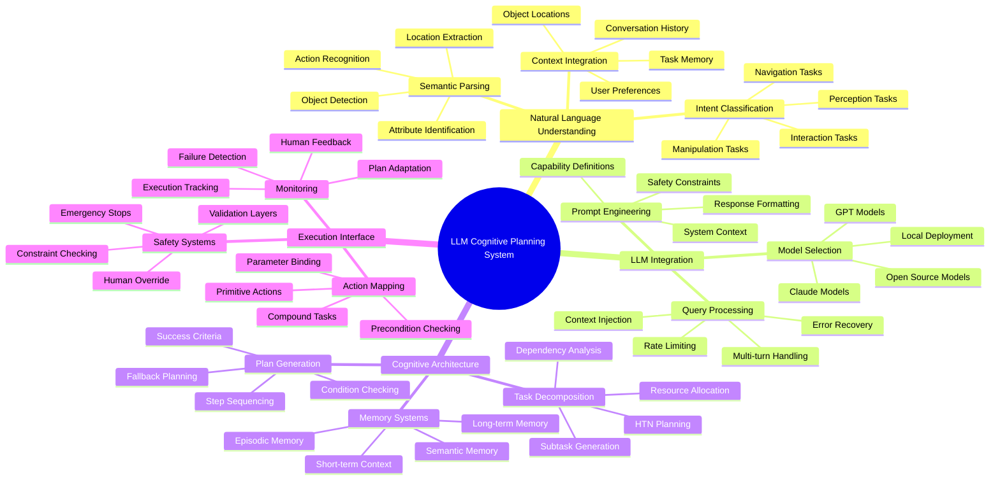

# Week 10: LLM Cognitive Planning

This week focuses on integrating Large Language Models (LLMs) for cognitive planning in humanoid robots. You'll learn to implement LLM-based reasoning, create task decomposition systems, and develop cognitive architectures that enable robots to understand complex instructions and plan multi-step actions.

## Learning Objectives

By the end of this week, you will be able to:

- Integrate LLMs (like OpenAI GPT, Claude, or open-source alternatives) with robotic systems
- Implement cognitive planning architectures for complex task execution
- Create task decomposition and reasoning systems
- Design natural language understanding for robot instructions
- Develop memory and context management for long-term interactions

## 10.1 Introduction to LLM Integration in Robotics

### Cognitive Planning for Humanoid Robots

Cognitive planning in robotics involves high-level reasoning about tasks, goals, and actions. LLMs provide powerful capabilities for:

- **Natural language understanding**: Interpreting complex human instructions
- **Task decomposition**: Breaking down complex tasks into executable steps
- **Context reasoning**: Understanding the environment and situational context
- **Plan generation**: Creating sequences of actions to achieve goals
- **Learning from interaction**: Adapting behavior based on experience

### LLM Integration Architecture

```python
import rclpy
from rclpy.node import Node
from std_msgs.msg import String
from humanoid_msgs.msg import ParsedVoiceCommand, CognitivePlan, TaskStep
from geometry_msgs.msg import Pose
from action_msgs.msg import GoalStatus
import openai
import json
import asyncio
from typing import List, Dict, Any, Optional
import time

class LLMCognitivePlannerNode(Node):
    def __init__(self):
        super().__init__('llm_cognitive_planner')

        # Initialize LLM client (using OpenAI as example)
        # In practice, you might use local models like Llama, Mistral, etc.
        openai.api_key = self.declare_parameter('openai_api_key', '').value
        self.model_name = self.declare_parameter('llm_model', 'gpt-3.5-turbo').value

        # Publishers and subscribers
        self.plan_pub = self.create_publisher(CognitivePlan, '/cognitive_plan', 10)
        self.status_pub = self.create_publisher(String, '/cognitive_status', 10)
        self.voice_cmd_sub = self.create_subscription(
            ParsedVoiceCommand, '/parsed_voice_command', self.voice_command_callback, 10
        )
        self.task_sub = self.create_subscription(
            String, '/high_level_task', self.task_callback, 10
        )

        # Memory and context management
        self.conversation_history = []
        self.robot_capabilities = self.get_robot_capabilities()
        self.environment_context = {}

        # Planning state
        self.current_plan = None
        self.plan_execution_status = "idle"

        self.get_logger().info('LLM Cognitive Planner initialized')

    def get_robot_capabilities(self) -> Dict[str, Any]:
        """Define robot capabilities for LLM context"""
        return {
            "locomotion": {
                "movement": ["forward", "backward", "left", "right", "turn"],
                "speed_range": [0.1, 0.5],
                "turn_speed": 0.5
            },
            "manipulation": {
                "actions": ["pick", "place", "grasp", "release"],
                "reachable_area": {"x": [-1.0, 1.0], "y": [-0.5, 0.5], "z": [0.2, 1.5]}
            },
            "navigation": {
                "locations": ["kitchen", "living_room", "bedroom", "office", "hallway"],
                "navigation_modes": ["move_to", "follow_path", "explore"]
            },
            "sensors": {
                "types": ["camera", "lidar", "imu", "microphone"],
                "capabilities": ["object_detection", "person_detection", "obstacle_detection"]
            }
        }

    def voice_command_callback(self, msg: ParsedVoiceCommand):
        """Handle parsed voice commands for cognitive planning"""
        self.get_logger().info(f'Processing voice command: {msg.raw_command}')

        # Add to conversation history
        self.conversation_history.append({
            "role": "user",
            "content": msg.raw_command,
            "timestamp": time.time()
        })

        # Generate cognitive plan
        plan = self.generate_cognitive_plan(msg.raw_command, msg.intent, msg.entities)

        if plan:
            self.publish_plan(plan)
            self.execute_plan(plan)

    def task_callback(self, msg: String):
        """Handle high-level task requests"""
        self.get_logger().info(f'Processing high-level task: {msg.data}')

        # Add to conversation history
        self.conversation_history.append({
            "role": "user",
            "content": msg.data,
            "timestamp": time.time()
        })

        # Generate cognitive plan for complex task
        plan = self.generate_complex_plan(msg.data)

        if plan:
            self.publish_plan(plan)
            self.execute_plan(plan)

    async def query_llm(self, messages: List[Dict[str, str]], max_tokens: int = 500) -> Optional[str]:
        """Query LLM with conversation history and context"""
        try:
            response = await openai.ChatCompletion.acreate(
                model=self.model_name,
                messages=messages,
                max_tokens=max_tokens,
                temperature=0.3,
                timeout=30
            )
            return response.choices[0].message.content.strip()
        except Exception as e:
            self.get_logger().error(f'LLM query failed: {e}')
            return None

    def generate_cognitive_plan(self, command: str, intent: str, entities: List[str]) -> Optional[CognitivePlan]:
        """Generate cognitive plan from voice command using LLM"""
        # Prepare context for LLM
        context_messages = [
            {
                "role": "system",
                "content": f"""You are a cognitive planner for a humanoid robot. The robot has these capabilities:
                {json.dumps(self.robot_capabilities, indent=2)}

                Your task is to:
                1. Understand the user command
                2. Break it down into executable steps
                3. Generate a plan in JSON format with steps, dependencies, and conditions

                Return ONLY valid JSON with this structure:
                {{
                    "task_description": "Brief description of the task",
                    "steps": [
                        {{
                            "id": "step_id",
                            "description": "What to do in this step",
                            "action": "robot_action_type",
                            "parameters": {{"param": "value"}},
                            "preconditions": ["condition1", "condition2"],
                            "postconditions": ["condition1", "condition2"],
                            "dependencies": ["step_id1", "step_id2"]
                        }}
                    ],
                    "success_criteria": ["criteria1", "criteria2"]
                }}"""
            }
        ]

        # Add conversation history
        context_messages.extend(self.conversation_history[-5:])  # Last 5 interactions

        # Add current command
        user_message = f"Command: {command}\nIntent: {intent}\nEntities: {entities}\n\nGenerate a cognitive plan for this command."
        context_messages.append({"role": "user", "content": user_message})

        # Query LLM
        loop = asyncio.new_event_loop()
        asyncio.set_event_loop(loop)
        try:
            response = loop.run_until_complete(self.query_llm(context_messages))
        finally:
            loop.close()

        if response:
            try:
                # Parse LLM response
                plan_data = json.loads(response)
                return self.create_plan_message(plan_data)
            except json.JSONDecodeError as e:
                self.get_logger().error(f'Failed to parse LLM response: {e}')
                self.get_logger().debug(f'LLM response: {response}')
                return None
        else:
            return None

    def generate_complex_plan(self, task: str) -> Optional[CognitivePlan]:
        """Generate complex plan for high-level tasks using LLM"""
        context_messages = [
            {
                "role": "system",
                "content": f"""You are a cognitive planner for a humanoid robot. The robot has these capabilities:
                {json.dumps(self.robot_capabilities, indent=2)}

                Your task is to create a detailed plan for complex multi-step tasks.
                Consider:
                - Task decomposition into subtasks
                - Resource requirements
                - Potential obstacles and fallback plans
                - Success criteria for each step

                Return ONLY valid JSON with this structure:
                {{
                    "task_name": "Name of the overall task",
                    "task_description": "Detailed description",
                    "priority": "high/medium/low",
                    "estimated_duration": "Estimated time in seconds",
                    "steps": [
                        {{
                            "id": "step_id",
                            "name": "Step name",
                            "description": "What to do",
                            "action": "action_type",
                            "parameters": {{"param": "value"}},
                            "preconditions": ["condition1"],
                            "postconditions": ["condition1"],
                            "dependencies": ["step_id"],
                            "timeout": 30,
                            "fallback_action": "alternative_action"
                        }}
                    ],
                    "success_criteria": ["criteria1"],
                    "failure_criteria": ["criteria1"],
                    "monitoring_points": ["step_id1", "step_id2"]
                }}"""
            },
            {
                "role": "user",
                "content": f"Create a cognitive plan for: {task}"
            }
        ]

        # Query LLM
        loop = asyncio.new_event_loop()
        asyncio.set_event_loop(loop)
        try:
            response = loop.run_until_complete(self.query_llm(context_messages))
        finally:
            loop.close()

        if response:
            try:
                plan_data = json.loads(response)
                return self.create_plan_message(plan_data)
            except json.JSONDecodeError as e:
                self.get_logger().error(f'Failed to parse complex plan: {e}')
                return None
        else:
            return None

    def create_plan_message(self, plan_data: Dict[str, Any]) -> CognitivePlan:
        """Convert plan data to ROS message"""
        plan_msg = CognitivePlan()
        plan_msg.task_name = plan_data.get('task_name', 'unnamed_task')
        plan_msg.task_description = plan_data.get('task_description', '')
        plan_msg.priority = plan_data.get('priority', 'medium')
        plan_msg.estimated_duration = float(plan_data.get('estimated_duration', 0))

        # Convert steps
        for step_data in plan_data.get('steps', []):
            step_msg = TaskStep()
            step_msg.id = step_data.get('id', '')
            step_msg.name = step_data.get('name', step_data.get('description', ''))
            step_msg.description = step_data.get('description', '')
            step_msg.action = step_data.get('action', '')
            step_msg.parameters = json.dumps(step_data.get('parameters', {}))
            step_msg.preconditions = step_data.get('preconditions', [])
            step_msg.postconditions = step_data.get('postconditions', [])
            step_msg.dependencies = step_data.get('dependencies', [])
            step_msg.timeout = float(step_data.get('timeout', 30.0))
            step_msg.fallback_action = step_data.get('fallback_action', '')

            plan_msg.steps.append(step_msg)

        plan_msg.success_criteria = plan_data.get('success_criteria', [])
        plan_msg.failure_criteria = plan_data.get('failure_criteria', [])
        plan_msg.monitoring_points = plan_data.get('monitoring_points', [])

        return plan_msg

    def publish_plan(self, plan: CognitivePlan):
        """Publish cognitive plan"""
        self.plan_pub.publish(plan)
        self.current_plan = plan
        self.plan_execution_status = "published"

        self.get_logger().info(f'Published cognitive plan: {plan.task_name}')

    def execute_plan(self, plan: CognitivePlan):
        """Execute the cognitive plan"""
        self.get_logger().info(f'Executing plan: {plan.task_name}')

        # This would integrate with action execution system
        # For now, just log the plan execution
        for step in plan.steps:
            self.get_logger().info(f'  - {step.id}: {step.description}')

class LLMPlanningManager:
    def __init__(self, node: LLMCognitivePlannerNode):
        self.node = node
        self.active_plans = {}
        self.plan_execution_threads = {}

    def start_plan_execution(self, plan: CognitivePlan):
        """Start executing a cognitive plan"""
        plan_id = plan.task_name + f"_{time.time()}"
        self.active_plans[plan_id] = plan

        # Execute plan in separate thread
        import threading
        execution_thread = threading.Thread(
            target=self.execute_plan_steps,
            args=(plan_id, plan)
        )
        execution_thread.daemon = True
        execution_thread.start()

        self.plan_execution_threads[plan_id] = execution_thread

    def execute_plan_steps(self, plan_id: str, plan: CognitivePlan):
        """Execute individual steps of a plan"""
        for step in plan.steps:
            self.node.get_logger().info(f'Executing step: {step.id}')

            # Check preconditions
            if not self.check_preconditions(step.preconditions):
                self.node.get_logger().error(f'Preconditions not met for step {step.id}')
                # Execute fallback if available
                if step.fallback_action:
                    self.execute_fallback(step.fallback_action)
                continue

            # Execute the action
            success = self.execute_action(step.action, json.loads(step.parameters))

            if success:
                # Check postconditions
                if self.check_postconditions(step.postconditions):
                    self.node.get_logger().info(f'Step {step.id} completed successfully')
                else:
                    self.node.get_logger().warn(f'Postconditions not met for step {step.id}')
            else:
                self.node.get_logger().error(f'Step {step.id} failed')
                if step.fallback_action:
                    self.execute_fallback(step.fallback_action)

    def check_preconditions(self, preconditions: List[str]) -> bool:
        """Check if preconditions are satisfied"""
        # This would check robot state, environment, etc.
        # For now, return True
        return True

    def check_postconditions(self, postconditions: List[str]) -> bool:
        """Check if postconditions are satisfied"""
        # This would verify action results
        # For now, return True
        return True

    def execute_action(self, action_type: str, parameters: Dict[str, Any]) -> bool:
        """Execute a specific robot action"""
        # This would interface with robot action servers
        # For now, simulate action execution
        self.node.get_logger().info(f'Executing action: {action_type} with params: {parameters}')
        time.sleep(1)  # Simulate action time
        return True

    def execute_fallback(self, fallback_action: str):
        """Execute fallback action"""
        self.node.get_logger().info(f'Executing fallback: {fallback_action}')
```

## 10.2 Task Decomposition and Reasoning Systems

### Hierarchical Task Network (HTN) Planner

```python
from dataclasses import dataclass, field
from typing import List, Dict, Any, Callable, Optional
import json

@dataclass
class Task:
    """Represents a task in the hierarchical task network"""
    id: str
    name: str
    description: str
    action: str
    parameters: Dict[str, Any] = field(default_factory=dict)
    subtasks: List['Task'] = field(default_factory=list)
    preconditions: List[str] = field(default_factory=list)
    postconditions: List[str] = field(default_factory=list)
    dependencies: List[str] = field(default_factory=list)
    priority: int = 0

class HTNPlanner:
    """Hierarchical Task Network planner using LLM reasoning"""

    def __init__(self, llm_interface):
        self.llm_interface = llm_interface
        self.task_library = self.initialize_task_library()

    def initialize_task_library(self) -> Dict[str, Task]:
        """Initialize library of primitive and compound tasks"""
        return {
            # Primitive tasks (direct robot actions)
            "move_to": Task(
                id="move_to",
                name="Move To Location",
                description="Move robot to specified location",
                action="navigation",
                parameters={"target_location": "", "speed": 0.2}
            ),
            "pick_object": Task(
                id="pick_object",
                name="Pick Object",
                description="Pick up an object",
                action="manipulation",
                parameters={"object_name": "", "position": {}}
            ),
            "place_object": Task(
                id="place_object",
                name="Place Object",
                description="Place object at location",
                action="manipulation",
                parameters={"target_location": ""}
            ),
            "detect_object": Task(
                id="detect_object",
                name="Detect Object",
                description="Detect specific object in environment",
                action="perception",
                parameters={"object_type": ""}
            ),

            # Compound tasks (higher-level tasks decomposed into primitives)
            "fetch_object": Task(
                id="fetch_object",
                name="Fetch Object",
                description="Go to object, pick it, and bring it back",
                action="compound",
                subtasks=[
                    Task("detect_obj", "Detect Object", "", "detect_object"),
                    Task("move_to_obj", "Move to Object", "", "move_to"),
                    Task("pick_obj", "Pick Object", "", "pick_object"),
                    Task("return_with_obj", "Return with Object", "", "move_to")
                ]
            ),
            "set_table": Task(
                id="set_table",
                name="Set Table",
                description="Place multiple items on table",
                action="compound",
                subtasks=[
                    Task("get_plate", "Get Plate", "", "fetch_object"),
                    Task("place_plate", "Place Plate", "", "place_object"),
                    Task("get_cup", "Get Cup", "", "fetch_object"),
                    Task("place_cup", "Place Cup", "", "place_object")
                ]
            )
        }

    def decompose_task(self, high_level_task: str) -> Optional[Task]:
        """Decompose high-level task using LLM reasoning"""
        # Query LLM to decompose task
        prompt = f"""
        Decompose the following high-level task into a hierarchical structure of subtasks:
        Task: {high_level_task}

        Use the following task library:
        {json.dumps([t.name for t in self.task_library.values()], indent=2)}

        Return the decomposition as a JSON object with this structure:
        {{
            "id": "task_id",
            "name": "Task Name",
            "description": "Task description",
            "action": "compound",
            "subtasks": [
                {{
                    "id": "subtask_id",
                    "name": "Subtask Name",
                    "description": "Subtask description",
                    "action": "primitive_or_compound",
                    "parameters": {{"param": "value"}},
                    "preconditions": ["condition1"],
                    "postconditions": ["condition1"]
                }}
            ]
        }}
        """

        response = self.llm_interface.query_llm([{"role": "user", "content": prompt}])

        if response:
            try:
                task_data = json.loads(response)
                return self.create_task_from_data(task_data)
            except json.JSONDecodeError:
                return None

        return None

    def create_task_from_data(self, task_data: Dict[str, Any]) -> Task:
        """Create Task object from LLM response data"""
        subtasks = []
        for subtask_data in task_data.get('subtasks', []):
            subtask = Task(
                id=subtask_data['id'],
                name=subtask_data['name'],
                description=subtask_data['description'],
                action=subtask_data['action'],
                parameters=subtask_data.get('parameters', {}),
                preconditions=subtask_data.get('preconditions', []),
                postconditions=subtask_data.get('postconditions', [])
            )
            subtasks.append(subtask)

        return Task(
            id=task_data['id'],
            name=task_data['name'],
            description=task_data['description'],
            action=task_data['action'],
            subtasks=subtasks,
            preconditions=task_data.get('preconditions', []),
            postconditions=task_data.get('postconditions', [])
        )

    def generate_execution_plan(self, task: Task) -> List[Dict[str, Any]]:
        """Generate linear execution plan from hierarchical task"""
        execution_plan = []

        def traverse_task(t: Task, plan: List[Dict[str, Any]]):
            if not t.subtasks:  # Primitive task
                plan.append({
                    'id': t.id,
                    'name': t.name,
                    'action': t.action,
                    'parameters': t.parameters,
                    'preconditions': t.preconditions,
                    'postconditions': t.postconditions
                })
            else:  # Compound task
                for subtask in t.subtasks:
                    traverse_task(subtask, plan)

        traverse_task(task, execution_plan)
        return execution_plan

class EnhancedLLMCognitivePlannerNode(LLMCognitivePlannerNode):
    def __init__(self):
        super().__init__()

        # Initialize HTN planner
        self.htn_planner = HTNPlanner(self)

        # Add HTN-specific publishers
        self.decomposition_pub = self.create_publisher(
            String, '/task_decomposition', 10
        )

    def generate_complex_plan(self, task: str) -> Optional[CognitivePlan]:
        """Enhanced plan generation using HTN decomposition"""
        # First, try to decompose task using HTN
        decomposed_task = self.htn_planner.decompose_task(task)

        if decomposed_task:
            # Generate execution plan from decomposition
            execution_plan = self.htn_planner.generate_execution_plan(decomposed_task)

            # Create CognitivePlan from execution plan
            plan_msg = CognitivePlan()
            plan_msg.task_name = decomposed_task.name
            plan_msg.task_description = decomposed_task.description
            plan_msg.priority = "medium"

            # Convert execution plan to TaskStep messages
            for i, step_data in enumerate(execution_plan):
                step_msg = TaskStep()
                step_msg.id = f"step_{i}"
                step_msg.name = step_data['name']
                step_msg.description = step_data['name']
                step_msg.action = step_data['action']
                step_msg.parameters = json.dumps(step_data['parameters'])
                step_msg.preconditions = step_data['preconditions']
                step_msg.postconditions = step_data['postconditions']

                plan_msg.steps.append(step_msg)

            # Publish decomposition for debugging
            decomposition_msg = String()
            decomposition_msg.data = json.dumps({
                'task': task,
                'decomposition': [s['name'] for s in execution_plan]
            }, indent=2)
            self.decomposition_pub.publish(decomposition_msg)

            return plan_msg

        # Fallback to LLM-based planning
        return super().generate_complex_plan(task)
```

## 10.3 Natural Language Understanding for Robot Instructions

### Semantic Parser for Robot Instructions

```python
import spacy
import re
from typing import Union, List, Dict, Any
from dataclasses import dataclass

@dataclass
class SemanticFrame:
    """Represents the semantic structure of an instruction"""
    action: str
    objects: List[Dict[str, str]]
    locations: List[Dict[str, str]]
    attributes: Dict[str, Any]
    temporal: Dict[str, Any]
    spatial: Dict[str, Any]

class SemanticParser:
    def __init__(self):
        # Load spaCy model
        try:
            self.nlp = spacy.load("en_core_web_sm")
        except OSError:
            self.nlp = None
            print("spaCy model not found. Install with: python -m spacy download en_core_web_sm")

        # Define action patterns
        self.action_patterns = {
            'navigation': [
                r'go\s+to|move\s+to|navigate\s+to|walk\s+to|head\s+to|go\s+over\s+to',
                r'bring\s+me|fetch|get|retrieve|carry',
                r'follow|chase|pursue'
            ],
            'manipulation': [
                r'pick\s+up|grasp|grab|take|hold|lift',
                r'put|place|set|drop|release|set\s+down',
                r'give|hand|deliver'
            ],
            'interaction': [
                r'greet|say\s+hello|wave|introduce',
                r'wait|stop|pause|hold|freeze',
                r'help|assist|aid'
            ],
            'perception': [
                r'find|look\s+for|search|locate|spot|see',
                r'identify|recognize|detect|notice',
                r'show|display|present'
            ]
        }

        # Define location patterns
        self.location_patterns = [
            r'(kitchen|living\s+room|bedroom|office|bathroom|hallway|dining\s+room)',
            r'(table|counter|shelf|cabinet|fridge|couch|chair)',
            r'(here|there|nearby|in\s+front|behind|left|right)'
        ]

    def parse_instruction(self, instruction: str) -> Optional[SemanticFrame]:
        """Parse natural language instruction into semantic frame"""
        if not self.nlp:
            return None

        doc = self.nlp(instruction.lower())

        # Extract action
        action = self.extract_action(doc, instruction)

        # Extract objects
        objects = self.extract_objects(doc)

        # Extract locations
        locations = self.extract_locations(doc, instruction)

        # Extract attributes and modifiers
        attributes = self.extract_attributes(doc)

        # Extract temporal information
        temporal = self.extract_temporal(doc)

        # Extract spatial relationships
        spatial = self.extract_spatial(doc)

        return SemanticFrame(
            action=action,
            objects=objects,
            locations=locations,
            attributes=attributes,
            temporal=temporal,
            spatial=spatial
        )

    def extract_action(self, doc, original_text: str) -> str:
        """Extract the main action from the instruction"""
        # Check for action patterns
        for action_type, patterns in self.action_patterns.items():
            for pattern in patterns:
                if re.search(pattern, original_text.lower()):
                    return action_type

        # If no pattern matches, use NLP to identify main verb
        for token in doc:
            if token.pos_ == "VERB" and token.dep_ == "ROOT":
                return token.lemma_

        return "unknown"

    def extract_objects(self, doc) -> List[Dict[str, str]]:
        """Extract objects mentioned in the instruction"""
        objects = []

        for token in doc:
            if token.pos_ in ["NOUN", "PROPN"] and token.dep_ in ["dobj", "pobj", "attr"]:
                # Get the full noun phrase
                obj_phrase = self.get_noun_phrase(token)
                objects.append({
                    "name": obj_phrase.text,
                    "type": "object",
                    "modifier": self.get_modifiers(token)
                })

        return objects

    def extract_locations(self, doc, original_text: str) -> List[Dict[str, str]]:
        """Extract locations from the instruction"""
        locations = []

        # Check for location patterns
        for pattern_list in self.location_patterns:
            matches = re.findall(pattern_list, original_text.lower())
            for match in matches:
                locations.append({
                    "name": match,
                    "type": "location"
                })

        # Also extract from NLP
        for ent in doc.ents:
            if ent.label_ in ["GPE", "LOC", "FAC"]:
                locations.append({
                    "name": ent.text,
                    "type": ent.label_.lower()
                })

        return locations

    def extract_attributes(self, doc) -> Dict[str, Any]:
        """Extract attributes and modifiers"""
        attributes = {}

        for token in doc:
            if token.pos_ == "ADJ":
                attributes[token.lemma_] = True
            elif token.pos_ == "ADV":
                attributes[token.lemma_] = True
            elif token.pos_ == "NUM":
                attributes["quantity"] = token.text

        return attributes

    def extract_temporal(self, doc) -> Dict[str, Any]:
        """Extract temporal information"""
        temporal = {}

        for ent in doc.ents:
            if ent.label_ == "TIME":
                temporal["time"] = ent.text
            elif ent.label_ == "DATE":
                temporal["date"] = ent.text

        return temporal

    def extract_spatial(self, doc) -> Dict[str, Any]:
        """Extract spatial relationships"""
        spatial = {}

        for token in doc:
            if token.pos_ == "ADP":  # Preposition
                spatial[token.text] = True
            elif token.text in ["near", "far", "close", "next", "beside", "behind", "in", "on", "under", "over"]:
                spatial[token.text] = True

        return spatial

    def get_noun_phrase(self, token) -> str:
        """Get the full noun phrase containing a token"""
        span = token.subtree
        return " ".join([t.text for t in span if t.pos_ != "DET"])  # Exclude determiners

    def get_modifiers(self, token) -> List[str]:
        """Get modifiers for a noun"""
        modifiers = []
        for child in token.children:
            if child.pos_ in ["ADJ", "DET", "NUM"]:
                modifiers.append(child.text)
        return modifiers

class NaturalLanguageInterface:
    def __init__(self, semantic_parser: SemanticParser):
        self.parser = semantic_parser

    def interpret_command(self, command: str) -> Dict[str, Any]:
        """Interpret natural language command and convert to robot action"""
        # Parse the command
        frame = self.parser.parse_instruction(command)

        if not frame:
            return {"action": "unknown", "parameters": {}}

        # Convert semantic frame to robot command
        robot_command = self.convert_to_robot_command(frame)

        return robot_command

    def convert_to_robot_command(self, frame: SemanticFrame) -> Dict[str, Any]:
        """Convert semantic frame to robot command structure"""
        command = {
            "action": frame.action,
            "parameters": {}
        }

        # Add object parameters
        if frame.objects:
            command["parameters"]["objects"] = [obj["name"] for obj in frame.objects]

        # Add location parameters
        if frame.locations:
            command["parameters"]["locations"] = [loc["name"] for loc in frame.locations]

        # Add attributes
        if frame.attributes:
            command["parameters"]["attributes"] = frame.attributes

        # Add spatial relationships
        if frame.spatial:
            command["parameters"]["spatial"] = frame.spatial

        return command

# Integration with the main node
class NLUCognitivePlannerNode(EnhancedLLMCognitivePlannerNode):
    def __init__(self):
        super().__init__()

        # Initialize NLU components
        self.semantic_parser = SemanticParser()
        self.nlu_interface = NaturalLanguageInterface(self.semantic_parser)

        # Add NLU publisher
        self.nlu_pub = self.create_publisher(
            String, '/nlu_interpretation', 10
        )

    def parse_voice_command(self, command):
        """Enhanced command parsing with NLU"""
        # Use semantic parser
        interpretation = self.nlu_interface.interpret_command(command)

        # Publish interpretation for debugging
        interpretation_msg = String()
        interpretation_msg.data = json.dumps(interpretation, indent=2)
        self.nlu_pub.publish(interpretation_msg)

        # Generate plan based on interpretation
        plan = self.generate_plan_from_interpretation(interpretation, command)

        if plan:
            self.publish_plan(plan)
            self.execute_plan(plan)

    def generate_plan_from_interpretation(self, interpretation: Dict[str, Any], original_command: str) -> Optional[CognitivePlan]:
        """Generate cognitive plan from NLU interpretation"""
        # Create a simple plan based on interpretation
        plan_msg = CognitivePlan()
        plan_msg.task_name = f"interpreted_task_{time.time()}"
        plan_msg.task_description = original_command
        plan_msg.priority = "medium"

        # Create steps based on interpretation
        action = interpretation.get("action", "unknown")
        params = interpretation.get("parameters", {})

        step_msg = TaskStep()
        step_msg.id = "main_step"
        step_msg.name = f"Execute {action}"
        step_msg.description = original_command
        step_msg.action = action
        step_msg.parameters = json.dumps(params)

        plan_msg.steps.append(step_msg)

        return plan_msg
```

## 10.4 Memory and Context Management

### Context Manager for Long-term Interactions

```python
import pickle
import os
from datetime import datetime, timedelta
from typing import Any, Dict, List, Optional

class InteractionContext:
    """Represents the context of an interaction session"""
    def __init__(self):
        self.session_id = None
        self.start_time = datetime.now()
        self.user_profile = {}
        self.task_history = []
        self.object_locations = {}
        self.environment_state = {}
        self.conversation_context = []
        self.goals = []

class ContextManager:
    def __init__(self, node):
        self.node = node
        self.current_context = InteractionContext()
        self.context_history = []
        self.max_contexts = 100  # Keep last 100 contexts
        self.context_file = "/tmp/robot_context.pkl"

    def update_context(self, **kwargs):
        """Update the current interaction context"""
        for key, value in kwargs.items():
            if hasattr(self.current_context, key):
                setattr(self.current_context, key, value)
            else:
                self.node.get_logger().warn(f"Unknown context attribute: {key}")

    def add_task_to_history(self, task_description: str, result: str):
        """Add a completed task to history"""
        task_entry = {
            "timestamp": datetime.now(),
            "task": task_description,
            "result": result
        }
        self.current_context.task_history.append(task_entry)

        # Keep only recent history
        if len(self.current_context.task_history) > 50:
            self.current_context.task_history = self.current_context.task_history[-50:]

    def remember_object_location(self, object_name: str, location: str):
        """Remember where an object was seen or placed"""
        self.current_context.object_locations[object_name.lower()] = {
            "location": location,
            "timestamp": datetime.now(),
            "confidence": 1.0
        }

    def find_object_location(self, object_name: str) -> Optional[str]:
        """Find remembered location of an object"""
        obj_key = object_name.lower()
        if obj_key in self.current_context.object_locations:
            location_data = self.current_context.object_locations[obj_key]

            # Check if location is still valid (less than 1 hour old)
            age = datetime.now() - location_data["timestamp"]
            if age < timedelta(hours=1):
                return location_data["location"]
            else:
                # Remove expired location
                del self.current_context.object_locations[obj_key]

        return None

    def add_conversation_turn(self, user_input: str, robot_response: str):
        """Add a turn to the conversation context"""
        turn = {
            "timestamp": datetime.now(),
            "user": user_input,
            "robot": robot_response
        }
        self.current_context.conversation_context.append(turn)

        # Keep only recent conversation (last 10 turns)
        if len(self.current_context.conversation_context) > 10:
            self.current_context.conversation_context = self.current_context.conversation_context[-10:]

    def get_relevant_context(self, current_request: str) -> str:
        """Get relevant context for current request"""
        context_parts = []

        # Add recent conversation context
        if self.current_context.conversation_context:
            recent_turns = self.current_context.conversation_context[-3:]  # Last 3 turns
            context = "Recent conversation:\n"
            for turn in recent_turns:
                context += f"User: {turn['user']}\n"
                context += f"Robot: {turn['robot']}\n"
            context_parts.append(context)

        # Add object location context
        if self.current_context.object_locations:
            locations = []
            for obj, data in self.current_context.object_locations.items():
                age = datetime.now() - data["timestamp"]
                if age < timedelta(minutes=30):  # Less than 30 minutes old
                    locations.append(f"{obj} is at {data['location']}")

            if locations:
                context_parts.append("Known object locations:\n" + "\n".join(locations))

        # Add recent task context
        if self.current_context.task_history:
            recent_tasks = self.current_context.task_history[-3:]  # Last 3 tasks
            tasks = []
            for task in recent_tasks:
                tasks.append(f"Task: {task['task']}, Result: {task['result']}")

            if tasks:
                context_parts.append("Recent tasks:\n" + "\n".join(tasks))

        return "\n\n".join(context_parts)

    def save_context(self):
        """Save current context to file"""
        try:
            with open(self.context_file, 'wb') as f:
                pickle.dump({
                    'current_context': self.current_context,
                    'context_history': self.context_history[-self.max_contexts:]
                }, f)
        except Exception as e:
            self.node.get_logger().error(f'Failed to save context: {e}')

    def load_context(self):
        """Load context from file"""
        try:
            if os.path.exists(self.context_file):
                with open(self.context_file, 'rb') as f:
                    data = pickle.load(f)
                    self.current_context = data.get('current_context', InteractionContext())
                    self.context_history = data.get('context_history', [])
        except Exception as e:
            self.node.get_logger().error(f'Failed to load context: {e}')

class ContextAwareCognitivePlannerNode(NLUCognitivePlannerNode):
    def __init__(self):
        super().__init__()

        # Initialize context manager
        self.context_manager = ContextManager(self)
        self.context_manager.load_context()

        # Add context publisher
        self.context_pub = self.create_publisher(
            String, '/interaction_context', 10
        )

    def voice_command_callback(self, msg: ParsedVoiceCommand):
        """Handle voice command with context awareness"""
        self.get_logger().info(f'Processing voice command with context: {msg.raw_command}')

        # Get relevant context for this request
        relevant_context = self.context_manager.get_relevant_context(msg.raw_command)

        # Add to conversation history
        self.context_manager.add_conversation_turn(msg.raw_command, "Processing...")

        # Generate cognitive plan with context
        plan = self.generate_context_aware_plan(msg.raw_command, msg.intent, msg.entities, relevant_context)

        if plan:
            self.publish_plan(plan)
            self.execute_plan_with_context(plan, msg.raw_command)

    def generate_context_aware_plan(self, command: str, intent: str, entities: List[str], context: str) -> Optional[CognitivePlan]:
        """Generate plan considering current context"""
        # Prepare context for LLM including interaction history
        context_messages = [
            {
                "role": "system",
                "content": f"""You are a cognitive planner for a humanoid robot. The robot has these capabilities:
                {json.dumps(self.robot_capabilities, indent=2)}

                Current context:
                {context}

                Your task is to generate a plan considering the current context and conversation history.
                Be aware of:
                - Previously mentioned objects and their locations
                - Recent tasks and their outcomes
                - Current conversation flow
                - User preferences if known"""
            },
            {
                "role": "user",
                "content": f"Command: {command}\nIntent: {intent}\nEntities: {entities}\n\nGenerate a context-aware cognitive plan."
            }
        ]

        # Query LLM
        loop = asyncio.new_event_loop()
        asyncio.set_event_loop(loop)
        try:
            response = loop.run_until_complete(self.query_llm(context_messages))
        finally:
            loop.close()

        if response:
            try:
                plan_data = json.loads(response)
                plan_msg = self.create_plan_message(plan_data)

                # Update context with new plan
                self.context_manager.update_context(current_plan=plan_msg.task_name)

                return plan_msg
            except json.JSONDecodeError as e:
                self.get_logger().error(f'Failed to parse context-aware plan: {e}')
                return None
        else:
            return None

    def execute_plan_with_context(self, plan: CognitivePlan, original_command: str):
        """Execute plan while updating context"""
        self.get_logger().info(f'Executing context-aware plan: {plan.task_name}')

        # Execute the plan (simplified)
        success = True  # In real implementation, this would track actual execution

        # Update context based on execution result
        result = "success" if success else "failed"
        self.context_manager.add_task_to_history(original_command, result)

        # Publish updated context
        context_msg = String()
        context_msg.data = json.dumps({
            "session_id": self.context_manager.current_context.session_id,
            "active_plan": plan.task_name,
            "object_locations": self.context_manager.current_context.object_locations,
            "task_history_count": len(self.context_manager.current_context.task_history)
        })
        self.context_pub.publish(context_msg)

        # Save context
        self.context_manager.save_context()

def main(args=None):
    rclpy.init(args=args)
    node = ContextAwareCognitivePlannerNode()
    rclpy.spin(node)
    node.context_manager.save_context()  # Save on shutdown
    node.destroy_node()
    rclpy.shutdown()

if __name__ == '__main__':
    main()
```

## 10.5 Practical Exercise: Cognitive Planning System

### Complete LLM Cognitive Planning System

Let's create a launch file for the cognitive planning system:

```xml
<!-- llm_cognitive_planning.launch.py -->
from launch import LaunchDescription
from launch_ros.actions import Node
from launch.actions import DeclareLaunchArgument
from launch.substitutions import LaunchConfiguration
from ament_index_python.packages import get_package_share_directory
import os

def generate_launch_description():
    # Launch arguments
    namespace = LaunchConfiguration('namespace')
    use_sim_time = LaunchConfiguration('use_sim_time')
    openai_api_key = LaunchConfiguration('openai_api_key')
    llm_model = LaunchConfiguration('llm_model')

    # Declare launch arguments
    declare_namespace_cmd = DeclareLaunchArgument(
        'namespace',
        default_value='',
        description='Top-level namespace'
    )

    declare_use_sim_time_cmd = DeclareLaunchArgument(
        'use_sim_time',
        default_value='false',
        description='Use simulation (Gazebo) clock if true'
    )

    declare_openai_api_key_cmd = DeclareLaunchArgument(
        'openai_api_key',
        default_value='',
        description='OpenAI API key for LLM access'
    )

    declare_llm_model_cmd = DeclareLaunchArgument(
        'llm_model',
        default_value='gpt-3.5-turbo',
        description='LLM model to use for cognitive planning'
    )

    # LLM cognitive planner node
    cognitive_planner_node = Node(
        package='humanoid_cognitive_planning',
        executable='llm_cognitive_planner',
        name='llm_cognitive_planner',
        parameters=[{
            'use_sim_time': use_sim_time,
            'openai_api_key': openai_api_key,
            'llm_model': llm_model,
        }],
        remappings=[
            ('/parsed_voice_command', '/voice_commands/parsed'),
            ('/cognitive_plan', '/planning/cognitive_plan'),
        ],
        output='screen'
    )

    # Task executor node (to execute the plans)
    task_executor_node = Node(
        package='humanoid_task_execution',
        executable='task_executor',
        name='task_executor',
        parameters=[{
            'use_sim_time': use_sim_time,
        }],
        remappings=[
            ('/cognitive_plan', '/planning/cognitive_plan'),
        ],
        output='screen'
    )

    # Context manager node (optional, for advanced context management)
    context_manager_node = Node(
        package='humanoid_context',
        executable='context_manager',
        name='context_manager',
        parameters=[{
            'use_sim_time': use_sim_time,
        }],
        output='screen'
    )

    # Create the launch description
    ld = LaunchDescription()

    # Declare launch options
    ld.add_action(declare_namespace_cmd)
    ld.add_action(declare_use_sim_time_cmd)
    ld.add_action(declare_openai_api_key_cmd)
    ld.add_action(declare_llm_model_cmd)

    # Add nodes
    ld.add_action(cognitive_planner_node)
    ld.add_action(task_executor_node)
    ld.add_action(context_manager_node)

    return ld
```

## 10.6 Mind Map: Showing VLA System Components and Interactions



## Summary

This week covered LLM cognitive planning for humanoid robots, including LLM integration, task decomposition systems, natural language understanding, and memory/context management. The combination of large language models with robotic planning enables humanoid robots to understand complex instructions, decompose tasks hierarchically, and maintain context for long-term interactions.

## Next Week Preview

Next week, we'll explore vision integration for the Vision-Language-Action system, learning how to combine computer vision with cognitive planning for enhanced robot capabilities.