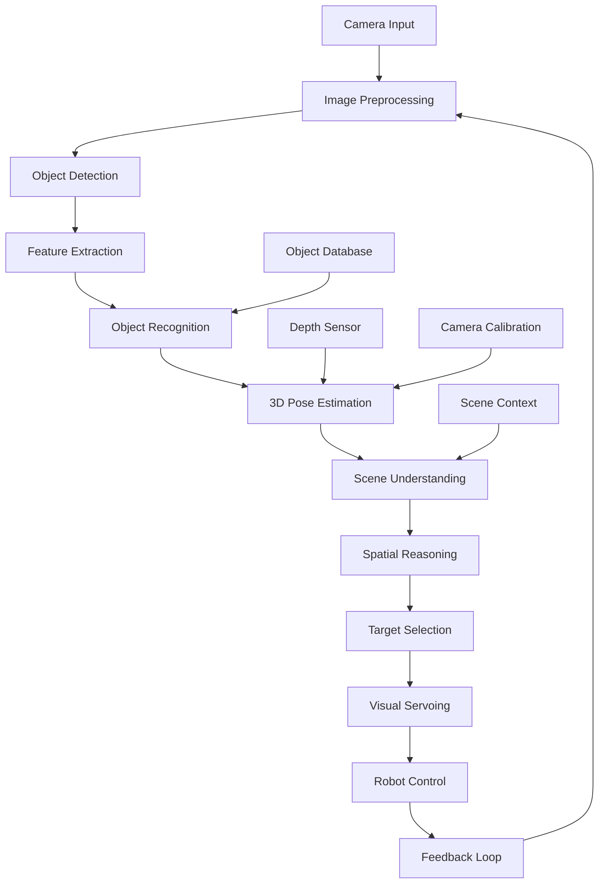

# Week 11: Vision Integration

This week focuses on vision integration for humanoid robots, covering computer vision techniques, object detection, scene understanding, and visual servoing. You'll learn to combine vision with cognitive planning for enhanced robot capabilities.

## Learning Objectives

By the end of this week, you will be able to:

- Implement computer vision pipelines for humanoid robots
- Integrate object detection and recognition systems
- Create scene understanding and spatial reasoning capabilities
- Develop visual servoing for precise manipulation
- Combine vision with cognitive planning for complex tasks

## 11.1 Computer Vision Pipelines for Humanoid Robots

### Vision Processing Architecture

```python
import rclpy
from rclpy.node import Node
from sensor_msgs.msg import Image, CameraInfo
from geometry_msgs.msg import Point, Pose, Vector3
from std_msgs.msg import String
from cv_bridge import CvBridge
import cv2
import numpy as np
import torch
import torchvision.transforms as transforms
from typing import List, Dict, Any, Optional
import threading
import queue
import time

class VisionProcessingNode(Node):
    def __init__(self):
        super().__init__('vision_processing')

        # Initialize CV bridge
        self.cv_bridge = CvBridge()

        # Initialize vision models
        self.object_detector = None
        self.pose_estimator = None
        self.segmentation_model = None

        # Publishers and subscribers
        self.image_sub = self.create_subscription(
            Image, '/camera/image_raw', self.image_callback, 10
        )
        self.camera_info_sub = self.create_subscription(
            CameraInfo, '/camera/camera_info', self.camera_info_callback, 10
        )

        # Vision result publishers
        self.detection_pub = self.create_publisher(String, '/vision/detections', 10)
        self.pose_pub = self.create_publisher(Pose, '/vision/target_pose', 10)
        self.debug_pub = self.create_publisher(Image, '/vision/debug_image', 10)

        # Camera parameters
        self.camera_matrix = None
        self.distortion_coeffs = None

        # Processing parameters
        self.processing_rate = 10  # Hz
        self.last_process_time = 0
        self.processing_queue = queue.Queue(maxsize=2)

        # Initialize vision models
        self.initialize_vision_models()

        self.get_logger().info('Vision Processing Node initialized')

    def initialize_vision_models(self):
        """Initialize computer vision models"""
        try:
            # Initialize object detection model (using YOLOv5 as example)
            self.object_detector = torch.hub.load(
                'ultralytics/yolov5',
                'yolov5s',
                pretrained=True
            )
            self.object_detector.eval()

            # Initialize segmentation model
            self.segmentation_model = torch.hub.load(
                'pytorch/vision:v0.10.0',
                'deeplabv3_resnet50',
                pretrained=True
            )
            self.segmentation_model.eval()

            self.get_logger().info('Vision models initialized successfully')

        except Exception as e:
            self.get_logger().error(f'Failed to initialize vision models: {e}')

    def camera_info_callback(self, msg):
        """Process camera calibration information"""
        self.camera_matrix = np.array(msg.k).reshape(3, 3)
        self.distortion_coeffs = np.array(msg.d)

    def image_callback(self, msg):
        """Process incoming camera image"""
        try:
            # Convert ROS image to OpenCV
            cv_image = self.cv_bridge.imgmsg_to_cv2(msg, desired_encoding='bgr8')

            # Add to processing queue (non-blocking)
            try:
                self.processing_queue.put_nowait(cv_image)
            except queue.Full:
                # Drop oldest image if queue is full
                try:
                    self.processing_queue.get_nowait()
                    self.processing_queue.put_nowait(cv_image)
                except queue.Empty:
                    pass

            # Process images at specified rate
            current_time = time.time()
            if current_time - self.last_process_time > 1.0 / self.processing_rate:
                self.process_vision_pipeline()
                self.last_process_time = current_time

        except Exception as e:
            self.get_logger().error(f'Error processing image: {e}')

    def process_vision_pipeline(self):
        """Main vision processing pipeline"""
        try:
            # Get latest image from queue
            if not self.processing_queue.empty():
                cv_image = self.processing_queue.get_nowait()

                # Perform object detection
                detections = self.perform_object_detection(cv_image)

                # Perform pose estimation
                pose_estimates = self.perform_pose_estimation(cv_image, detections)

                # Perform segmentation
                segmentation = self.perform_segmentation(cv_image)

                # Combine results
                vision_result = {
                    'detections': detections,
                    'poses': pose_estimates,
                    'segmentation': segmentation,
                    'timestamp': time.time()
                }

                # Publish results
                self.publish_vision_results(vision_result, cv_image)

        except queue.Empty:
            pass  # No new images to process
        except Exception as e:
            self.get_logger().error(f'Error in vision pipeline: {e}')

    def perform_object_detection(self, image):
        """Perform object detection on image"""
        if self.object_detector is None:
            return []

        try:
            # Run object detection
            results = self.object_detector(image)

            # Process results
            detections = []
            for detection in results.xyxy[0]:  # xyxy format: [x1, y1, x2, y2, conf, class]
                x1, y1, x2, y2, conf, cls = detection
                if conf > 0.5:  # Confidence threshold
                    detection_info = {
                        'class_id': int(cls),
                        'class_name': self.object_detector.names[int(cls)],
                        'confidence': float(conf),
                        'bbox': [float(x1), float(y1), float(x2), float(y2)],
                        'center': [(x1 + x2) / 2, (y1 + y2) / 2]
                    }
                    detections.append(detection_info)

            return detections

        except Exception as e:
            self.get_logger().error(f'Object detection error: {e}')
            return []

    def perform_pose_estimation(self, image, detections):
        """Estimate 3D poses of detected objects"""
        poses = []

        for detection in detections:
            bbox = detection['bbox']
            center_x, center_y = detection['center']

            # Estimate depth (simplified - in real system, use stereo or depth camera)
            # For now, assume objects are at known distance based on size
            width = bbox[2] - bbox[0]
            height = bbox[3] - bbox[1]

            # Convert 2D coordinates to 3D (simplified)
            if self.camera_matrix is not None:
                # Convert to camera coordinates
                z = 1.0  # Assumed distance (would come from depth sensor)
                x = (center_x - self.camera_matrix[0, 2]) * z / self.camera_matrix[0, 0]
                y = (center_y - self.camera_matrix[1, 2]) * z / self.camera_matrix[1, 1]

                pose = {
                    'object_class': detection['class_name'],
                    'position': [x, y, z],
                    'confidence': detection['confidence']
                }
                poses.append(pose)

        return poses

    def perform_segmentation(self, image):
        """Perform semantic segmentation"""
        if self.segmentation_model is None:
            return None

        try:
            # Preprocess image for segmentation
            transform = transforms.Compose([
                transforms.ToPILImage(),
                transforms.Resize((224, 224)),
                transforms.ToTensor(),
                transforms.Normalize(mean=[0.485, 0.456, 0.406],
                                   std=[0.229, 0.224, 0.225])
            ])

            input_tensor = transform(cv2.cvtColor(image, cv2.COLOR_BGR2RGB))
            input_batch = input_tensor.unsqueeze(0)  # Add batch dimension

            # Run segmentation
            with torch.no_grad():
                output = self.segmentation_model(input_batch)['out'][0]
                predicted = torch.argmax(output, dim=0).cpu().numpy()

            return predicted

        except Exception as e:
            self.get_logger().error(f'Segmentation error: {e}')
            return None

    def publish_vision_results(self, results, original_image):
        """Publish vision processing results"""
        # Publish detections as JSON string
        if results['detections']:
            detection_msg = String()
            detection_msg.data = str(results['detections'])
            self.detection_pub.publish(detection_msg)

        # Publish pose estimates
        for pose in results['poses']:
            pose_msg = Pose()
            pose_msg.position.x = pose['position'][0]
            pose_msg.position.y = pose['position'][1]
            pose_msg.position.z = pose['position'][2]
            self.pose_pub.publish(pose_msg)

        # Publish debug image with annotations
        debug_image = self.annotate_image(original_image, results)
        debug_msg = self.cv_bridge.cv2_to_imgmsg(debug_image, encoding='bgr8')
        self.debug_pub.publish(debug_msg)

    def annotate_image(self, image, results):
        """Annotate image with vision results"""
        annotated = image.copy()

        # Draw detections
        for detection in results['detections']:
            bbox = detection['bbox']
            label = f"{detection['class_name']}: {detection['confidence']:.2f}"
            color = (0, 255, 0)  # Green

            # Draw bounding box
            cv2.rectangle(annotated, (int(bbox[0]), int(bbox[1])),
                         (int(bbox[2]), int(bbox[3])), color, 2)

            # Draw label
            cv2.putText(annotated, label, (int(bbox[0]), int(bbox[1])-10),
                       cv2.FONT_HERSHEY_SIMPLEX, 0.5, color, 2)

        return annotated

class AdvancedVisionNode(VisionProcessingNode):
    def __init__(self):
        super().__init__()

        # Additional subscribers for multi-camera setup
        self.depth_sub = self.create_subscription(
            Image, '/camera/depth', self.depth_callback, 10
        )

        # Additional publishers for advanced features
        self.scene_pub = self.create_publisher(String, '/vision/scene_description', 10)
        self.gaze_pub = self.create_publisher(Point, '/vision/gaze_target', 10)

        # Initialize advanced vision components
        self.scene_understanding_model = None
        self.initialize_advanced_models()

    def initialize_advanced_models(self):
        """Initialize advanced vision models"""
        try:
            # Initialize scene understanding model
            # This would typically be a more complex model trained on scene data
            self.get_logger().info('Advanced vision models initialized')
        except Exception as e:
            self.get_logger().error(f'Failed to initialize advanced models: {e}')

    def depth_callback(self, msg):
        """Process depth information"""
        try:
            depth_image = self.cv_bridge.imgmsg_to_cv2(msg, desired_encoding='passthrough')
            # Process depth data for 3D understanding
            self.process_depth_data(depth_image)
        except Exception as e:
            self.get_logger().error(f'Error processing depth: {e}')

    def process_depth_data(self, depth_image):
        """Process depth information for 3D understanding"""
        # Convert depth to point cloud or use for 3D reconstruction
        # This is where depth data would be fused with RGB data
        pass

    def perform_scene_understanding(self, image, detections, depth_data=None):
        """Perform scene understanding combining multiple modalities"""
        scene_description = {
            'objects': [],
            'spatial_relations': [],
            'surface_types': [],
            'navigation_relevant': [],
            'interaction_candidates': []
        }

        # Analyze object relationships
        for detection in detections:
            scene_description['objects'].append({
                'class': detection['class_name'],
                'position': detection['center'],
                'confidence': detection['confidence']
            })

        # Analyze spatial relationships between objects
        if len(detections) > 1:
            for i in range(len(detections)):
                for j in range(i+1, len(detections)):
                    obj1 = detections[i]
                    obj2 = detections[j]

                    # Calculate spatial relationship
                    dx = obj2['center'][0] - obj1['center'][0]
                    dy = obj2['center'][1] - obj1['center'][1]
                    distance = np.sqrt(dx*dx + dy*dy)

                    relation = {
                        'object1': obj1['class_name'],
                        'object2': obj2['class_name'],
                        'relationship': self.classify_spatial_relationship(dx, dy, distance),
                        'distance_px': distance
                    }
                    scene_description['spatial_relations'].append(relation)

        return scene_description

    def classify_spatial_relationship(self, dx, dy, distance):
        """Classify spatial relationship between objects"""
        angle = np.arctan2(dy, dx)
        angle_deg = np.degrees(angle)

        if distance < 50:  # pixels
            return "on"
        elif -45 <= angle_deg < 45:
            return "right of"
        elif 45 <= angle_deg < 135:
            return "above"
        elif -135 <= angle_deg < -45:
            return "below"
        else:
            return "left of"
```

## 11.2 Object Detection and Recognition Systems

### Multi-Modal Object Recognition

```python
import torch
import torchvision
from torchvision import transforms
import numpy as np
import cv2
from typing import List, Dict, Any, Tuple
import json

class MultiModalObjectRecognition:
    def __init__(self, device='cuda' if torch.cuda.is_available() else 'cpu'):
        self.device = device
        self.models = {}
        self.transforms = {}
        self.object_database = {}

        self.initialize_models()

    def initialize_models(self):
        """Initialize multiple recognition models"""
        # YOLO for object detection
        self.models['detection'] = torch.hub.load(
            'ultralytics/yolov5', 'yolov5s', pretrained=True
        ).to(self.device)

        # Classification model
        self.models['classification'] = torchvision.models.resnet50(pretrained=True)
        self.models['classification'].eval().to(self.device)

        # Feature extraction model
        self.models['features'] = torchvision.models.resnet50(pretrained=True)
        self.models['features'].fc = torch.nn.Identity()  # Remove final layer
        self.models['features'].eval().to(self.device)

        # Define transforms
        self.transforms['detection'] = transforms.Compose([
            transforms.ToPILImage(),
            transforms.Resize((640, 640)),
            transforms.ToTensor()
        ])

        self.transforms['classification'] = transforms.Compose([
            transforms.ToPILImage(),
            transforms.Resize((224, 224)),
            transforms.ToTensor(),
            transforms.Normalize(mean=[0.485, 0.456, 0.406],
                               std=[0.229, 0.224, 0.225])
        ])

    def detect_objects(self, image: np.ndarray) -> List[Dict[str, Any]]:
        """Detect objects in image using YOLO"""
        # Convert to tensor and add batch dimension
        img_tensor = torch.from_numpy(image).permute(2, 0, 1).float().unsqueeze(0) / 255.0

        # Run detection
        with torch.no_grad():
            results = self.models['detection'](img_tensor.to(self.device))

        detections = []
        for det in results.xyxy[0]:  # xyxy format: [x1, y1, x2, y2, conf, class]
            x1, y1, x2, y2, conf, cls = det
            if conf > 0.5:  # Confidence threshold
                detection = {
                    'bbox': [float(x1), float(y1), float(x2), float(y2)],
                    'confidence': float(conf),
                    'class_id': int(cls),
                    'class_name': self.models['detection'].names[int(cls)],
                    'center': [(x1 + x2) / 2, (y1 + y2) / 2]
                }
                detections.append(detection)

        return detections

    def classify_region(self, image: np.ndarray, bbox: List[float]) -> Dict[str, Any]:
        """Classify a specific region of the image"""
        # Extract region
        x1, y1, x2, y2 = [int(x) for x in bbox]
        region = image[y1:y2, x1:x2]

        if region.size == 0:
            return {'class': 'unknown', 'confidence': 0.0}

        # Preprocess for classification
        region_tensor = self.transforms['classification'](region).unsqueeze(0).to(self.device)

        # Run classification
        with torch.no_grad():
            outputs = self.models['classification'](region_tensor)
            probabilities = torch.nn.functional.softmax(outputs[0], dim=0)
            confidence, predicted = torch.max(probabilities, 0)

        # Get class name (simplified - would use ImageNet classes)
        imagenet_classes = {i: f'class_{i}' for i in range(1000)}  # Placeholder
        class_name = imagenet_classes.get(int(predicted), f'class_{int(predicted)}')

        return {
            'class': class_name,
            'confidence': float(confidence),
            'class_id': int(predicted)
        }

    def extract_features(self, image: np.ndarray) -> np.ndarray:
        """Extract deep features for object recognition"""
        # Preprocess image
        img_tensor = self.transforms['classification'](image).unsqueeze(0).to(self.device)

        # Extract features
        with torch.no_grad():
            features = self.models['features'](img_tensor)

        return features.cpu().numpy().flatten()

    def recognize_object(self, image: np.ndarray, bbox: List[float]) -> Dict[str, Any]:
        """Perform comprehensive object recognition"""
        # Extract region
        x1, y1, x2, y2 = [int(x) for x in bbox]
        region = image[y1:y2, x1:x2]

        if region.size == 0:
            return {'status': 'empty_region'}

        # Get detection-based classification
        detections = self.detect_objects(image)

        # Get feature-based recognition
        features = self.extract_features(region)

        # Look up in object database
        best_match = self.find_best_match(features)

        # Combine results
        recognition_result = {
            'bbox': bbox,
            'detection_result': next((d for d in detections
                                    if self.iou(bbox, d['bbox']) > 0.5), None),
            'feature_match': best_match,
            'features': features.tolist(),
            'timestamp': time.time()
        }

        return recognition_result

    def find_best_match(self, features: np.ndarray, threshold: float = 0.8) -> Optional[Dict[str, Any]]:
        """Find best match in object database"""
        if not self.object_database:
            return None

        best_match = None
        best_similarity = 0.0

        for obj_id, stored_features in self.object_database.items():
            similarity = self.cosine_similarity(features, stored_features)
            if similarity > best_similarity and similarity > threshold:
                best_similarity = similarity
                best_match = {
                    'object_id': obj_id,
                    'similarity': similarity,
                    'object_info': stored_features.get('info', {})
                }

        return best_match

    def cosine_similarity(self, a: np.ndarray, b: np.ndarray) -> float:
        """Calculate cosine similarity between two feature vectors"""
        dot_product = np.dot(a, b)
        norm_a = np.linalg.norm(a)
        norm_b = np.linalg.norm(b)

        if norm_a == 0 or norm_b == 0:
            return 0.0

        return dot_product / (norm_a * norm_b)

    def iou(self, box1: List[float], box2: List[float]) -> float:
        """Calculate Intersection over Union"""
        x1_1, y1_1, x2_1, y2_1 = box1
        x1_2, y1_2, x2_2, y2_2 = box2

        # Calculate intersection
        xi1 = max(x1_1, x1_2)
        yi1 = max(y1_1, y1_2)
        xi2 = min(x2_1, x2_2)
        yi2 = min(y2_1, y2_2)

        inter_area = max(0, xi2 - xi1) * max(0, yi2 - yi1)
        box1_area = (x2_1 - x1_1) * (y2_1 - y1_1)
        box2_area = (x2_2 - x1_2) * (y2_2 - y1_2)

        union_area = box1_area + box2_area - inter_area
        iou = inter_area / union_area if union_area > 0 else 0

        return iou

class ObjectRecognitionVisionNode(AdvancedVisionNode):
    def __init__(self):
        super().__init__()

        # Initialize multi-modal recognition
        self.object_recognizer = MultiModalObjectRecognition()

        # Publisher for detailed object recognition
        self.object_recognition_pub = self.create_publisher(
            String, '/vision/object_recognition', 10
        )

        # Publisher for object tracking
        self.object_tracking_pub = self.create_publisher(
            String, '/vision/object_tracking', 10
        )

    def perform_object_recognition(self, image, detections):
        """Perform detailed object recognition"""
        recognition_results = []

        for detection in detections:
            recognition = self.object_recognizer.recognize_object(
                image, detection['bbox']
            )

            if recognition.get('status') != 'empty_region':
                recognition_results.append({
                    'detection': detection,
                    'recognition': recognition
                })

        # Publish detailed recognition results
        recognition_msg = String()
        recognition_msg.data = json.dumps(recognition_results, indent=2)
        self.object_recognition_pub.publish(recognition_msg)

        return recognition_results
```

## 11.3 Scene Understanding and Spatial Reasoning

### Spatial Reasoning Engine

```python
import numpy as np
from scipy.spatial import distance
from typing import List, Dict, Any, Tuple
import json

class SpatialReasoningEngine:
    def __init__(self):
        self.spatial_relations = {}
        self.object_properties = {}
        self.environment_map = None
        self.robot_pose = np.array([0, 0, 0])  # x, y, theta

    def update_environment(self, objects: List[Dict[str, Any]], robot_pose: np.ndarray):
        """Update environment representation with new object detections"""
        self.robot_pose = robot_pose

        # Clear previous spatial relations
        self.spatial_relations = {}

        # Update object properties
        for obj in objects:
            obj_id = obj['id'] if 'id' in obj else obj['class_name']
            self.object_properties[obj_id] = {
                'position': np.array(obj['position']),
                'size': obj.get('size', [1.0, 1.0, 1.0]),
                'class': obj['class_name'],
                'confidence': obj.get('confidence', 1.0)
            }

        # Calculate spatial relations
        self.calculate_spatial_relations()

    def calculate_spatial_relations(self):
        """Calculate spatial relations between all objects"""
        obj_ids = list(self.object_properties.keys())

        for i, obj1_id in enumerate(obj_ids):
            for j, obj2_id in enumerate(obj_ids):
                if i != j:
                    rel = self.calculate_relation(
                        self.object_properties[obj1_id],
                        self.object_properties[obj2_id]
                    )
                    if obj1_id not in self.spatial_relations:
                        self.spatial_relations[obj1_id] = {}
                    self.spatial_relations[obj1_id][obj2_id] = rel

    def calculate_relation(self, obj1: Dict[str, Any], obj2: Dict[str, Any]) -> Dict[str, Any]:
        """Calculate spatial relation between two objects"""
        pos1 = obj1['position'][:2]  # x, y only
        pos2 = obj2['position'][:2]

        # Calculate distance
        dist = np.linalg.norm(pos2 - pos1)

        # Calculate angle (relative to robot heading)
        angle = np.arctan2(pos2[1] - pos1[1], pos2[0] - pos1[0])

        # Determine spatial relationship
        if dist < 0.5:  # Close proximity
            relation = "on"
        elif dist < 1.5:  # Medium distance
            relation = self.get_directional_relation(angle)
        else:  # Far
            relation = "near"

        return {
            'relation': relation,
            'distance': float(dist),
            'angle': float(angle),
            'relative_position': [float(pos2[0] - pos1[0]), float(pos2[1] - pos1[1])]
        }

    def get_directional_relation(self, angle: float) -> str:
        """Convert angle to directional relation"""
        # Convert to degrees and normalize
        angle_deg = np.degrees(angle) % 360

        if 315 <= angle_deg or angle_deg < 45:
            return "right"
        elif 45 <= angle_deg < 135:
            return "front"
        elif 135 <= angle_deg < 225:
            return "left"
        else:
            return "back"

    def get_reachable_objects(self, max_distance: float = 1.0) -> List[str]:
        """Get objects within robot's reach"""
        reachable = []

        for obj_id, props in self.object_properties.items():
            obj_pos = props['position'][:2]
            robot_pos = self.robot_pose[:2]
            dist = np.linalg.norm(obj_pos - robot_pos)

            if dist <= max_distance:
                reachable.append(obj_id)

        return reachable

    def find_path_to_object(self, target_object: str) -> List[np.ndarray]:
        """Find path to target object considering obstacles"""
        if target_object not in self.object_properties:
            return []

        target_pos = self.object_properties[target_object]['position'][:2]
        robot_pos = self.robot_pose[:2]

        # Simple direct path (in real implementation, use path planning)
        path = [robot_pos, target_pos]

        return path

    def get_interaction_candidates(self, action: str) -> List[str]:
        """Get objects suitable for specific action"""
        candidates = []

        for obj_id, props in self.object_properties.items():
            if self.is_suitable_for_action(props, action):
                candidates.append(obj_id)

        return candidates

    def is_suitable_for_action(self, obj_props: Dict[str, Any], action: str) -> bool:
        """Check if object is suitable for specific action"""
        obj_class = obj_props['class']

        action_requirements = {
            'grasp': ['cup', 'bottle', 'box', 'book', 'phone'],
            'push': ['chair', 'table', 'box'],
            'look_at': ['person', 'sign', 'screen', 'object'],
            'avoid': ['wall', 'obstacle', 'furniture']
        }

        return obj_class in action_requirements.get(action, [])

class SceneUnderstandingVisionNode(ObjectRecognitionVisionNode):
    def __init__(self):
        super().__init__()

        # Initialize spatial reasoning engine
        self.spatial_reasoner = SpatialReasoningEngine()

        # Publisher for scene understanding
        self.scene_understanding_pub = self.create_publisher(
            String, '/vision/scene_understanding', 10
        )

        # Publisher for spatial relations
        self.spatial_relations_pub = self.create_publisher(
            String, '/vision/spatial_relations', 10
        )

    def perform_scene_understanding(self, image, detections, depth_data=None):
        """Perform comprehensive scene understanding"""
        # Convert detections to scene objects
        scene_objects = self.convert_detections_to_scene_objects(detections)

        # Update spatial reasoner
        robot_pose = np.array([0, 0, 0])  # Would come from localization
        self.spatial_reasoner.update_environment(scene_objects, robot_pose)

        # Generate scene description
        scene_description = self.generate_scene_description(scene_objects)

        # Find interaction candidates
        interaction_candidates = {
            'graspable': self.spatial_reasoner.get_interaction_candidates('grasp'),
            'reachable': self.spatial_reasoner.get_reachable_objects(),
            'avoidable': self.spatial_reasoner.get_interaction_candidates('avoid')
        }

        # Combine all information
        scene_result = {
            'objects': scene_objects,
            'spatial_relations': self.spatial_reasoner.spatial_relations,
            'scene_description': scene_description,
            'interaction_candidates': interaction_candidates,
            'timestamp': time.time()
        }

        # Publish scene understanding
        scene_msg = String()
        scene_msg.data = json.dumps(scene_result, indent=2)
        self.scene_understanding_pub.publish(scene_msg)

        # Publish spatial relations separately
        relations_msg = String()
        relations_msg.data = json.dumps(self.spatial_reasoner.spatial_relations, indent=2)
        self.spatial_relations_pub.publish(relations_msg)

        return scene_result

    def convert_detections_to_scene_objects(self, detections):
        """Convert detection results to scene objects with 3D positions"""
        scene_objects = []

        for i, detection in enumerate(detections):
            # Estimate 3D position from 2D detection and depth (simplified)
            center_x, center_y = detection['center']
            bbox = detection['bbox']

            # In real system, use depth from depth camera
            # For now, assume fixed distance based on object size
            width = bbox[2] - bbox[0]
            height = bbox[3] - bbox[1]

            # Estimate distance (simplified)
            avg_size = (width + height) / 2
            distance = max(0.5, 1000 / avg_size)  # Rough estimation

            # Convert to 3D coordinates
            if self.camera_matrix is not None:
                z = distance  # Estimated depth
                x = (center_x - self.camera_matrix[0, 2]) * z / self.camera_matrix[0, 0]
                y = (center_y - self.camera_matrix[1, 2]) * z / self.camera_matrix[1, 1]
            else:
                x, y, z = 0, 0, 1  # Default position

            scene_object = {
                'id': f"obj_{i}",
                'class_name': detection['class_name'],
                'position': [x, y, z],
                'bbox': detection['bbox'],
                'confidence': detection['confidence'],
                'size': [width, height, z]  # Simplified size
            }

            scene_objects.append(scene_object)

        return scene_objects

    def generate_scene_description(self, scene_objects):
        """Generate natural language description of the scene"""
        if not scene_objects:
            return "The scene appears to be empty."

        # Count objects by class
        class_counts = {}
        for obj in scene_objects:
            cls = obj['class_name']
            class_counts[cls] = class_counts.get(cls, 0) + 1

        # Generate description
        descriptions = []
        for cls, count in class_counts.items():
            if count == 1:
                descriptions.append(f"a {cls}")
            else:
                descriptions.append(f"{count} {cls}s")

        if len(descriptions) == 1:
            scene_desc = f"The scene contains {descriptions[0]}."
        else:
            scene_desc = f"The scene contains {', '.join(descriptions[:-1])}, and {descriptions[-1]}."

        return scene_desc
```

## 11.4 Visual Servoing for Precise Manipulation

### Visual Servoing Controller

```python
import numpy as np
from geometry_msgs.msg import Twist, Point, Vector3
from sensor_msgs.msg import Image
from cv_bridge import CvBridge
import cv2
from typing import Tuple, Optional

class VisualServoingController:
    def __init__(self, node):
        self.node = node
        self.cv_bridge = CvBridge()

        # Control parameters
        self.kp = 0.5  # Proportional gain
        self.ki = 0.1  # Integral gain
        self.kd = 0.2  # Derivative gain

        # Control state
        self.integral_error = np.zeros(2)
        self.previous_error = np.zeros(2)
        self.control_history = []

        # Target tracking
        self.target_position = None
        self.target_template = None
        self.tracking = False

        # Camera parameters (would come from camera info)
        self.camera_matrix = np.array([[500, 0, 320], [0, 500, 240], [0, 0, 1]])
        self.image_center = np.array([320, 240])

    def set_target(self, target_image, target_point):
        """Set the visual target for servoing"""
        self.target_template = target_image.copy()
        self.target_position = np.array(target_point)
        self.tracking = True
        self.node.get_logger().info(f'Set visual target at {self.target_position}')

    def compute_control_command(self, current_image, current_error=None):
        """Compute control command based on visual error"""
        if not self.tracking:
            return None

        if current_error is None:
            # Find target in current image
            current_position = self.locate_target_in_image(current_image)
            if current_position is None:
                return None

            # Calculate error
            current_error = self.target_position - current_position

        # PID control
        p_term = self.kp * current_error
        self.integral_error += current_error
        i_term = self.ki * self.integral_error
        d_term = self.kd * (current_error - self.previous_error)

        control_output = p_term + i_term + d_term

        # Store for next iteration
        self.previous_error = current_error
        self.control_history.append({
            'error': current_error.copy(),
            'control': control_output.copy(),
            'timestamp': time.time()
        })

        # Limit history to prevent integral windup
        if len(self.control_history) > 100:
            self.control_history = self.control_history[-100:]

        return control_output

    def locate_target_in_image(self, image):
        """Locate the target in the current image"""
        if self.target_template is None:
            return None

        # Template matching (simplified)
        result = cv2.matchTemplate(image, self.target_template, cv2.TM_CCOEFF_NORMED)
        min_val, max_val, min_loc, max_loc = cv2.minMaxLoc(result)

        if max_val > 0.7:  # Threshold for match
            # Calculate center of matched region
            h, w = self.target_template.shape[:2]
            center_x = max_loc[0] + w // 2
            center_y = max_loc[1] + h // 2
            return np.array([center_x, center_y])

        return None

    def convert_to_robot_command(self, control_output):
        """Convert visual servoing output to robot command"""
        # Convert pixel errors to robot velocities
        # This depends on camera-robot calibration

        # Simple conversion (would need proper calibration)
        linear_x = -control_output[1] * 0.001  # Y error -> forward/backward
        angular_z = -control_output[0] * 0.001  # X error -> rotation

        # Limit velocities
        linear_x = np.clip(linear_x, -0.2, 0.2)
        angular_z = np.clip(angular_z, -0.5, 0.5)

        cmd_vel = Twist()
        cmd_vel.linear.x = float(linear_x)
        cmd_vel.angular.z = float(angular_z)

        return cmd_vel

    def is_on_target(self, tolerance=10):
        """Check if robot is on target (within tolerance in pixels)"""
        if self.target_position is None:
            return False

        # This would be called with current position from tracking
        # For now, return False to continue tracking
        return False

class VisualServoingVisionNode(SceneUnderstandingVisionNode):
    def __init__(self):
        super().__init__()

        # Initialize visual servoing controller
        self.visual_servoing = VisualServoingController(self)

        # Additional subscribers for servoing
        self.target_sub = self.create_subscription(
            Point, '/vision/target_point', self.target_callback, 10
        )

        # Publisher for servoing commands
        self.servo_cmd_pub = self.create_publisher(Twist, '/cmd_vel_servo', 10)

        # Timer for servoing control loop
        self.servo_timer = self.create_timer(0.1, self.servoing_control_loop)

        self.servoing_active = False
        self.last_servo_image = None

    def target_callback(self, msg):
        """Handle target point for visual servoing"""
        target_point = [msg.x, msg.y]
        self.get_logger().info(f'Received servoing target: {target_point}')

        # Set target if we have a current image
        if self.last_servo_image is not None:
            self.visual_servoing.set_target(self.last_servo_image, target_point)
            self.servoing_active = True

    def image_callback(self, msg):
        """Process incoming camera image (extended for servoing)"""
        try:
            # Convert ROS image to OpenCV
            cv_image = self.cv_bridge.imgmsg_to_cv2(msg, desired_encoding='bgr8')
            self.last_servo_image = cv_image.copy()  # Store for servoing

            # Add to processing queue (non-blocking)
            try:
                self.processing_queue.put_nowait(cv_image)
            except queue.Full:
                # Drop oldest image if queue is full
                try:
                    self.processing_queue.get_nowait()
                    self.processing_queue.put_nowait(cv_image)
                except queue.Empty:
                    pass

            # Process images at specified rate
            current_time = time.time()
            if current_time - self.last_process_time > 1.0 / self.processing_rate:
                self.process_vision_pipeline()
                self.last_process_time = current_time

        except Exception as e:
            self.get_logger().error(f'Error processing image: {e}')

    def servoing_control_loop(self):
        """Main visual servoing control loop"""
        if not self.servoing_active or self.last_servo_image is None:
            return

        # Compute control command
        control_output = self.visual_servoing.compute_control_command(self.last_servo_image)

        if control_output is not None:
            # Convert to robot command
            cmd_vel = self.visual_servoing.convert_to_robot_command(control_output)

            # Publish command
            self.servo_cmd_pub.publish(cmd_vel)

            # Check if we're on target
            if self.visual_servoing.is_on_target():
                self.get_logger().info('Reached visual servoing target')
                self.servoing_active = False

    def perform_object_recognition(self, image, detections):
        """Enhanced object recognition with servoing targets"""
        recognition_results = super().perform_object_recognition(image, detections)

        # Check if any detected object should be a servoing target
        for detection in detections:
            if detection['class_name'] in ['cup', 'bottle', 'phone']:  # Objects of interest
                # Set this as a potential servoing target
                center_x, center_y = detection['center']
                target_point = Point()
                target_point.x = float(center_x)
                target_point.y = float(center_y)
                target_point.z = 0.0  # Not used for 2D servoing

                # Publish as potential target (user can confirm)
                # This would typically require user confirmation or additional logic

        return recognition_results
```

## 11.5 Practical Exercise: Vision-Language-Action Integration

### Complete Vision Integration System

Let's create a launch file for the vision system:

```xml
<!-- vision_integration.launch.py -->
from launch import LaunchDescription
from launch_ros.actions import Node
from launch.actions import DeclareLaunchArgument
from launch.substitutions import LaunchConfiguration
from ament_index_python.packages import get_package_share_directory
import os

def generate_launch_description():
    # Launch arguments
    namespace = LaunchConfiguration('namespace')
    use_sim_time = LaunchConfiguration('use_sim_time')
    camera_topic = LaunchConfiguration('camera_topic')
    processing_rate = LaunchConfiguration('processing_rate')

    # Declare launch arguments
    declare_namespace_cmd = DeclareLaunchArgument(
        'namespace',
        default_value='',
        description='Top-level namespace'
    )

    declare_use_sim_time_cmd = DeclareLaunchArgument(
        'use_sim_time',
        default_value='false',
        description='Use simulation (Gazebo) clock if true'
    )

    declare_camera_topic_cmd = DeclareLaunchArgument(
        'camera_topic',
        default_value='/camera/image_raw',
        description='Camera topic to subscribe to'
    )

    declare_processing_rate_cmd = DeclareLaunchArgument(
        'processing_rate',
        default_value='10',
        description='Vision processing rate in Hz'
    )

    # Vision processing node
    vision_processing_node = Node(
        package='humanoid_vision',
        executable='vision_processing_node',
        name='vision_processing',
        parameters=[{
            'use_sim_time': use_sim_time,
            'processing_rate': processing_rate,
        }],
        remappings=[
            ('/camera/image_raw', camera_topic),
            ('/vision/detections', '/perception/detections'),
            ('/vision/debug_image', '/debug/vision_debug'),
        ],
        output='screen'
    )

    # Object recognition node
    object_recognition_node = Node(
        package='humanoid_vision',
        executable='object_recognition_node',
        name='object_recognition',
        parameters=[{
            'use_sim_time': use_sim_time,
        }],
        remappings=[
            ('/vision/detections', '/perception/detections'),
            ('/vision/object_recognition', '/perception/object_recognition'),
        ],
        output='screen'
    )

    # Scene understanding node
    scene_understanding_node = Node(
        package='humanoid_vision',
        executable='scene_understanding_node',
        name='scene_understanding',
        parameters=[{
            'use_sim_time': use_sim_time,
        }],
        remappings=[
            ('/vision/object_recognition', '/perception/object_recognition'),
            ('/vision/scene_understanding', '/perception/scene_understanding'),
        ],
        output='screen'
    )

    # Visual servoing node
    visual_servoing_node = Node(
        package='humanoid_vision',
        executable='visual_servoing_node',
        name='visual_servoing',
        parameters=[{
            'use_sim_time': use_sim_time,
        }],
        remappings=[
            ('/camera/image_raw', camera_topic),
            ('/cmd_vel_servo', '/cmd_vel'),
        ],
        output='screen'
    )

    # Create the launch description
    ld = LaunchDescription()

    # Declare launch options
    ld.add_action(declare_namespace_cmd)
    ld.add_action(declare_use_sim_time_cmd)
    ld.add_action(declare_camera_topic_cmd)
    ld.add_action(declare_processing_rate_cmd)

    # Add nodes
    ld.add_action(vision_processing_node)
    ld.add_action(object_recognition_node)
    ld.add_action(scene_understanding_node)
    ld.add_action(visual_servoing_node)

    return ld
```

## 11.6 Flowchart: Vision Integration Pipeline



## Summary

This week covered vision integration for humanoid robots, including computer vision pipelines, object detection and recognition systems, scene understanding with spatial reasoning, and visual servoing for precise manipulation. The integration of these vision capabilities enables humanoid robots to perceive and understand their environment, recognize objects, and perform precise visual-guided actions.

## Next Week Preview

Next week, we'll explore action execution and control systems, learning how to convert high-level plans into precise robot movements and implement feedback control for reliable task execution.