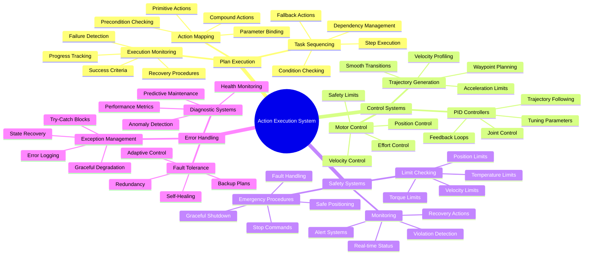

# Week 12: Action Execution and Control

This week focuses on action execution and control systems for humanoid robots, covering the conversion of high-level plans into precise robot movements, feedback control for reliable task execution, motor control, and safety mechanisms. You'll learn to implement robust control systems that can handle the complexities of humanoid locomotion and manipulation.

## Learning Objectives

By the end of this week, you will be able to:

- Convert high-level cognitive plans into executable robot actions
- Implement feedback control systems for precise movement
- Control humanoid robot joints and actuators effectively
- Implement safety mechanisms and error handling
- Create robust action execution frameworks for humanoid robots

## 12.1 Converting Plans to Robot Actions

### Action Execution Framework

```python
import rclpy
from rclpy.node import Node
from std_msgs.msg import String
from geometry_msgs.msg import Twist, Pose, Point
from sensor_msgs.msg import JointState
from humanoid_msgs.msg import CognitivePlan, TaskStep
from action_msgs.msg import GoalStatus
from rclpy.action import ActionClient
from control_msgs.action import FollowJointTrajectory
from trajectory_msgs.msg import JointTrajectory, JointTrajectoryPoint
import numpy as np
import time
from typing import Dict, List, Any, Optional
import json

class ActionExecutorNode(Node):
    def __init__(self):
        super().__init__('action_executor')

        # Publishers
        self.cmd_vel_pub = self.create_publisher(Twist, '/cmd_vel', 10)
        self.joint_trajectory_pub = self.create_publisher(JointTrajectory, '/joint_trajectory', 10)
        self.status_pub = self.create_publisher(String, '/action_status', 10)

        # Subscribers
        self.plan_sub = self.create_subscription(
            CognitivePlan, '/cognitive_plan', self.plan_callback, 10
        )
        self.joint_state_sub = self.create_subscription(
            JointState, '/joint_states', self.joint_state_callback, 10
        )

        # Action clients
        self.trajectory_client = ActionClient(
            self, FollowJointTrajectory, 'joint_trajectory_controller/follow_joint_trajectory'
        )

        # Robot state
        self.current_joint_states = {}
        self.is_executing = False
        self.current_plan = None
        self.current_step = 0

        # Action execution parameters
        self.max_execution_time = 30.0  # seconds
        self.position_tolerance = 0.05  # meters
        self.angle_tolerance = 0.1      # radians

        self.get_logger().info('Action Executor Node initialized')

    def plan_callback(self, msg: CognitivePlan):
        """Handle incoming cognitive plan"""
        self.get_logger().info(f'Received plan: {msg.task_name}')

        # Store plan and start execution
        self.current_plan = msg
        self.current_step = 0
        self.execute_plan()

    def joint_state_callback(self, msg: JointState):
        """Update current joint states"""
        for i, name in enumerate(msg.name):
            if i < len(msg.position):
                self.current_joint_states[name] = msg.position[i]

    def execute_plan(self):
        """Execute the current cognitive plan"""
        if not self.current_plan or self.is_executing:
            return

        self.is_executing = True
        self.get_logger().info(f'Starting execution of plan: {self.current_plan.task_name}')

        try:
            # Execute each step in the plan
            for i, step in enumerate(self.current_plan.steps):
                self.get_logger().info(f'Executing step {i+1}/{len(self.current_plan.steps)}: {step.name}')

                # Check preconditions
                if not self.check_preconditions(step.preconditions):
                    self.get_logger().error(f'Preconditions not met for step {step.id}')
                    self.publish_status(f'Preconditions failed for step {step.id}')
                    self.is_executing = False
                    return

                # Execute the action
                success = self.execute_action_step(step)

                if not success:
                    self.get_logger().error(f'Step {step.id} failed')
                    self.publish_status(f'Step {step.id} failed')

                    # Try fallback action if available
                    if step.fallback_action:
                        self.get_logger().info(f'Trying fallback: {step.fallback_action}')
                        fallback_success = self.execute_fallback_action(step.fallback_action)
                        if not fallback_success:
                            self.is_executing = False
                            return
                    else:
                        self.is_executing = False
                        return

                # Check postconditions
                if not self.check_postconditions(step.postconditions):
                    self.get_logger().warn(f'Postconditions not fully met for step {step.id}')

                self.current_step = i + 1

            self.get_logger().info('Plan execution completed successfully')
            self.publish_status('Plan completed successfully')

        except Exception as e:
            self.get_logger().error(f'Plan execution error: {e}')
            self.publish_status(f'Execution error: {str(e)}')

        finally:
            self.is_executing = False
            self.current_plan = None

    def execute_action_step(self, step: TaskStep) -> bool:
        """Execute a single action step"""
        try:
            # Parse step parameters
            params = json.loads(step.parameters) if step.parameters else {}

            # Execute based on action type
            if step.action == 'navigation':
                return self.execute_navigation_action(params)
            elif step.action == 'manipulation':
                return self.execute_manipulation_action(params)
            elif step.action == 'locomotion':
                return self.execute_locomotion_action(params)
            elif step.action == 'perception':
                return self.execute_perception_action(params)
            else:
                self.get_logger().warn(f'Unknown action type: {step.action}')
                return False

        except json.JSONDecodeError:
            self.get_logger().error(f'Invalid JSON parameters for step {step.id}')
            return False
        except Exception as e:
            self.get_logger().error(f'Error executing step {step.id}: {e}')
            return False

    def execute_navigation_action(self, params: Dict[str, Any]) -> bool:
        """Execute navigation action"""
        target_x = params.get('target_x', 0.0)
        target_y = params.get('target_y', 0.0)
        target_theta = params.get('target_theta', 0.0)
        speed = params.get('speed', 0.2)

        self.get_logger().info(f'Navigating to ({target_x}, {target_y}, {target_theta}) at speed {speed}')

        # Simple navigation (in real implementation, use Nav2)
        start_time = time.time()
        timeout = params.get('timeout', 30.0)

        # Publish velocity commands to reach target
        while time.time() - start_time < timeout:
            # Calculate current position error (simplified)
            # In real implementation, use localization system
            error_x = target_x
            error_y = target_y
            error_theta = target_theta

            # Calculate required velocity
            cmd_vel = Twist()
            cmd_vel.linear.x = min(speed, max(-speed, error_x * 0.5))  # Proportional control
            cmd_vel.angular.z = min(0.5, max(-0.5, error_theta * 1.0))

            # Check if we're close enough
            distance_error = np.sqrt(error_x**2 + error_y**2)
            if distance_error < self.position_tolerance and abs(error_theta) < self.angle_tolerance:
                self.get_logger().info('Navigation target reached')
                cmd_vel.linear.x = 0.0
                cmd_vel.angular.z = 0.0
                self.cmd_vel_pub.publish(cmd_vel)
                return True

            self.cmd_vel_pub.publish(cmd_vel)
            time.sleep(0.1)

        # Timeout reached
        cmd_vel = Twist()
        cmd_vel.linear.x = 0.0
        cmd_vel.angular.z = 0.0
        self.cmd_vel_pub.publish(cmd_vel)
        self.get_logger().warn('Navigation timeout reached')
        return False

    def execute_manipulation_action(self, params: Dict[str, Any]) -> bool:
        """Execute manipulation action"""
        action_type = params.get('action_type', 'move')
        joint_positions = params.get('joint_positions', [])
        trajectory_points = params.get('trajectory', [])

        self.get_logger().info(f'Executing manipulation: {action_type}')

        if trajectory_points:
            # Execute joint trajectory
            return self.execute_joint_trajectory(trajectory_points)
        elif joint_positions:
            # Move to specific joint positions
            return self.move_to_joint_positions(joint_positions)

        return False

    def execute_locomotion_action(self, params: Dict[str, Any]) -> bool:
        """Execute locomotion action (walking, stepping, etc.)"""
        gait_type = params.get('gait_type', 'walk')
        step_length = params.get('step_length', 0.3)
        step_height = params.get('step_height', 0.05)
        num_steps = params.get('num_steps', 1)

        self.get_logger().info(f'Executing {gait_type} gait for {num_steps} steps')

        # Generate gait trajectory
        trajectory = self.generate_gait_trajectory(gait_type, step_length, step_height, num_steps)

        if trajectory:
            return self.execute_joint_trajectory(trajectory)

        return False

    def execute_perception_action(self, params: Dict[str, Any]) -> bool:
        """Execute perception action (look at, detect, etc.)"""
        action_type = params.get('action_type', 'look_at')
        target_x = params.get('target_x', 0.0)
        target_y = params.get('target_y', 0.0)
        target_z = params.get('target_z', 1.0)

        self.get_logger().info(f'Executing perception: {action_type} at ({target_x}, {target_y}, {target_z})')

        # Move head/camera to look at target
        # In real implementation, control neck/head joints
        return True

    def execute_joint_trajectory(self, trajectory_points: List[Dict[str, Any]]) -> bool:
        """Execute joint trajectory"""
        if not self.trajectory_client.wait_for_server(timeout_sec=1.0):
            self.get_logger().error('Trajectory action server not available')
            return False

        # Create trajectory message
        trajectory_msg = JointTrajectory()
        trajectory_msg.joint_names = list(trajectory_points[0].keys()) if trajectory_points else []

        for point_data in trajectory_points:
            point_msg = JointTrajectoryPoint()
            positions = []
            for joint_name in trajectory_msg.joint_names:
                positions.append(point_data.get(joint_name, 0.0))
            point_msg.positions = positions
            point_msg.time_from_start.sec = 1  # Simplified timing
            trajectory_msg.points.append(point_msg)

        # Send trajectory goal
        goal_msg = FollowJointTrajectory.Goal()
        goal_msg.trajectory = trajectory_msg

        # Send goal and wait for result
        future = self.trajectory_client.send_goal_async(goal_msg)
        rclpy.spin_until_future_complete(self, future)

        goal_handle = future.result()
        if not goal_handle.accepted:
            self.get_logger().error('Trajectory goal rejected')
            return False

        result_future = goal_handle.get_result_async()
        rclpy.spin_until_future_complete(self, result_future)

        result = result_future.result()
        return result.result.error_code == 0

    def move_to_joint_positions(self, joint_positions: List[float]) -> bool:
        """Move joints to specified positions"""
        # This would publish to joint position controllers
        # For now, simulate the movement
        self.get_logger().info(f'Moving to joint positions: {joint_positions}')
        time.sleep(2)  # Simulate movement time
        return True

    def generate_gait_trajectory(self, gait_type: str, step_length: float, step_height: float, num_steps: int) -> Optional[List[Dict[str, float]]]:
        """Generate gait trajectory for walking"""
        if gait_type == 'walk':
            # Simplified walking trajectory generation
            # In real implementation, use proper gait planning algorithms
            trajectory = []

            for i in range(num_steps):
                # Generate step trajectory points
                # This is a simplified example
                step_points = [
                    {'left_hip': 0.0, 'left_knee': 0.0, 'left_ankle': 0.0,
                     'right_hip': 0.0, 'right_knee': 0.0, 'right_ankle': 0.0}
                ]
                trajectory.extend(step_points)

            return trajectory

        return None

    def check_preconditions(self, preconditions: List[str]) -> bool:
        """Check if preconditions are satisfied"""
        # In real implementation, check robot state, sensors, etc.
        # For now, assume all preconditions are met
        return True

    def check_postconditions(self, postconditions: List[str]) -> bool:
        """Check if postconditions are satisfied"""
        # In real implementation, verify action results
        # For now, assume all postconditions are met
        return True

    def execute_fallback_action(self, fallback_action: str) -> bool:
        """Execute fallback action"""
        self.get_logger().info(f'Executing fallback action: {fallback_action}')
        # Implement fallback logic based on the action
        return True

    def publish_status(self, status: str):
        """Publish action execution status"""
        status_msg = String()
        status_msg.data = status
        self.status_pub.publish(status_msg)

class AdvancedActionExecutorNode(ActionExecutorNode):
    def __init__(self):
        super().__init__()

        # Additional publishers for advanced control
        self.feedback_pub = self.create_publisher(String, '/action_feedback', 10)
        self.safety_pub = self.create_publisher(String, '/safety_status', 10)

        # Initialize safety systems
        self.safety_system = SafetySystem(self)
        self.feedback_system = ExecutionFeedbackSystem(self)

    def execute_action_step(self, step: TaskStep) -> bool:
        """Enhanced action execution with safety and feedback"""
        # Check safety before execution
        if not self.safety_system.is_safe_to_execute(step):
            self.get_logger().error(f'Safety check failed for step {step.id}')
            self.safety_system.trigger_safety_procedures()
            return False

        # Start feedback monitoring
        self.feedback_system.start_monitoring(step)

        # Execute the action
        success = super().execute_action_step(step)

        # Process feedback
        feedback = self.feedback_system.get_execution_feedback(step, success)
        self.feedback_system.publish_feedback(feedback)

        # Update safety status
        self.safety_system.update_status(step, success)

        return success

class SafetySystem:
    def __init__(self, node: Node):
        self.node = node
        self.safety_limits = {
            'max_velocity': 0.5,
            'max_acceleration': 1.0,
            'max_torque': 100.0,
            'max_joint_angles': {'hip': 1.57, 'knee': 2.0, 'ankle': 0.5}
        }
        self.emergency_stop = False

    def is_safe_to_execute(self, step: TaskStep) -> bool:
        """Check if it's safe to execute the given step"""
        if self.emergency_stop:
            return False

        # Check various safety conditions
        if self.would_exceed_limits(step):
            return False

        return True

    def would_exceed_limits(self, step: TaskStep) -> bool:
        """Check if step would exceed safety limits"""
        # Parse parameters and check against limits
        try:
            params = json.loads(step.parameters) if step.parameters else {}

            # Check velocity limits
            velocity = params.get('velocity', 0.0)
            if abs(velocity) > self.safety_limits['max_velocity']:
                self.node.get_logger().warn(f'Velocity limit exceeded: {velocity}')
                return True

            # Check other limits as needed
            return False

        except json.JSONDecodeError:
            return True  # Invalid parameters are unsafe

    def trigger_safety_procedures(self):
        """Trigger safety procedures"""
        self.emergency_stop = True
        self.node.get_logger().warn('EMERGENCY STOP triggered!')

    def update_status(self, step: TaskStep, success: bool):
        """Update safety status after step execution"""
        # Reset emergency stop if all is well
        if not self.emergency_stop and success:
            self.emergency_stop = False

class ExecutionFeedbackSystem:
    def __init__(self, node: Node):
        self.node = node
        self.execution_history = []

    def start_monitoring(self, step: TaskStep):
        """Start monitoring execution of a step"""
        self.current_monitoring = {
            'step_id': step.id,
            'start_time': time.time(),
            'start_joint_states': {}  # Would capture current states
        }

    def get_execution_feedback(self, step: TaskStep, success: bool) -> Dict[str, Any]:
        """Get feedback about step execution"""
        feedback = {
            'step_id': step.id,
            'success': success,
            'execution_time': time.time() - self.current_monitoring['start_time'],
            'start_time': self.current_monitoring['start_time'],
            'end_time': time.time(),
            'parameters': json.loads(step.parameters) if step.parameters else {},
            'timestamp': time.time()
        }

        self.execution_history.append(feedback)
        return feedback

    def publish_feedback(self, feedback: Dict[str, Any]):
        """Publish execution feedback"""
        feedback_msg = String()
        feedback_msg.data = json.dumps(feedback, indent=2)
        self.node.feedback_pub.publish(feedback_msg)
```

## 12.2 Feedback Control Systems for Precise Movement

### PID Controller for Joint Control

```python
import numpy as np
from typing import Dict, List, Tuple, Optional
import time

class PIDController:
    def __init__(self, kp: float = 1.0, ki: float = 0.0, kd: float = 0.0,
                 min_output: float = -1.0, max_output: float = 1.0):
        self.kp = kp  # Proportional gain
        self.ki = ki  # Integral gain
        self.kd = kd  # Derivative gain
        self.min_output = min_output
        self.max_output = max_output

        # State variables
        self.previous_error = 0.0
        self.integral = 0.0
        self.previous_time = None

    def compute(self, setpoint: float, measured_value: float) -> float:
        """Compute PID output"""
        current_time = time.time()

        if self.previous_time is None:
            self.previous_time = current_time
            return 0.0

        dt = current_time - self.previous_time
        if dt <= 0:
            return 0.0

        # Calculate error
        error = setpoint - measured_value

        # Proportional term
        p_term = self.kp * error

        # Integral term (with anti-windup)
        self.integral += error * dt
        i_term = self.ki * self.integral

        # Derivative term
        derivative = (error - self.previous_error) / dt
        d_term = self.kd * derivative

        # Calculate output
        output = p_term + i_term + d_term

        # Clamp output
        output = max(self.min_output, min(self.max_output, output))

        # Store state for next iteration
        self.previous_error = error
        self.previous_time = current_time

        return output

    def reset(self):
        """Reset the controller state"""
        self.previous_error = 0.0
        self.integral = 0.0
        self.previous_time = None

class JointController:
    def __init__(self, joint_name: str, kp: float = 1.0, ki: float = 0.1, kd: float = 0.05):
        self.joint_name = joint_name
        self.controller = PIDController(kp, ki, kd)
        self.current_position = 0.0
        self.current_velocity = 0.0
        self.target_position = 0.0
        self.tolerance = 0.01  # radians

    def update(self, current_position: float, dt: float = 0.01) -> float:
        """Update joint controller and return control output"""
        self.current_position = current_position

        # Compute control effort
        control_effort = self.controller.compute(self.target_position, current_position)

        return control_effort

    def set_target(self, target: float):
        """Set target position for the joint"""
        self.target_position = target
        self.controller.reset()  # Reset controller when target changes

    def is_at_target(self) -> bool:
        """Check if joint is at target within tolerance"""
        return abs(self.current_position - self.target_position) <= self.tolerance

class MultiJointController:
    def __init__(self, joint_names: List[str]):
        self.joint_names = joint_names
        self.joint_controllers = {}

        # Initialize controllers for each joint with appropriate gains
        default_gains = {
            'hip': (2.0, 0.1, 0.1),
            'knee': (3.0, 0.2, 0.1),
            'ankle': (1.5, 0.05, 0.05),
            'shoulder': (2.5, 0.15, 0.1),
            'elbow': (2.0, 0.1, 0.05),
            'wrist': (1.0, 0.05, 0.02)
        }

        for joint_name in joint_names:
            # Extract joint type from name (simplified)
            joint_type = 'generic'
            for jt in ['hip', 'knee', 'ankle', 'shoulder', 'elbow', 'wrist']:
                if jt in joint_name.lower():
                    joint_type = jt
                    break

            kp, ki, kd = default_gains.get(joint_type, (1.0, 0.0, 0.0))
            self.joint_controllers[joint_name] = JointController(joint_name, kp, ki, kd)

    def update(self, current_positions: Dict[str, float]) -> Dict[str, float]:
        """Update all joint controllers and return control outputs"""
        control_outputs = {}

        for joint_name, controller in self.joint_controllers.items():
            if joint_name in current_positions:
                control_output = controller.update(current_positions[joint_name])
                control_outputs[joint_name] = control_output

        return control_outputs

    def set_targets(self, targets: Dict[str, float]):
        """Set target positions for multiple joints"""
        for joint_name, target in targets.items():
            if joint_name in self.joint_controllers:
                self.joint_controllers[joint_name].set_target(target)

    def are_all_at_target(self) -> bool:
        """Check if all joints are at their targets"""
        for controller in self.joint_controllers.values():
            if not controller.is_at_target():
                return False
        return True

class FeedbackControlActionExecutorNode(AdvancedActionExecutorNode):
    def __init__(self):
        super().__init__()

        # Initialize feedback control systems
        self.joint_controllers = None
        self.trajectory_tracker = TrajectoryTracker(self)

        # Additional publishers for control feedback
        self.control_status_pub = self.create_publisher(String, '/control_status', 10)

    def initialize_joint_controllers(self, joint_names: List[str]):
        """Initialize joint controllers for feedback control"""
        self.joint_controllers = MultiJointController(joint_names)
        self.get_logger().info(f'Initialized controllers for {len(joint_names)} joints')

    def execute_manipulation_action(self, params: Dict[str, Any]) -> bool:
        """Execute manipulation with feedback control"""
        action_type = params.get('action_type', 'move')

        if action_type == 'move_to_pose':
            target_positions = params.get('joint_positions', {})
            return self.execute_feedback_controlled_move(target_positions)
        elif action_type == 'follow_trajectory':
            trajectory = params.get('trajectory', [])
            return self.execute_trajectory_following(trajectory)
        else:
            return super().execute_manipulation_action(params)

    def execute_feedback_controlled_move(self, target_positions: Dict[str, float]) -> bool:
        """Execute move with feedback control"""
        if not self.joint_controllers:
            self.get_logger().error('Joint controllers not initialized')
            return False

        # Set targets for all joints
        self.joint_controllers.set_targets(target_positions)

        # Control loop
        start_time = time.time()
        timeout = 30.0  # seconds

        while time.time() - start_time < timeout:
            # Get current positions (from joint states)
            current_positions = self.get_current_joint_positions()

            # Update controllers
            control_outputs = self.joint_controllers.update(current_positions)

            # Publish control commands
            self.publish_joint_control_commands(control_outputs)

            # Check if all joints are at target
            if self.joint_controllers.are_all_at_target():
                self.get_logger().info('All joints reached target positions')
                return True

            # Sleep for control loop
            time.sleep(0.01)  # 100 Hz control loop

        self.get_logger().warn('Timeout reached in feedback controlled move')
        return False

    def execute_trajectory_following(self, trajectory: List[Dict[str, float]]) -> bool:
        """Execute trajectory following with feedback control"""
        if not self.joint_controllers:
            self.get_logger().error('Joint controllers not initialized')
            return False

        # Follow trajectory points
        for i, waypoint in enumerate(trajectory):
            self.get_logger().info(f'Following trajectory waypoint {i+1}/{len(trajectory)}')

            # Set target for this waypoint
            self.joint_controllers.set_targets(waypoint)

            # Wait for this waypoint to be reached
            start_time = time.time()
            waypoint_timeout = 5.0  # seconds per waypoint

            while time.time() - start_time < waypoint_timeout:
                current_positions = self.get_current_joint_positions()
                control_outputs = self.joint_controllers.update(current_positions)
                self.publish_joint_control_commands(control_outputs)

                if self.joint_controllers.are_all_at_target():
                    self.get_logger().info(f'Reached waypoint {i+1}')
                    break

                time.sleep(0.01)

        return True

    def get_current_joint_positions(self) -> Dict[str, float]:
        """Get current joint positions from joint states"""
        return self.current_joint_states.copy()

    def publish_joint_control_commands(self, control_outputs: Dict[str, float]):
        """Publish joint control commands"""
        # Create and publish joint trajectory message
        trajectory_msg = JointTrajectory()
        trajectory_msg.joint_names = list(control_outputs.keys())

        point_msg = JointTrajectoryPoint()
        point_msg.positions = list(control_outputs.values())
        point_msg.time_from_start.sec = 0
        point_msg.time_from_start.nanosec = 10000000  # 10ms
        trajectory_msg.points.append(point_msg)

        self.joint_trajectory_pub.publish(trajectory_msg)

class TrajectoryTracker:
    def __init__(self, node: Node):
        self.node = node
        self.current_trajectory = None
        self.current_waypoint = 0
        self.trajectory_progress = 0.0

    def track_trajectory(self, trajectory: List[Dict[str, float]],
                        current_positions: Dict[str, float]) -> Dict[str, float]:
        """Track trajectory execution and provide feedback"""
        if not trajectory:
            return {}

        # Calculate progress
        if self.current_waypoint < len(trajectory):
            target = trajectory[self.current_waypoint]

            # Calculate distance to current waypoint
            total_distance = 0.0
            for joint_name, target_pos in target.items():
                if joint_name in current_positions:
                    total_distance += abs(target_pos - current_positions[joint_name])

            # Update waypoint if close enough
            if total_distance < 0.05:  # tolerance
                self.current_waypoint += 1

        # Calculate overall progress
        self.trajectory_progress = min(1.0, self.current_waypoint / len(trajectory)) if trajectory else 0.0

        return {
            'current_waypoint': self.current_waypoint,
            'total_waypoints': len(trajectory) if trajectory else 0,
            'progress': self.trajectory_progress,
            'remaining_waypoints': len(trajectory) - self.current_waypoint if trajectory else 0
        }
```

## 12.3 Motor Control and Actuator Management

### Advanced Motor Control System

```python
import struct
from typing import Dict, List, Tuple, Optional
import threading
import time

class MotorController:
    def __init__(self, motor_id: int, name: str, max_torque: float = 100.0,
                 max_velocity: float = 5.0, gear_ratio: float = 1.0):
        self.motor_id = motor_id
        self.name = name
        self.max_torque = max_torque
        self.max_velocity = max_velocity
        self.gear_ratio = gear_ratio

        # Motor state
        self.position = 0.0
        self.velocity = 0.0
        self.effort = 0.0
        self.temperature = 25.0  # Celsius
        self.is_enabled = False

        # Control parameters
        self.target_position = 0.0
        self.target_velocity = 0.0
        self.target_effort = 0.0

        # Safety limits
        self.position_limits = (-np.pi * 2, np.pi * 2)  # radians
        self.temperature_limit = 80.0  # Celsius

        # Communication interface (simulated)
        self.communication_lock = threading.Lock()

    def enable(self) -> bool:
        """Enable the motor"""
        with self.communication_lock:
            # Simulate enabling motor
            self.is_enabled = True
            self.node.get_logger().info(f'Motor {self.name} enabled')
            return True

    def disable(self) -> bool:
        """Disable the motor"""
        with self.communication_lock:
            # Simulate disabling motor
            self.is_enabled = False
            self.target_effort = 0.0
            self.node.get_logger().info(f'Motor {self.name} disabled')
            return True

    def set_position(self, position: float) -> bool:
        """Set target position for the motor"""
        if not self.is_enabled:
            return False

        # Check position limits
        if position < self.position_limits[0] or position > self.position_limits[1]:
            self.node.get_logger().warn(f'Position limit exceeded for {self.name}: {position}')
            return False

        self.target_position = position
        return self.send_command('position', position)

    def set_velocity(self, velocity: float) -> bool:
        """Set target velocity for the motor"""
        if not self.is_enabled:
            return False

        # Check velocity limits
        limited_velocity = max(-self.max_velocity, min(self.max_velocity, velocity))
        self.target_velocity = limited_velocity
        return self.send_command('velocity', limited_velocity)

    def set_effort(self, effort: float) -> bool:
        """Set target effort/torque for the motor"""
        if not self.is_enabled:
            return False

        # Check effort limits
        limited_effort = max(-self.max_torque, min(self.max_torque, effort))
        self.target_effort = limited_effort
        return self.send_command('effort', limited_effort)

    def send_command(self, command_type: str, value: float) -> bool:
        """Send command to the physical motor (simulated)"""
        # In real implementation, this would send actual commands to the motor
        # For simulation, just update internal state
        if command_type == 'position':
            # Simulate position control
            self.target_position = value
        elif command_type == 'velocity':
            self.target_velocity = value
        elif command_type == 'effort':
            self.target_effort = value

        return True

    def update_state(self, new_position: float, new_velocity: float,
                     new_effort: float, new_temperature: float):
        """Update motor state from feedback"""
        self.position = new_position
        self.velocity = new_velocity
        self.effort = new_effort
        self.temperature = new_temperature

    def is_safe(self) -> bool:
        """Check if motor is operating safely"""
        if self.temperature > self.temperature_limit:
            return False
        return True

    def get_faults(self) -> List[str]:
        """Get list of current faults"""
        faults = []

        if self.temperature > self.temperature_limit:
            faults.append(f"Overheating: {self.temperature}°C")

        if not self.is_enabled:
            faults.append("Motor disabled")

        # Check other potential faults
        return faults

class ActuatorManager:
    def __init__(self, node: Node):
        self.node = node
        self.motors: Dict[str, MotorController] = {}
        self.motor_names = []
        self.safety_monitoring = True
        self.monitoring_thread = None
        self.is_running = False

    def add_motor(self, name: str, motor_id: int, **kwargs) -> MotorController:
        """Add a motor to the manager"""
        motor = MotorController(motor_id, name, **kwargs)
        self.motors[name] = motor
        self.motor_names.append(name)
        return motor

    def initialize_motors(self) -> bool:
        """Initialize all motors"""
        success = True
        for name, motor in self.motors.items():
            if not motor.enable():
                self.node.get_logger().error(f'Failed to enable motor {name}')
                success = False

        if success:
            self.start_safety_monitoring()
            self.node.get_logger().info(f'Initialized {len(self.motors)} motors')

        return success

    def start_safety_monitoring(self):
        """Start safety monitoring thread"""
        if not self.is_running:
            self.is_running = True
            self.monitoring_thread = threading.Thread(target=self.safety_monitor_loop)
            self.monitoring_thread.daemon = True
            self.monitoring_thread.start()

    def safety_monitor_loop(self):
        """Monitor motor safety in a separate thread"""
        while self.is_running:
            for name, motor in self.motors.items():
                if not motor.is_safe():
                    faults = motor.get_faults()
                    self.node.get_logger().error(f'Motor {name} unsafe: {faults}')
                    # Trigger safety procedures
                    self.emergency_stop()
                    break

            time.sleep(0.1)  # Check every 100ms

    def emergency_stop(self):
        """Emergency stop all motors"""
        self.node.get_logger().warn('EMERGENCY STOP: Disabling all motors')
        for motor in self.motors.values():
            motor.disable()

    def set_joint_positions(self, positions: Dict[str, float]) -> bool:
        """Set positions for multiple joints"""
        success = True
        for joint_name, position in positions.items():
            if joint_name in self.motors:
                if not self.motors[joint_name].set_position(position):
                    success = False
            else:
                self.node.get_logger().warn(f'Motor not found: {joint_name}')

        return success

    def set_joint_velocities(self, velocities: Dict[str, float]) -> bool:
        """Set velocities for multiple joints"""
        success = True
        for joint_name, velocity in velocities.items():
            if joint_name in self.motors:
                if not self.motors[joint_name].set_velocity(velocity):
                    success = False
            else:
                self.node.get_logger().warn(f'Motor not found: {joint_name}')

        return success

    def set_joint_efforts(self, efforts: Dict[str, float]) -> bool:
        """Set efforts for multiple joints"""
        success = True
        for joint_name, effort in efforts.items():
            if joint_name in self.motors:
                if not self.motors[joint_name].set_effort(effort):
                    success = False
            else:
                self.node.get_logger().warn(f'Motor not found: {joint_name}')

        return success

    def get_current_positions(self) -> Dict[str, float]:
        """Get current positions of all motors"""
        positions = {}
        for name, motor in self.motors.items():
            positions[name] = motor.position
        return positions

    def get_motor_status(self) -> Dict[str, Dict[str, float]]:
        """Get status of all motors"""
        status = {}
        for name, motor in self.motors.items():
            status[name] = {
                'position': motor.position,
                'velocity': motor.velocity,
                'effort': motor.effort,
                'temperature': motor.temperature,
                'enabled': motor.is_enabled,
                'faults': motor.get_faults()
            }
        return status

class MotorControlActionExecutorNode(FeedbackControlActionExecutorNode):
    def __init__(self):
        super().__init__()

        # Initialize actuator manager
        self.actuator_manager = ActuatorManager(self)
        self.initialize_actuator_system()

        # Additional publishers for motor control
        self.motor_status_pub = self.create_publisher(String, '/motor_status', 10)

        # Timer for motor status updates
        self.motor_status_timer = self.create_timer(1.0, self.publish_motor_status)

    def initialize_actuator_system(self):
        """Initialize the actuator control system"""
        # Define humanoid robot joints (example configuration)
        humanoid_joints = [
            # Legs
            {'name': 'left_hip_roll', 'id': 1, 'max_torque': 150.0},
            {'name': 'left_hip_yaw', 'id': 2, 'max_torque': 150.0},
            {'name': 'left_hip_pitch', 'id': 3, 'max_torque': 200.0},
            {'name': 'left_knee', 'id': 4, 'max_torque': 250.0},
            {'name': 'left_ankle_pitch', 'id': 5, 'max_torque': 100.0},
            {'name': 'left_ankle_roll', 'id': 6, 'max_torque': 100.0},

            {'name': 'right_hip_roll', 'id': 7, 'max_torque': 150.0},
            {'name': 'right_hip_yaw', 'id': 8, 'max_torque': 150.0},
            {'name': 'right_hip_pitch', 'id': 9, 'max_torque': 200.0},
            {'name': 'right_knee', 'id': 10, 'max_torque': 250.0},
            {'name': 'right_ankle_pitch', 'id': 11, 'max_torque': 100.0},
            {'name': 'right_ankle_roll', 'id': 12, 'max_torque': 100.0},

            # Arms
            {'name': 'left_shoulder_pitch', 'id': 13, 'max_torque': 80.0},
            {'name': 'left_shoulder_roll', 'id': 14, 'max_torque': 80.0},
            {'name': 'left_elbow', 'id': 15, 'max_torque': 60.0},

            {'name': 'right_shoulder_pitch', 'id': 16, 'max_torque': 80.0},
            {'name': 'right_shoulder_roll', 'id': 17, 'max_torque': 80.0},
            {'name': 'right_elbow', 'id': 18, 'max_torque': 60.0},

            # Head/Neck
            {'name': 'neck_yaw', 'id': 19, 'max_torque': 20.0},
            {'name': 'neck_pitch', 'id': 20, 'max_torque': 20.0},
        ]

        # Add motors to manager
        for joint_info in humanoid_joints:
            self.actuator_manager.add_motor(**joint_info)

        # Initialize all motors
        if self.actuator_manager.initialize_motors():
            self.get_logger().info('Actuator system initialized successfully')
        else:
            self.get_logger().error('Failed to initialize actuator system')

    def execute_manipulation_action(self, params: Dict[str, Any]) -> bool:
        """Execute manipulation with motor control"""
        action_type = params.get('action_type', 'move')

        if action_type == 'move_to_joint_positions':
            joint_positions = params.get('joint_positions', {})
            return self.actuator_manager.set_joint_positions(joint_positions)
        elif action_type == 'apply_joint_efforts':
            joint_efforts = params.get('joint_efforts', {})
            return self.actuator_manager.set_joint_efforts(joint_efforts)
        elif action_type == 'move_along_trajectory':
            trajectory = params.get('trajectory', [])
            return self.execute_motor_trajectory(trajectory)
        else:
            return super().execute_manipulation_action(params)

    def execute_motor_trajectory(self, trajectory: List[Dict[str, float]]) -> bool:
        """Execute trajectory using motor control"""
        for i, waypoint in enumerate(trajectory):
            self.get_logger().info(f'Executing trajectory waypoint {i+1}/{len(trajectory)}')

            # Set positions for this waypoint
            success = self.actuator_manager.set_joint_positions(waypoint)

            if not success:
                self.get_logger().error(f'Failed to execute waypoint {i+1}')
                return False

            # Wait for motors to reach positions (simplified)
            time.sleep(0.5)

        return True

    def publish_motor_status(self):
        """Publish motor status information"""
        status = self.actuator_manager.get_motor_status()

        status_msg = String()
        status_msg.data = json.dumps(status, indent=2)
        self.motor_status_pub.publish(status_msg)

    def joint_state_callback(self, msg: JointState):
        """Update motor states from joint state message"""
        super().joint_state_callback(msg)

        # Update actuator manager with current joint states
        for i, name in enumerate(msg.name):
            if i < len(msg.position) and name in self.actuator_manager.motors:
                motor = self.actuator_manager.motors[name]
                velocity = msg.velocity[i] if i < len(msg.velocity) else 0.0
                effort = msg.effort[i] if i < len(msg.effort) else 0.0

                motor.update_state(msg.position[i], velocity, effort, motor.temperature)
```

## 12.4 Safety Mechanisms and Error Handling

### Comprehensive Safety System

```python
import signal
import sys
from enum import Enum
from dataclasses import dataclass
from typing import List, Dict, Any, Callable

class SafetyLevel(Enum):
    SAFE = 0
    WARNING = 1
    DANGER = 2
    EMERGENCY = 3

class SafetyCondition(Enum):
    POSITION_LIMIT = "position_limit"
    VELOCITY_LIMIT = "velocity_limit"
    TORQUE_LIMIT = "torque_limit"
    COLLISION_DETECTED = "collision_detected"
    JOINT_LIMIT = "joint_limit"
    TEMPERATURE_HIGH = "temperature_high"
    IMU_TILT = "imu_tilt"

@dataclass
class SafetyViolation:
    condition: SafetyCondition
    description: str
    severity: SafetyLevel
    timestamp: float
    values: Dict[str, float]

class SafetySystem:
    def __init__(self, node: Node):
        self.node = node
        self.violations: List[SafetyViolation] = []
        self.safety_enabled = True
        self.emergency_stop_active = False
        self.safety_callbacks: Dict[SafetyCondition, List[Callable]] = {}

        # Safety parameters
        self.position_limits = {}
        self.velocity_limits = {}
        self.torque_limits = {}
        self.temperature_limits = {}
        self.imu_tilt_threshold = 30.0  # degrees

        # Initialize safety system
        self.setup_signal_handlers()

    def setup_signal_handlers(self):
        """Setup signal handlers for graceful shutdown"""
        signal.signal(signal.SIGINT, self.signal_handler)
        signal.signal(signal.SIGTERM, self.signal_handler)

    def signal_handler(self, signum, frame):
        """Handle shutdown signals"""
        self.node.get_logger().info(f'Received signal {signum}, initiating safe shutdown...')
        self.emergency_stop()
        sys.exit(0)

    def register_safety_callback(self, condition: SafetyCondition, callback: Callable):
        """Register a callback for specific safety conditions"""
        if condition not in self.safety_callbacks:
            self.safety_callbacks[condition] = []
        self.safety_callbacks[condition].append(callback)

    def check_safety(self, robot_state: Dict[str, Any]) -> bool:
        """Check overall safety status"""
        if not self.safety_enabled or self.emergency_stop_active:
            return False

        # Check various safety conditions
        violations = []

        # Check position limits
        violations.extend(self.check_position_limits(robot_state))

        # Check velocity limits
        violations.extend(self.check_velocity_limits(robot_state))

        # Check torque limits
        violations.extend(self.check_torque_limits(robot_state))

        # Check temperature limits
        violations.extend(self.check_temperature_limits(robot_state))

        # Check IMU data for excessive tilt
        violations.extend(self.check_imu_tilt(robot_state))

        # Store violations
        self.violations.extend(violations)

        # Process violations
        for violation in violations:
            self.process_safety_violation(violation)

        # Return safe status
        critical_violations = [v for v in violations if v.severity in [SafetyLevel.DANGER, SafetyLevel.EMERGENCY]]
        return len(critical_violations) == 0

    def check_position_limits(self, robot_state: Dict[str, Any]) -> List[SafetyViolation]:
        """Check joint position limits"""
        violations = []

        for joint_name, position in robot_state.get('joint_positions', {}).items():
            if joint_name in self.position_limits:
                min_pos, max_pos = self.position_limits[joint_name]
                if position < min_pos or position > max_pos:
                    violations.append(SafetyViolation(
                        condition=SafetyCondition.POSITION_LIMIT,
                        description=f"Joint {joint_name} position limit exceeded: {position} (limits: {min_pos}, {max_pos})",
                        severity=SafetyLevel.DANGER,
                        timestamp=time.time(),
                        values={'joint': joint_name, 'position': position, 'min': min_pos, 'max': max_pos}
                    ))

        return violations

    def check_velocity_limits(self, robot_state: Dict[str, Any]) -> List[SafetyViolation]:
        """Check joint velocity limits"""
        violations = []

        for joint_name, velocity in robot_state.get('joint_velocities', {}).items():
            if joint_name in self.velocity_limits:
                max_vel = self.velocity_limits[joint_name]
                if abs(velocity) > max_vel:
                    violations.append(SafetyViolation(
                        condition=SafetyCondition.VELOCITY_LIMIT,
                        description=f"Joint {joint_name} velocity limit exceeded: {velocity} (limit: {max_vel})",
                        severity=SafetyLevel.WARNING,
                        timestamp=time.time(),
                        values={'joint': joint_name, 'velocity': velocity, 'limit': max_vel}
                    ))

        return violations

    def check_torque_limits(self, robot_state: Dict[str, Any]) -> List[SafetyViolation]:
        """Check joint torque limits"""
        violations = []

        for joint_name, torque in robot_state.get('joint_efforts', {}).items():
            if joint_name in self.torque_limits:
                max_torque = self.torque_limits[joint_name]
                if abs(torque) > max_torque:
                    violations.append(SafetyViolation(
                        condition=SafetyCondition.TORQUE_LIMIT,
                        description=f"Joint {joint_name} torque limit exceeded: {torque} (limit: {max_torque})",
                        severity=SafetyLevel.DANGER,
                        timestamp=time.time(),
                        values={'joint': joint_name, 'torque': torque, 'limit': max_torque}
                    ))

        return violations

    def check_temperature_limits(self, robot_state: Dict[str, Any]) -> List[SafetyViolation]:
        """Check motor temperature limits"""
        violations = []

        for joint_name, temp in robot_state.get('motor_temperatures', {}).items():
            if joint_name in self.temperature_limits:
                max_temp = self.temperature_limits[joint_name]
                if temp > max_temp:
                    violations.append(SafetyViolation(
                        condition=SafetyCondition.TEMPERATURE_HIGH,
                        description=f"Joint {joint_name} temperature limit exceeded: {temp}°C (limit: {max_temp}°C)",
                        severity=SafetyLevel.WARNING,
                        timestamp=time.time(),
                        values={'joint': joint_name, 'temperature': temp, 'limit': max_temp}
                    ))

        return violations

    def check_imu_tilt(self, robot_state: Dict[str, Any]) -> List[SafetyViolation]:
        """Check IMU for excessive tilt"""
        violations = []

        imu_data = robot_state.get('imu_data', {})
        if 'roll' in imu_data and 'pitch' in imu_data:
            roll = abs(imu_data['roll'])
            pitch = abs(imu_data['pitch'])
            max_tilt = max(roll, pitch)

            if max_tilt > self.imu_tilt_threshold:
                violations.append(SafetyViolation(
                    condition=SafetyCondition.IMU_TILT,
                    description=f"Excessive tilt detected: roll={roll:.2f}°, pitch={pitch:.2f}° (threshold: {self.imu_tilt_threshold}°)",
                    severity=SafetyLevel.EMERGENCY,
                    timestamp=time.time(),
                    values={'roll': roll, 'pitch': pitch, 'threshold': self.imu_tilt_threshold}
                ))

        return violations

    def process_safety_violation(self, violation: SafetyViolation):
        """Process a safety violation"""
        # Log the violation
        log_func = {
            SafetyLevel.SAFE: self.node.get_logger().debug,
            SafetyLevel.WARNING: self.node.get_logger().warn,
            SafetyLevel.DANGER: self.node.get_logger().error,
            SafetyLevel.EMERGENCY: self.node.get_logger().fatal
        }.get(violation.severity, self.node.get_logger().info)

        log_func(f"Safety violation: {violation.description}")

        # Trigger callbacks for this condition
        if violation.condition in self.safety_callbacks:
            for callback in self.safety_callbacks[violation.condition]:
                try:
                    callback(violation)
                except Exception as e:
                    self.node.get_logger().error(f"Error in safety callback: {e}")

        # Take appropriate action based on severity
        if violation.severity == SafetyLevel.EMERGENCY:
            self.emergency_stop()

    def emergency_stop(self):
        """Activate emergency stop"""
        if not self.emergency_stop_active:
            self.emergency_stop_active = True
            self.node.get_logger().fatal('EMERGENCY STOP ACTIVATED!')

            # Stop all robot motion
            self.stop_all_motion()

            # Disable all motors
            if hasattr(self.node, 'actuator_manager'):
                self.node.actuator_manager.emergency_stop()

    def stop_all_motion(self):
        """Stop all robot motion"""
        # Publish zero velocity commands
        cmd_vel = Twist()
        if hasattr(self.node, 'cmd_vel_pub'):
            self.node.cmd_vel_pub.publish(cmd_vel)

    def enable_safety(self):
        """Enable safety system"""
        self.safety_enabled = True
        self.emergency_stop_active = False
        self.node.get_logger().info('Safety system enabled')

    def disable_safety(self):
        """Disable safety system (use with caution)"""
        self.safety_enabled = False
        self.node.get_logger().warn('Safety system disabled - use with extreme caution!')

class ErrorHandlingActionExecutorNode(MotorControlActionExecutorNode):
    def __init__(self):
        super().__init__()

        # Initialize safety system
        self.safety_system = SafetySystem(self)

        # Setup safety callbacks
        self.setup_safety_callbacks()

        # Publisher for safety status
        self.safety_status_pub = self.create_publisher(String, '/safety_status', 10)

        # Timer for safety monitoring
        self.safety_timer = self.create_timer(0.1, self.safety_monitor_callback)

    def setup_safety_callbacks(self):
        """Setup safety callbacks for different conditions"""
        self.safety_system.register_safety_callback(
            SafetyCondition.POSITION_LIMIT,
            self.handle_position_limit_violation
        )
        self.safety_system.register_safety_callback(
            SafetyCondition.TORQUE_LIMIT,
            self.handle_torque_limit_violation
        )
        self.safety_system.register_safety_callback(
            SafetyCondition.IMU_TILT,
            self.handle_imu_tilt_violation
        )

    def safety_monitor_callback(self):
        """Safety monitoring callback"""
        # Gather current robot state
        robot_state = self.get_current_robot_state()

        # Check safety
        is_safe = self.safety_system.check_safety(robot_state)

        # Publish safety status
        safety_status = {
            'is_safe': is_safe,
            'emergency_stop': self.safety_system.emergency_stop_active,
            'violations_count': len(self.safety_system.violations[-10:]),  # Last 10 violations
            'timestamp': time.time()
        }

        status_msg = String()
        status_msg.data = json.dumps(safety_status, indent=2)
        self.safety_status_pub.publish(status_msg)

    def get_current_robot_state(self) -> Dict[str, Any]:
        """Get current robot state for safety checking"""
        state = {
            'joint_positions': self.current_joint_states,
            'joint_velocities': {},  # Would come from joint states
            'joint_efforts': {},    # Would come from joint states
            'motor_temperatures': {}, # Would come from motor feedback
            'imu_data': {}          # Would come from IMU
        }

        # Add IMU data if available
        if hasattr(self, 'imu_orientation') and self.imu_orientation is not None:
            # Convert quaternion to Euler angles
            import math
            x, y, z, w = self.imu_orientation
            # Simplified conversion (would use proper quaternion to Euler conversion)
            state['imu_data'] = {
                'roll': math.atan2(2*(w*x + y*z), 1 - 2*(x*x + y*y)),
                'pitch': math.asin(2*(w*y - z*x)),
                'yaw': math.atan2(2*(w*z + x*y), 1 - 2*(y*y + z*z))
            }
            # Convert to degrees
            state['imu_data']['roll'] = math.degrees(state['imu_data']['roll'])
            state['imu_data']['pitch'] = math.degrees(state['imu_data']['pitch'])
            state['imu_data']['yaw'] = math.degrees(state['imu_data']['yaw'])

        return state

    def execute_action_step(self, step: TaskStep) -> bool:
        """Execute action step with enhanced error handling"""
        try:
            # Check safety before execution
            robot_state = self.get_current_robot_state()
            if not self.safety_system.check_safety(robot_state):
                self.get_logger().error('Safety check failed before executing step')
                return False

            # Execute the action
            success = super().execute_action_step(step)

            # Check safety after execution
            robot_state = self.get_current_robot_state()
            if not self.safety_system.check_safety(robot_state):
                self.get_logger().warn('Safety issues detected after executing step')
                return False

            return success

        except Exception as e:
            self.get_logger().error(f'Error executing action step {step.id}: {e}')
            self.safety_system.emergency_stop()
            return False

    def handle_position_limit_violation(self, violation: SafetyViolation):
        """Handle position limit violation"""
        self.get_logger().warn(f"Position limit violation: {violation.description}")
        # Could implement recovery actions here

    def handle_torque_limit_violation(self, violation: SafetyViolation):
        """Handle torque limit violation"""
        self.get_logger().error(f"Torque limit violation: {violation.description}")
        # Reduce control effort or stop motion

    def handle_imu_tilt_violation(self, violation: SafetyViolation):
        """Handle IMU tilt violation"""
        self.get_logger().fatal(f"Critical tilt detected: {violation.description}")
        # Emergency stop is already triggered by safety system
```

## 12.5 Practical Exercise: Complete Action Execution System

### Integration Example

Let's create a launch file for the complete action execution system:

```xml
<!-- action_execution.launch.py -->
from launch import LaunchDescription
from launch_ros.actions import Node
from launch.actions import DeclareLaunchArgument
from launch.substitutions import LaunchConfiguration
from ament_index_python.packages import get_package_share_directory
import os

def generate_launch_description():
    # Launch arguments
    namespace = LaunchConfiguration('namespace')
    use_sim_time = LaunchConfiguration('use_sim_time')
    controller_manager_name = LaunchConfiguration('controller_manager_name')

    # Declare launch arguments
    declare_namespace_cmd = DeclareLaunchArgument(
        'namespace',
        default_value='',
        description='Top-level namespace'
    )

    declare_use_sim_time_cmd = DeclareLaunchArgument(
        'use_sim_time',
        default_value='false',
        description='Use simulation (Gazebo) clock if true'
    )

    declare_controller_manager_name_cmd = DeclareLaunchArgument(
        'controller_manager_name',
        default_value='controller_manager',
        description='Controller manager node name'
    )

    # Action execution node
    action_executor_node = Node(
        package='humanoid_action_execution',
        executable='action_executor_node',
        name='action_executor',
        parameters=[{
            'use_sim_time': use_sim_time,
        }],
        remappings=[
            ('/cognitive_plan', '/planning/cognitive_plan'),
            ('/joint_states', '/joint_states'),
            ('/cmd_vel', '/cmd_vel'),
            ('/action_status', '/execution/action_status'),
        ],
        output='screen'
    )

    # Joint trajectory controller (if using ros2_controllers)
    joint_trajectory_controller = Node(
        package='controller_manager',
        executable='ros2_control_node',
        name='controller_manager',
        parameters=[{
            'use_sim_time': use_sim_time,
            'update_rate': 100,  # Hz
        }],
        output='screen'
    )

    # Safety monitor node
    safety_monitor_node = Node(
        package='humanoid_safety',
        executable='safety_monitor_node',
        name='safety_monitor',
        parameters=[{
            'use_sim_time': use_sim_time,
        }],
        remappings=[
            ('/joint_states', '/joint_states'),
            ('/imu/data', '/imu/data'),
        ],
        output='screen'
    )

    # Create the launch description
    ld = LaunchDescription()

    # Declare launch options
    ld.add_action(declare_namespace_cmd)
    ld.add_action(declare_use_sim_time_cmd)
    ld.add_action(declare_controller_manager_name_cmd)

    # Add nodes
    ld.add_action(action_executor_node)
    ld.add_action(joint_trajectory_controller)
    ld.add_action(safety_monitor_node)

    return ld
```

## 12.6 Mind Map: Action Execution Components and Interactions



## Summary

This week covered action execution and control systems for humanoid robots, including converting high-level plans to executable actions, implementing feedback control for precise movement, motor control and actuator management, and comprehensive safety mechanisms with error handling. The integration of these systems enables humanoid robots to execute complex tasks reliably and safely.

## Next Week Preview

Next week, we'll conclude Module 4 with the capstone project: implementing an autonomous humanoid system that integrates all components of the Vision-Language-Action pipeline, creating a complete autonomous humanoid robot capable of understanding voice commands, perceiving its environment, and executing complex tasks.