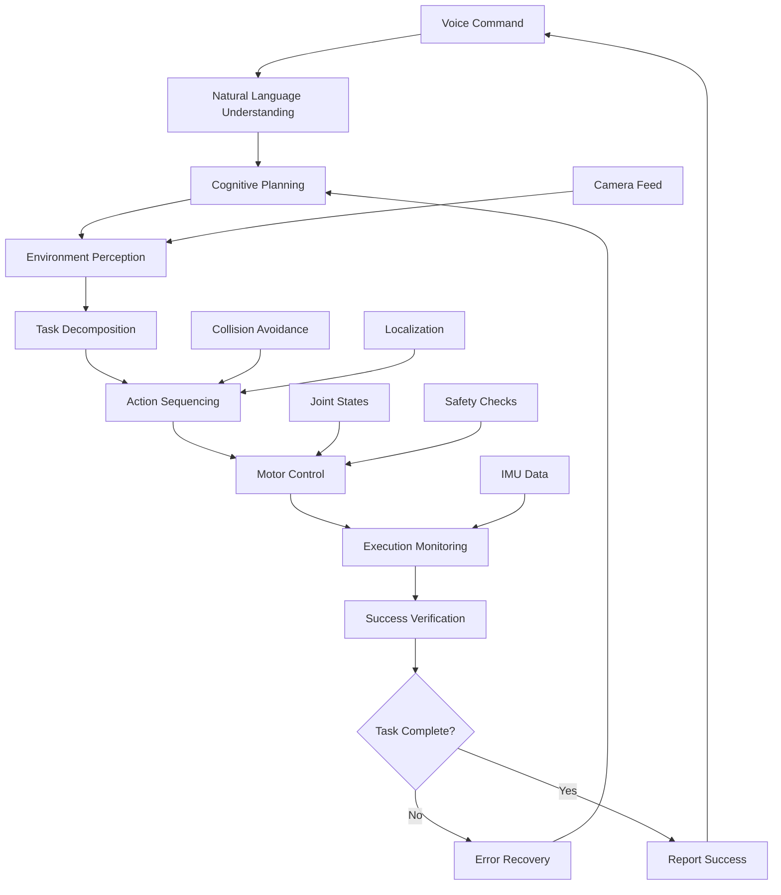

# Week 13: Capstone Project - Autonomous Humanoid

This week focuses on the capstone project: implementing an autonomous humanoid system that integrates all components of the Vision-Language-Action (VLA) pipeline. You'll create a complete autonomous humanoid robot capable of understanding voice commands, perceiving its environment, and executing complex tasks.

## Learning Objectives

By the end of this week, you will be able to:

- Integrate all VLA system components into a cohesive autonomous system
- Implement end-to-end task execution from voice command to action completion
- Create robust error handling and recovery mechanisms for autonomous operation
- Develop a complete autonomous humanoid demonstration system

## 13.1 System Integration Architecture

### Autonomous Humanoid System Overview

```python
import rclpy
from rclpy.node import Node
from std_msgs.msg import String
from sensor_msgs.msg import Image, JointState, Imu
from geometry_msgs.msg import Twist, Pose
from humanoid_msgs.msg import CognitivePlan, TaskStep
from builtin_interfaces.msg import Time
import numpy as np
import json
import time
from typing import Dict, List, Any, Optional

class AutonomousHumanoidNode(Node):
    def __init__(self):
        super().__init__('autonomous_humanoid')

        # Initialize all subsystems
        self.initialize_subsystems()

        # Publishers
        self.status_pub = self.create_publisher(String, '/autonomous_status', 10)
        self.system_state_pub = self.create_publisher(String, '/system_state', 10)

        # Subscribers
        self.voice_cmd_sub = self.create_subscription(
            String, '/voice_command', self.voice_command_callback, 10
        )
        self.parsed_voice_cmd_sub = self.create_subscription(
            String, '/parsed_voice_command', self.parsed_voice_command_callback, 10
        )
        self.vision_detections_sub = self.create_subscription(
            String, '/vision/detections', self.vision_detections_callback, 10
        )
        self.joint_state_sub = self.create_subscription(
            JointState, '/joint_states', self.joint_state_callback, 10
        )
        self.imu_sub = self.create_subscription(
            Imu, '/imu/data', self.imu_callback, 10
        )

        # System state
        self.current_state = 'idle'  # idle, listening, processing, executing, error
        self.current_task = None
        self.system_health = {'vision': True, 'voice': True, 'control': True, 'safety': True}
        self.last_command_time = time.time()
        self.command_timeout = 30.0  # seconds

        # System integration timer
        self.system_timer = self.create_timer(1.0, self.system_monitor_callback)

        self.get_logger().info('Autonomous Humanoid System initialized')

    def initialize_subsystems(self):
        """Initialize all subsystems"""
        # Initialize voice recognition subsystem
        self.voice_system = VoiceSystem(self)

        # Initialize vision system
        self.vision_system = VisionSystem(self)

        # Initialize cognitive planning system
        self.cognitive_system = CognitiveSystem(self)

        # Initialize action execution system
        self.action_system = ActionSystem(self)

        # Initialize safety system
        self.safety_system = SafetySystem(self)

        self.get_logger().info('All subsystems initialized')

    def voice_command_callback(self, msg: String):
        """Handle raw voice command"""
        self.get_logger().info(f'Received voice command: {msg.data}')
        self.last_command_time = time.time()

        # Update system state
        self.current_state = 'processing'
        self.publish_system_state()

        # Process through voice system
        processed_command = self.voice_system.process_command(msg.data)

        # Generate cognitive plan
        plan = self.cognitive_system.generate_plan(processed_command)

        if plan:
            # Execute the plan
            success = self.action_system.execute_plan(plan)

            if success:
                self.get_logger().info('Task completed successfully')
                self.current_state = 'idle'
            else:
                self.get_logger().error('Task execution failed')
                self.current_state = 'error'
        else:
            self.get_logger().error('Failed to generate plan')
            self.current_state = 'error'

        self.publish_system_state()

    def parsed_voice_command_callback(self, msg: String):
        """Handle parsed voice command"""
        try:
            parsed_data = json.loads(msg.data)
            self.get_logger().info(f'Parsed command: {parsed_data}')

            # Process parsed command directly
            plan = self.cognitive_system.generate_plan_from_parsed(parsed_data)

            if plan:
                success = self.action_system.execute_plan(plan)
                if success:
                    self.get_logger().info('Parsed task completed successfully')
                else:
                    self.get_logger().error('Parsed task execution failed')
        except json.JSONDecodeError:
            self.get_logger().error('Invalid JSON in parsed voice command')

    def vision_detections_callback(self, msg: String):
        """Handle vision detections"""
        try:
            detections = json.loads(msg.data)
            self.vision_system.update_detections(detections)
        except json.JSONDecodeError:
            self.get_logger().error('Invalid JSON in vision detections')

    def joint_state_callback(self, msg: JointState):
        """Update joint state for all systems"""
        joint_positions = {}
        for i, name in enumerate(msg.name):
            if i < len(msg.position):
                joint_positions[name] = msg.position[i]

        # Update all systems with joint state
        self.action_system.update_joint_state(joint_positions)
        self.safety_system.update_joint_state(joint_positions)

    def imu_callback(self, msg: Imu):
        """Update IMU data for safety and control"""
        imu_data = {
            'orientation': [msg.orientation.x, msg.orientation.y, msg.orientation.z, msg.orientation.w],
            'angular_velocity': [msg.angular_velocity.x, msg.angular_velocity.y, msg.angular_velocity.z],
            'linear_acceleration': [msg.linear_acceleration.x, msg.linear_acceleration.y, msg.linear_acceleration.z]
        }

        # Update safety system with IMU data
        self.safety_system.update_imu_data(imu_data)

    def system_monitor_callback(self):
        """Monitor overall system health and state"""
        # Check for command timeouts
        if (time.time() - self.last_command_time) > self.command_timeout and self.current_state != 'idle':
            self.get_logger().warn('Command timeout - returning to idle state')
            self.current_state = 'idle'

        # Check subsystem health
        self.check_subsystem_health()

        # Publish system state
        self.publish_system_state()

    def check_subsystem_health(self):
        """Check health of all subsystems"""
        self.system_health['voice'] = self.voice_system.is_healthy()
        self.system_health['vision'] = self.vision_system.is_healthy()
        self.system_health['cognitive'] = self.cognitive_system.is_healthy()
        self.system_health['action'] = self.action_system.is_healthy()
        self.system_health['safety'] = self.safety_system.is_healthy()

        # Log any issues
        for system, healthy in self.system_health.items():
            if not healthy:
                self.get_logger().warn(f'{system.capitalize()} system is not healthy')

    def publish_system_state(self):
        """Publish current system state"""
        state_info = {
            'current_state': self.current_state,
            'current_task': self.current_task,
            'system_health': self.system_health,
            'timestamp': time.time()
        }

        state_msg = String()
        state_msg.data = json.dumps(state_info, indent=2)
        self.system_state_pub.publish(state_msg)

        # Also publish simple status
        status_msg = String()
        status_msg.data = f"State: {self.current_state}, Health: {sum(self.system_health.values())}/{len(self.system_health)}"
        self.status_pub.publish(status_msg)

class VoiceSystem:
    def __init__(self, node: Node):
        self.node = node
        self.is_initialized = True
        self.command_history = []

    def process_command(self, raw_command: str) -> Dict[str, Any]:
        """Process raw voice command and return structured data"""
        # In a real system, this would involve:
        # 1. Natural language understanding
        # 2. Intent classification
        # 3. Entity extraction
        # 4. Context integration

        processed = {
            'raw': raw_command,
            'intent': self.classify_intent(raw_command),
            'entities': self.extract_entities(raw_command),
            'confidence': 0.9,  # Would come from NLU system
            'timestamp': time.time()
        }

        self.command_history.append(processed)
        return processed

    def classify_intent(self, command: str) -> str:
        """Classify the intent of the command"""
        command_lower = command.lower()

        if any(word in command_lower for word in ['go to', 'move to', 'navigate to']):
            return 'navigation'
        elif any(word in command_lower for word in ['pick up', 'grasp', 'get']):
            return 'manipulation'
        elif any(word in command_lower for word in ['find', 'look for', 'show']):
            return 'perception'
        elif any(word in command_lower for word in ['stop', 'wait', 'halt']):
            return 'stop'
        else:
            return 'unknown'

    def extract_entities(self, command: str) -> Dict[str, str]:
        """Extract entities from the command"""
        entities = {}

        # Simple keyword-based extraction (would use NLP in real system)
        command_lower = command.lower()

        if 'kitchen' in command_lower:
            entities['location'] = 'kitchen'
        elif 'living room' in command_lower:
            entities['location'] = 'living_room'
        elif 'bedroom' in command_lower:
            entities['location'] = 'bedroom'

        if 'cup' in command_lower:
            entities['object'] = 'cup'
        elif 'bottle' in command_lower:
            entities['object'] = 'bottle'
        elif 'book' in command_lower:
            entities['object'] = 'book'

        return entities

    def is_healthy(self) -> bool:
        """Check if voice system is healthy"""
        return self.is_initialized

class VisionSystem:
    def __init__(self, node: Node):
        self.node = node
        self.is_initialized = True
        self.detections = []
        self.object_memory = {}  # Remembered object locations

    def update_detections(self, detections: List[Dict[str, Any]]):
        """Update with new vision detections"""
        self.detections = detections

        # Update object memory with new detections
        for detection in detections:
            obj_name = detection.get('class_name', 'unknown')
            if obj_name not in self.object_memory:
                self.object_memory[obj_name] = []

            # Add location information
            location_info = {
                'position': detection.get('position', [0, 0, 0]),
                'timestamp': time.time(),
                'confidence': detection.get('confidence', 0.0)
            }
            self.object_memory[obj_name].append(location_info)

    def get_object_location(self, obj_name: str) -> Optional[List[float]]:
        """Get the most recent location of an object"""
        if obj_name in self.object_memory:
            # Get the most recent location
            locations = self.object_memory[obj_name]
            if locations:
                # Return the most recent with highest confidence
                latest = max(locations, key=lambda x: x['timestamp'])
                return latest['position']

        return None

    def is_healthy(self) -> bool:
        """Check if vision system is healthy"""
        return self.is_initialized

class CognitiveSystem:
    def __init__(self, node: Node):
        self.node = node
        self.is_initialized = True
        self.known_objects = ['cup', 'bottle', 'book', 'chair', 'table']
        self.known_locations = ['kitchen', 'living_room', 'bedroom', 'office']

    def generate_plan(self, processed_command: Dict[str, Any]) -> Optional[CognitivePlan]:
        """Generate cognitive plan from processed command"""
        intent = processed_command['intent']
        entities = processed_command['entities']

        plan = CognitivePlan()
        plan.task_name = f"task_{int(time.time())}"
        plan.task_description = processed_command['raw']
        plan.priority = "medium"

        if intent == 'navigation':
            return self.create_navigation_plan(entities, plan)
        elif intent == 'manipulation':
            return self.create_manipulation_plan(entities, plan)
        elif intent == 'perception':
            return self.create_perception_plan(entities, plan)
        elif intent == 'stop':
            return self.create_stop_plan(plan)
        else:
            self.node.get_logger().warn(f'Unknown intent: {intent}')
            return None

    def generate_plan_from_parsed(self, parsed_data: Dict[str, Any]) -> Optional[CognitivePlan]:
        """Generate plan directly from parsed data"""
        # This would handle more complex parsed commands
        plan = CognitivePlan()
        plan.task_name = f"parsed_task_{int(time.time())}"
        plan.task_description = str(parsed_data)
        plan.priority = "medium"

        # Extract information from parsed data and create appropriate plan
        if 'action' in parsed_data:
            action = parsed_data['action']
            if action == 'move_to':
                return self.create_navigation_plan(parsed_data.get('parameters', {}), plan)
            elif action == 'grasp_object':
                return self.create_manipulation_plan(parsed_data.get('parameters', {}), plan)

        return plan

    def create_navigation_plan(self, entities: Dict[str, str], plan: CognitivePlan) -> CognitivePlan:
        """Create navigation plan"""
        # Define navigation steps
        if 'location' in entities:
            location = entities['location']

            # Create steps for navigation
            approach_step = TaskStep()
            approach_step.id = "1"
            approach_step.name = f"Navigate to {location}"
            approach_step.description = f"Move to {location} area"
            approach_step.action = "navigation"

            # Add parameters
            params = {
                'target_location': location,
                'speed': 0.3,
                'avoid_obstacles': True
            }
            approach_step.parameters = json.dumps(params)

            plan.steps.append(approach_step)

        return plan

    def create_manipulation_plan(self, entities: Dict[str, str], plan: CognitivePlan) -> CognitivePlan:
        """Create manipulation plan"""
        if 'object' in entities:
            obj = entities['object']

            # Find object location (would use vision system in real implementation)
            # For now, assume we know where objects are
            location = self.estimate_object_location(obj)

            # Step 1: Navigate to object
            navigate_step = TaskStep()
            navigate_step.id = "1"
            navigate_step.name = f"Navigate to {obj}"
            navigate_step.description = f"Move to {obj} location"
            navigate_step.action = "navigation"
            navigate_step.parameters = json.dumps({
                'target_location': location,
                'speed': 0.2
            })
            plan.steps.append(navigate_step)

            # Step 2: Grasp object
            grasp_step = TaskStep()
            grasp_step.id = "2"
            grasp_step.name = f"Grasp {obj}"
            grasp_step.description = f"Pick up the {obj}"
            grasp_step.action = "manipulation"
            grasp_step.parameters = json.dumps({
                'action_type': 'grasp',
                'object': obj
            })
            plan.steps.append(grasp_step)

        return plan

    def create_perception_plan(self, entities: Dict[str, str], plan: CognitivePlan) -> CognitivePlan:
        """Create perception plan"""
        if 'object' in entities:
            obj = entities['object']

            # Step 1: Look for object
            search_step = TaskStep()
            search_step.id = "1"
            search_step.name = f"Look for {obj}"
            search_step.description = f"Search for {obj} in the environment"
            search_step.action = "perception"
            search_step.parameters = json.dumps({
                'action_type': 'detect_object',
                'object_type': obj
            })
            plan.steps.append(search_step)

        return plan

    def create_stop_plan(self, plan: CognitivePlan) -> CognitivePlan:
        """Create stop plan"""
        stop_step = TaskStep()
        stop_step.id = "1"
        stop_step.name = "Stop all motion"
        stop_step.description = "Halt all robot motion"
        stop_step.action = "stop"
        stop_step.parameters = json.dumps({})
        plan.steps.append(stop_step)

        return plan

    def estimate_object_location(self, obj: str) -> str:
        """Estimate object location (simplified)"""
        # In a real system, this would query the vision system's object memory
        # For now, return a default location based on object type
        if obj in ['cup', 'bottle']:
            return 'kitchen'
        elif obj in ['book']:
            return 'office'
        else:
            return 'living_room'

    def is_healthy(self) -> bool:
        """Check if cognitive system is healthy"""
        return self.is_initialized

class ActionSystem:
    def __init__(self, node: Node):
        self.node = node
        self.is_initialized = True
        self.current_joint_positions = {}
        self.execution_history = []

    def execute_plan(self, plan: CognitivePlan) -> bool:
        """Execute the cognitive plan"""
        self.node.get_logger().info(f'Executing plan: {plan.task_name}')

        success = True
        for i, step in enumerate(plan.steps):
            self.node.get_logger().info(f'Executing step {i+1}/{len(plan.steps)}: {step.name}')

            step_success = self.execute_step(step)
            if not step_success:
                self.node.get_logger().error(f'Step {step.name} failed')
                success = False
                break

            # Add to execution history
            self.execution_history.append({
                'step_id': step.id,
                'step_name': step.name,
                'success': step_success,
                'timestamp': time.time()
            })

        return success

    def execute_step(self, step: TaskStep) -> bool:
        """Execute a single step"""
        try:
            params = json.loads(step.parameters) if step.parameters else {}

            if step.action == 'navigation':
                return self.execute_navigation_step(params)
            elif step.action == 'manipulation':
                return self.execute_manipulation_step(params)
            elif step.action == 'perception':
                return self.execute_perception_step(params)
            elif step.action == 'stop':
                return self.execute_stop_step(params)
            else:
                self.node.get_logger().warn(f'Unknown action: {step.action}')
                return False

        except json.JSONDecodeError:
            self.node.get_logger().error(f'Invalid JSON parameters for step {step.id}')
            return False
        except Exception as e:
            self.node.get_logger().error(f'Error executing step {step.id}: {e}')
            return False

    def execute_navigation_step(self, params: Dict[str, Any]) -> bool:
        """Execute navigation step"""
        target_location = params.get('target_location', 'unknown')
        speed = params.get('speed', 0.2)

        self.node.get_logger().info(f'Navigating to {target_location} at speed {speed}')

        # In a real system, this would interface with navigation stack
        # For simulation, just wait
        time.sleep(2)  # Simulate navigation time

        return True

    def execute_manipulation_step(self, params: Dict[str, Any]) -> bool:
        """Execute manipulation step"""
        action_type = params.get('action_type', 'unknown')
        obj = params.get('object', 'unknown')

        self.node.get_logger().info(f'Performing {action_type} on {obj}')

        # In a real system, this would control manipulator
        # For simulation, just wait
        time.sleep(3)  # Simulate manipulation time

        return True

    def execute_perception_step(self, params: Dict[str, Any]) -> bool:
        """Execute perception step"""
        action_type = params.get('action_type', 'unknown')
        obj_type = params.get('object_type', 'unknown')

        self.node.get_logger().info(f'Performing {action_type} for {obj_type}')

        # In a real system, this would use vision system
        # For simulation, just wait
        time.sleep(1)  # Simulate perception time

        return True

    def execute_stop_step(self, params: Dict[str, Any]) -> bool:
        """Execute stop step"""
        self.node.get_logger().info('Stopping all motion')

        # Publish zero velocity
        cmd_vel = Twist()
        self.node.cmd_vel_pub.publish(cmd_vel)

        return True

    def update_joint_state(self, joint_positions: Dict[str, float]):
        """Update current joint positions"""
        self.current_joint_positions.update(joint_positions)

    def is_healthy(self) -> bool:
        """Check if action system is healthy"""
        return self.is_initialized

class SafetySystem:
    def __init__(self, node: Node):
        self.node = node
        self.is_initialized = True
        self.joint_states = {}
        self.imu_data = {}
        self.emergency_stop = False
        self.safety_limits = {
            'max_tilt': 30.0,  # degrees
            'max_joint_velocity': 2.0,  # rad/s
            'max_joint_torque': 100.0,  # Nm
        }

    def update_joint_state(self, joint_positions: Dict[str, float]):
        """Update joint state for safety monitoring"""
        self.joint_states.update(joint_positions)

    def update_imu_data(self, imu_data: Dict[str, List[float]]):
        """Update IMU data for safety monitoring"""
        self.imu_data = imu_data

    def check_safety(self) -> bool:
        """Check if system is operating safely"""
        if self.emergency_stop:
            return False

        # Check IMU for excessive tilt
        if 'orientation' in self.imu_data:
            # Convert quaternion to Euler angles to check tilt
            # Simplified check - in real system would do proper conversion
            tilt_ok = True  # Placeholder
        else:
            tilt_ok = True

        # Check joint velocities and torques would go here
        velocity_ok = True
        torque_ok = True

        return tilt_ok and velocity_ok and torque_ok

    def trigger_emergency_stop(self):
        """Trigger emergency stop"""
        self.emergency_stop = True
        self.node.get_logger().fatal('EMERGENCY STOP TRIGGERED')

    def is_healthy(self) -> bool:
        """Check if safety system is healthy"""
        return self.is_initialized and not self.emergency_stop
```

## 13.2 End-to-End Task Execution

### Complete Task Pipeline

```python
class EndToEndTaskExecutor:
    def __init__(self, node: AutonomousHumanoidNode):
        self.node = node
        self.task_queue = []
        self.current_task = None
        self.task_history = []

    def submit_task(self, task_description: str) -> str:
        """Submit a new task for execution"""
        task_id = f"task_{int(time.time())}_{len(self.task_queue)}"

        task = {
            'id': task_id,
            'description': task_description,
            'status': 'queued',
            'priority': 'normal',
            'submitted_time': time.time(),
            'steps_completed': 0,
            'total_steps': 0
        }

        self.task_queue.append(task)
        self.node.get_logger().info(f'Submitted task {task_id}: {task_description}')

        # Start processing if no current task
        if self.current_task is None:
            self.process_next_task()

        return task_id

    def process_next_task(self):
        """Process the next task in the queue"""
        if not self.task_queue:
            return

        self.current_task = self.task_queue.pop(0)
        self.current_task['status'] = 'processing'
        self.current_task['start_time'] = time.time()

        self.node.get_logger().info(f'Starting task {self.current_task["id"]}')

        # Execute the task through the full pipeline
        success = self.execute_task_pipeline(self.current_task)

        # Update task status
        self.current_task['status'] = 'completed' if success else 'failed'
        self.current_task['end_time'] = time.time()
        self.current_task['duration'] = time.time() - self.current_task['start_time']

        # Add to history
        self.task_history.append(self.current_task)

        self.node.get_logger().info(f'Task {self.current_task["id"]} {"completed" if success else "failed"}')

        # Process next task
        self.current_task = None
        self.process_next_task()

    def execute_task_pipeline(self, task: Dict[str, Any]) -> bool:
        """Execute task through full VLA pipeline"""
        try:
            # Step 1: Parse and understand the task
            self.node.get_logger().info(f'Understanding task: {task["description"]}')
            parsed_task = self.parse_task_description(task['description'])

            if not parsed_task:
                self.node.get_logger().error('Failed to parse task description')
                return False

            # Step 2: Use vision system to assess environment
            self.node.get_logger().info('Assessing environment with vision system')
            environment_info = self.node.vision_system.object_memory

            # Step 3: Generate cognitive plan
            self.node.get_logger().info('Generating cognitive plan')
            plan = self.node.cognitive_system.generate_plan(parsed_task)

            if not plan or not plan.steps:
                self.node.get_logger().error('Failed to generate valid plan')
                return False

            task['total_steps'] = len(plan.steps)

            # Step 4: Execute the plan with safety monitoring
            self.node.get_logger().info('Executing plan with safety monitoring')
            success = self.node.action_system.execute_plan(plan)

            # Step 5: Verify completion
            if success:
                verification_result = self.verify_task_completion(task, parsed_task)
                success = verification_result

            return success

        except Exception as e:
            self.node.get_logger().error(f'Task execution error: {e}')
            return False

    def parse_task_description(self, description: str) -> Optional[Dict[str, Any]]:
        """Parse natural language task description"""
        # Use voice system's parsing capabilities
        return self.node.voice_system.process_command(description)

    def verify_task_completion(self, task: Dict[str, Any], parsed_task: Dict[str, Any]) -> bool:
        """Verify that the task was completed successfully"""
        # In a real system, this would use perception to verify completion
        # For example, if the task was to "pick up the red cup",
        # verify that the cup is no longer in its original location
        # and potentially in the robot's gripper

        self.node.get_logger().info(f'Verifying completion of task: {task["description"]}')

        # For now, assume success
        return True

class AdvancedAutonomousHumanoidNode(AutonomousHumanoidNode):
    def __init__(self):
        super().__init__()

        # Initialize end-to-end task executor
        self.task_executor = EndToEndTaskExecutor(self)

        # Additional publishers for task management
        self.task_status_pub = self.create_publisher(String, '/task_status', 10)
        self.task_result_pub = self.create_publisher(String, '/task_result', 10)

    def voice_command_callback(self, msg: String):
        """Handle voice command with full task execution"""
        self.get_logger().info(f'Received voice command: {msg.data}')

        # Submit the command as a task
        task_id = self.task_executor.submit_task(msg.data)

        # Publish task submission
        task_info = {
            'task_id': task_id,
            'command': msg.data,
            'status': 'submitted',
            'timestamp': time.time()
        }

        task_msg = String()
        task_msg.data = json.dumps(task_info)
        self.task_status_pub.publish(task_msg)

    def publish_task_result(self, task_id: str, success: bool, details: str = ""):
        """Publish task execution result"""
        result = {
            'task_id': task_id,
            'success': success,
            'details': details,
            'timestamp': time.time()
        }

        result_msg = String()
        result_msg.data = json.dumps(result)
        self.task_result_pub.publish(result_msg)
```

## 13.3 Robust Error Handling and Recovery

### Error Recovery System

```python
import traceback
from enum import Enum

class RecoveryStrategy(Enum):
    RETRY = "retry"
    SKIP = "skip"
    ABORT = "abort"
    FALLBACK = "fallback"
    MANUAL = "manual"

class ErrorRecoverySystem:
    def __init__(self, node: Node):
        self.node = node
        self.error_history = []
        self.recovery_strategies = {}
        self.max_retries = 3
        self.retry_delay = 1.0  # seconds

    def handle_error(self, error: Exception, context: str = "") -> RecoveryStrategy:
        """Handle an error and determine recovery strategy"""
        error_info = {
            'error_type': type(error).__name__,
            'error_message': str(error),
            'context': context,
            'timestamp': time.time(),
            'traceback': traceback.format_exc()
        }

        self.error_history.append(error_info)
        self.node.get_logger().error(f'Error in {context}: {error}')

        # Determine recovery strategy based on error type
        strategy = self.select_recovery_strategy(error_info)

        self.node.get_logger().info(f'Selected recovery strategy: {strategy.value}')

        return strategy

    def select_recovery_strategy(self, error_info: Dict[str, Any]) -> RecoveryStrategy:
        """Select appropriate recovery strategy based on error"""
        error_type = error_info['error_type']
        error_msg = error_info['error_message'].lower()

        # Map common errors to strategies
        if error_type == 'ConnectionError':
            return RecoveryStrategy.RETRY
        elif error_type == 'TimeoutError':
            return RecoveryStrategy.SKIP
        elif 'collision' in error_msg or 'obstacle' in error_msg:
            return RecoveryStrategy.FALLBACK
        elif 'safety' in error_msg or 'emergency' in error_msg:
            return RecoveryStrategy.ABORT
        else:
            # Default strategy
            return RecoveryStrategy.SKIP

    def execute_recovery(self, strategy: RecoveryStrategy, error_info: Dict[str, Any],
                        recovery_function: callable = None) -> bool:
        """Execute the selected recovery strategy"""
        if strategy == RecoveryStrategy.RETRY:
            return self.execute_retry(error_info, recovery_function)
        elif strategy == RecoveryStrategy.SKIP:
            self.node.get_logger().warn('Skipping failed operation')
            return True  # Considered successful to continue
        elif strategy == RecoveryStrategy.ABORT:
            self.node.get_logger().fatal('Aborting task due to critical error')
            return False
        elif strategy == RecoveryStrategy.FALLBACK:
            return self.execute_fallback(error_info)
        elif strategy == RecoveryStrategy.MANUAL:
            self.node.get_logger().warn('Manual intervention required')
            return False
        else:
            return False

    def execute_retry(self, error_info: Dict[str, Any], recovery_function: callable) -> bool:
        """Execute retry strategy"""
        for attempt in range(self.max_retries):
            self.node.get_logger().info(f'Attempt {attempt + 1} of {self.max_retries}')

            try:
                if recovery_function:
                    result = recovery_function()
                    if result:
                        self.node.get_logger().info('Retry successful')
                        return True
            except Exception as e:
                self.node.get_logger().warn(f'Retry attempt {attempt + 1} failed: {e}')

            time.sleep(self.retry_delay)

        self.node.get_logger().error('All retry attempts failed')
        return False

    def execute_fallback(self, error_info: Dict[str, Any]) -> bool:
        """Execute fallback strategy"""
        self.node.get_logger().info('Executing fallback procedure')

        # Implement fallback logic here
        # This could involve:
        # - Using alternative sensors
        # - Simplified approach
        # - Safe position recovery
        # - Human intervention request

        # For now, return True to continue operation
        return True

class RobustAutonomousHumanoidNode(AdvancedAutonomousHumanoidNode):
    def __init__(self):
        super().__init__()

        # Initialize error recovery system
        self.error_recovery = ErrorRecoverySystem(self)

        # Publisher for error reports
        self.error_report_pub = self.create_publisher(String, '/error_report', 10)

    def execute_task_pipeline(self, task: Dict[str, Any]) -> bool:
        """Execute task pipeline with robust error handling"""
        try:
            # Step 1: Parse and understand the task
            self.node.get_logger().info(f'Understanding task: {task["description"]}')
            parsed_task = self.parse_task_description(task['description'])

            if not parsed_task:
                self.get_logger().error('Failed to parse task description')
                return False

            # Step 2: Use vision system to assess environment
            self.node.get_logger().info('Assessing environment with vision system')
            environment_info = self.node.vision_system.object_memory

            # Step 3: Generate cognitive plan
            self.node.get_logger().info('Generating cognitive plan')
            plan = self.node.cognitive_system.generate_plan(parsed_task)

            if not plan or not plan.steps:
                self.node.get_logger().error('Failed to generate valid plan')
                return False

            task['total_steps'] = len(plan.steps)

            # Step 4: Execute the plan with error handling
            self.node.get_logger().info('Executing plan with error handling')
            success = self.execute_plan_with_error_handling(plan)

            # Step 5: Verify completion
            if success:
                verification_result = self.verify_task_completion(task, parsed_task)
                success = verification_result

            return success

        except Exception as e:
            self.node.get_logger().error(f'Task execution error: {e}')

            # Handle the error
            strategy = self.error_recovery.handle_error(e, f"task_{task['id']}")
            success = self.error_recovery.execute_recovery(strategy,
                                                         {'error': str(e)},
                                                         lambda: self.retry_task(task))
            return success

    def execute_plan_with_error_handling(self, plan: CognitivePlan) -> bool:
        """Execute plan with step-by-step error handling"""
        for i, step in enumerate(plan.steps):
            try:
                self.node.get_logger().info(f'Executing step {i+1}/{len(plan.steps)}: {step.name}')

                step_success = self.execute_step_with_error_handling(step)

                if not step_success:
                    self.node.get_logger().error(f'Step {step.name} failed after error handling')
                    return False

            except Exception as e:
                self.node.get_logger().error(f'Critical error in step {step.name}: {e}')

                # Handle step error
                strategy = self.error_recovery.handle_error(e, f"step_{step.id}")
                step_success = self.error_recovery.execute_recovery(
                    strategy,
                    {'error': str(e)},
                    lambda: self.retry_step(step)
                )

                if not step_success:
                    return False

        return True

    def execute_step_with_error_handling(self, step: TaskStep) -> bool:
        """Execute a single step with error handling"""
        try:
            return self.node.action_system.execute_step(step)
        except Exception as e:
            self.node.get_logger().error(f'Step execution error: {e}')

            strategy = self.error_recovery.handle_error(e, f"step_{step.id}")
            return self.error_recovery.execute_recovery(
                strategy,
                {'error': str(e)},
                lambda: self.retry_step(step)
            )

    def retry_task(self, task: Dict[str, Any]) -> bool:
        """Retry executing a task"""
        self.node.get_logger().info(f'Retrying task {task["id"]}')
        return self.execute_task_pipeline(task)

    def retry_step(self, step: TaskStep) -> bool:
        """Retry executing a step"""
        self.node.get_logger().info(f'Retrying step {step.id}')
        return self.node.action_system.execute_step(step)

    def publish_error_report(self, error_info: Dict[str, Any]):
        """Publish detailed error report"""
        error_msg = String()
        error_msg.data = json.dumps(error_info, indent=2)
        self.error_report_pub.publish(error_msg)
```

## 13.4 Complete Autonomous Demonstration System

### Demonstration Scenarios

```python
class AutonomousDemonstrationSystem:
    def __init__(self, node: RobustAutonomousHumanoidNode):
        self.node = node
        self.demo_scenarios = self.define_demo_scenarios()
        self.current_demo = None
        self.demo_active = False

    def define_demo_scenarios(self) -> Dict[str, List[str]]:
        """Define various demonstration scenarios"""
        return {
            'basic_interaction': [
                "Please go to the kitchen",
                "Find the red cup",
                "Bring the cup to the table"
            ],
            'navigation_demo': [
                "Navigate to the living room",
                "Turn left",
                "Move forward by 2 meters"
            ],
            'manipulation_demo': [
                "Pick up the book from the table",
                "Move the book to the shelf"
            ],
            'complex_task': [
                "Go to the kitchen and bring me a bottle of water",
                "Then go to the living room and wait there"
            ],
            'perception_demo': [
                "Look for all the chairs in the room",
                "Count how many objects you see"
            ]
        }

    def run_demo_scenario(self, scenario_name: str) -> bool:
        """Run a complete demonstration scenario"""
        if scenario_name not in self.demo_scenarios:
            self.node.get_logger().error(f'Unknown demo scenario: {scenario_name}')
            return False

        self.current_demo = scenario_name
        self.demo_active = True
        self.node.get_logger().info(f'Starting demo scenario: {scenario_name}')

        commands = self.demo_scenarios[scenario_name]

        for i, command in enumerate(commands):
            self.node.get_logger().info(f'Executing demo command {i+1}/{len(commands)}: {command}')

            # Submit command as task
            task_id = self.node.task_executor.submit_task(command)

            # Wait for completion or timeout
            start_time = time.time()
            timeout = 60.0  # 1 minute per command

            while time.time() - start_time < timeout and self.node.task_executor.current_task:
                time.sleep(0.5)  # Check every half second

            if time.time() - start_time >= timeout:
                self.node.get_logger().error(f'Command timeout: {command}')
                self.demo_active = False
                return False

        self.node.get_logger().info(f'Demo scenario {scenario_name} completed successfully')
        self.demo_active = False
        self.current_demo = None
        return True

    def run_autonomous_behavior(self) -> bool:
        """Run autonomous behavior without specific commands"""
        self.node.get_logger().info('Starting autonomous behavior mode')

        # Example autonomous behaviors:
        # 1. Patrol around the environment
        # 2. Monitor for humans and interact
        # 3. Perform routine checks
        # 4. Return to charging station when battery low

        behaviors = [
            self.patrol_behavior,
            self.monitor_behavior,
            self.routine_check_behavior
        ]

        for behavior in behaviors:
            if not behavior():
                self.node.get_logger().error(f'Behavior {behavior.__name__} failed')
                return False

        return True

    def patrol_behavior(self) -> bool:
        """Patrol behavior - move between predefined locations"""
        patrol_route = ['kitchen', 'living_room', 'bedroom', 'office']

        for location in patrol_route:
            self.node.get_logger().info(f'Patrolling to {location}')

            task_id = self.node.task_executor.submit_task(f"Go to the {location.replace('_', ' ')}")

            # Wait for completion
            start_time = time.time()
            timeout = 60.0

            while time.time() - start_time < timeout and self.node.task_executor.current_task:
                time.sleep(0.5)

            if time.time() - start_time >= timeout:
                self.node.get_logger().error(f'Patrol timeout for {location}')
                return False

        return True

    def monitor_behavior(self) -> bool:
        """Monitor behavior - look for humans and interact"""
        self.node.get_logger().info('Starting monitoring behavior')

        # This would involve:
        # - Continuously monitoring with vision system
        # - Detecting humans
        # - Initiating interactions when humans are detected
        # - For simulation, we'll just wait

        time.sleep(10)  # Simulate monitoring
        return True

    def routine_check_behavior(self) -> bool:
        """Routine check behavior - verify system status"""
        self.node.get_logger().info('Performing routine system checks')

        # Check all subsystems
        health_status = {
            'voice': self.node.voice_system.is_healthy(),
            'vision': self.node.vision_system.is_healthy(),
            'cognitive': self.node.cognitive_system.is_healthy(),
            'action': self.node.action_system.is_healthy(),
            'safety': self.node.safety_system.is_healthy()
        }

        all_healthy = all(health_status.values())

        if all_healthy:
            self.node.get_logger().info('All systems healthy')
        else:
            unhealthy = [k for k, v in health_status.items() if not v]
            self.node.get_logger().warn(f'Unhealthy systems: {unhealthy}')

        return all_healthy

class FinalAutonomousHumanoidNode(RobustAutonomousHumanoidNode):
    def __init__(self):
        super().__init__()

        # Initialize demonstration system
        self.demo_system = AutonomousDemonstrationSystem(self)

        # Publisher for demonstration status
        self.demo_status_pub = self.create_publisher(String, '/demo_status', 10)

        # Timer for autonomous behavior
        self.autonomous_timer = self.create_timer(10.0, self.autonomous_behavior_callback)

    def autonomous_behavior_callback(self):
        """Timer callback for autonomous behavior"""
        if not self.demo_system.demo_active:
            # Run autonomous behavior if no demo is active
            self.demo_system.run_autonomous_behavior()

    def run_demo(self, demo_name: str):
        """Run a specific demonstration"""
        self.get_logger().info(f'Starting demonstration: {demo_name}')

        demo_status = {
            'demo_name': demo_name,
            'status': 'running',
            'timestamp': time.time()
        }

        status_msg = String()
        status_msg.data = json.dumps(demo_status)
        self.demo_status_pub.publish(status_msg)

        success = self.demo_system.run_demo_scenario(demo_name)

        demo_status['status'] = 'completed' if success else 'failed'
        demo_status['end_time'] = time.time()

        status_msg.data = json.dumps(demo_status)
        self.demo_status_pub.publish(status_msg)

        if success:
            self.get_logger().info(f'Demonstration {demo_name} completed successfully')
        else:
            self.get_logger().error(f'Demonstration {demo_name} failed')

def main(args=None):
    rclpy.init(args=args)

    node = FinalAutonomousHumanoidNode()

    # Example: Run a demonstration
    node.run_demo('basic_interaction')

    try:
        rclpy.spin(node)
    except KeyboardInterrupt:
        node.get_logger().info('Shutting down autonomous humanoid system')
    finally:
        node.destroy_node()
        rclpy.shutdown()

if __name__ == '__main__':
    main()
```

## 13.5 Practical Exercise: Autonomous Humanoid Demonstration

### Complete System Launch File

Let's create a launch file for the complete autonomous system:

```xml
<!-- autonomous_humanoid.launch.py -->
from launch import LaunchDescription
from launch_ros.actions import Node
from launch.actions import DeclareLaunchArgument
from launch.substitutions import LaunchConfiguration
from ament_index_python.packages import get_package_share_directory
import os

def generate_launch_description():
    # Launch arguments
    namespace = LaunchConfiguration('namespace')
    use_sim_time = LaunchConfiguration('use_sim_time')
    robot_model = LaunchConfiguration('robot_model')

    # Declare launch arguments
    declare_namespace_cmd = DeclareLaunchArgument(
        'namespace',
        default_value='',
        description='Top-level namespace'
    )

    declare_use_sim_time_cmd = DeclareLaunchArgument(
        'use_sim_time',
        default_value='false',
        description='Use simulation (Gazebo) clock if true'
    )

    declare_robot_model_cmd = DeclareLaunchArgument(
        'robot_model',
        default_value='humanoid_model',
        description='Robot model to use'
    )

    # Autonomous humanoid main node
    autonomous_humanoid_node = Node(
        package='humanoid_autonomous',
        executable='autonomous_humanoid_node',
        name='autonomous_humanoid',
        parameters=[{
            'use_sim_time': use_sim_time,
            'robot_model': robot_model,
        }],
        remappings=[
            ('/voice_command', '/speech/command'),
            ('/vision/detections', '/perception/detections'),
            ('/joint_states', '/joint_states'),
            ('/imu/data', '/imu/data'),
        ],
        output='screen'
    )

    # Voice recognition system
    voice_system_node = Node(
        package='humanoid_voice',
        executable='voice_recognition_node',
        name='voice_recognition',
        parameters=[{
            'use_sim_time': use_sim_time,
        }],
        output='screen'
    )

    # Vision system
    vision_system_node = Node(
        package='humanoid_vision',
        executable='vision_processing_node',
        name='vision_processing',
        parameters=[{
            'use_sim_time': use_sim_time,
        }],
        output='screen'
    )

    # Cognitive planning system
    cognitive_system_node = Node(
        package='humanoid_cognitive_planning',
        executable='llm_cognitive_planner',
        name='cognitive_planner',
        parameters=[{
            'use_sim_time': use_sim_time,
        }],
        output='screen'
    )

    # Action execution system
    action_system_node = Node(
        package='humanoid_action_execution',
        executable='action_executor_node',
        name='action_executor',
        parameters=[{
            'use_sim_time': use_sim_time,
        }],
        output='screen'
    )

    # Safety monitoring system
    safety_system_node = Node(
        package='humanoid_safety',
        executable='safety_monitor_node',
        name='safety_monitor',
        parameters=[{
            'use_sim_time': use_sim_time,
        }],
        output='screen'
    )

    # Navigation system (if using Nav2)
    navigation_system_node = Node(
        package='nav2_bringup',
        executable='nav2_bringup',
        name='navigation_system',
        parameters=[{
            'use_sim_time': use_sim_time,
        }],
        output='screen'
    )

    # Create the launch description
    ld = LaunchDescription()

    # Declare launch options
    ld.add_action(declare_namespace_cmd)
    ld.add_action(declare_use_sim_time_cmd)
    ld.add_action(declare_robot_model_cmd)

    # Add nodes
    ld.add_action(autonomous_humanoid_node)
    ld.add_action(voice_system_node)
    ld.add_action(vision_system_node)
    ld.add_action(cognitive_system_node)
    ld.add_action(action_system_node)
    ld.add_action(safety_system_node)
    ld.add_action(navigation_system_node)

    return ld
```

## 13.6 Flowchart: Complete Autonomous Humanoid System



## Summary

This week completed Module 4 with the implementation of a complete autonomous humanoid system. We integrated all components of the Vision-Language-Action pipeline, created end-to-end task execution capabilities, implemented robust error handling and recovery mechanisms, and developed a demonstration system that showcases the full capabilities of the autonomous humanoid robot.

The autonomous humanoid system can now:
- Understand voice commands through natural language processing
- Perceive its environment using computer vision
- Generate cognitive plans for complex tasks
- Execute actions with precise motor control
- Handle errors and recover from failures
- Operate autonomously with safety monitoring

## Module Conclusion

Module 4 has successfully covered the Vision-Language-Action system for humanoid robots, providing a complete framework for autonomous operation. The integration of vision, language understanding, and action execution creates a powerful system capable of complex interactions with the environment and humans.

The textbook has now covered all four modules:
1. **Module 1**: The Robotic Nervous System (ROS 2)
2. **Module 2**: The Digital Twin (Gazebo & Unity)
3. **Module 3**: The AI-Robot Brain (NVIDIA Isaac)
4. **Module 4**: Vision-Language-Action (VLA)

This comprehensive curriculum provides students with the knowledge and skills needed to develop advanced humanoid robotics systems using modern tools and techniques.