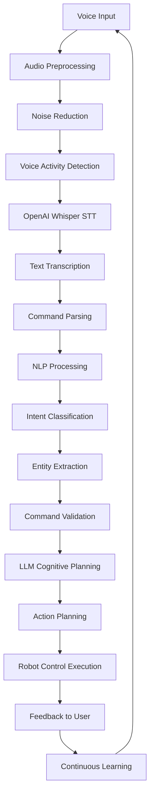

# Week 9: Voice Recognition and Processing

This week focuses on voice recognition and processing for humanoid robots, specifically integrating OpenAI Whisper for speech-to-text capabilities. You'll learn to process voice commands, handle audio preprocessing, and create natural language interfaces for robot control.

## Learning Objectives

By the end of this week, you will be able to:

- Integrate OpenAI Whisper for voice recognition in robotics
- Process and preprocess audio signals for robot commands
- Parse and interpret voice commands for robot execution
- Handle noise reduction and audio quality issues
- Create robust voice command interfaces for humanoid robots

## 9.1 Introduction to Voice Recognition in Robotics

### Voice Recognition for Humanoid Robots

Voice recognition is a crucial component for creating natural human-robot interaction. For humanoid robots, voice recognition enables:

- **Natural interaction**: Humans can communicate using natural language
- **Hands-free operation**: Useful when robot is performing tasks
- **Accessibility**: Enables interaction for users with mobility limitations
- **Multi-modal interfaces**: Combines with vision and action for richer interactions

### OpenAI Whisper Overview

OpenAI Whisper is a robust speech recognition model that can transcribe speech in multiple languages. Key features for robotics:

- **Multilingual support**: Supports 99 languages
- **Robust to noise**: Performs well in various acoustic environments
- **Open-source**: Can be customized and deployed locally
- **Multiple models**: Different sizes for various computational requirements

### Whisper Architecture for Robotics

```python
import rclpy
from rclpy.node import Node
from std_msgs.msg import String
from sensor_msgs.msg import AudioData
from geometry_msgs.msg import Twist
import numpy as np
import whisper
import torch
import pyaudio
import wave
import threading
import queue
import time

class VoiceRecognitionNode(Node):
    def __init__(self):
        super().__init__('voice_recognition_node')

        # Initialize Whisper model
        self.get_logger().info('Loading Whisper model...')
        self.model = whisper.load_model("base")  # Use "small" or "medium" for better accuracy
        self.get_logger().info('Whisper model loaded successfully')

        # Audio processing parameters
        self.sample_rate = 16000  # Whisper expects 16kHz
        self.chunk_size = 1024
        self.audio_queue = queue.Queue()
        self.command_queue = queue.Queue()

        # Publishers and subscribers
        self.voice_cmd_pub = self.create_publisher(String, '/voice_command', 10)
        self.audio_sub = self.create_subscription(AudioData, '/audio', self.audio_callback, 10)
        self.cmd_vel_pub = self.create_publisher(Twist, '/cmd_vel', 10)

        # Voice recognition control
        self.is_listening = False
        self.listening_timer = self.create_timer(0.1, self.check_listening_state)

        # Audio recording setup
        self.audio = pyaudio.PyAudio()
        self.setup_audio_stream()

        self.get_logger().info('Voice Recognition Node initialized')

    def setup_audio_stream(self):
        """Setup audio stream for recording"""
        try:
            self.stream = self.audio.open(
                format=pyaudio.paInt16,
                channels=1,
                rate=self.sample_rate,
                input=True,
                frames_per_buffer=self.chunk_size
            )
            self.get_logger().info('Audio stream initialized')
        except Exception as e:
            self.get_logger().error(f'Failed to initialize audio stream: {e}')

    def audio_callback(self, msg):
        """Receive audio data from ROS topic"""
        # Convert AudioData message to numpy array
        audio_data = np.frombuffer(msg.data, dtype=np.int16).astype(np.float32) / 32768.0
        self.audio_queue.put(audio_data)

    def start_listening(self):
        """Start voice recognition"""
        self.is_listening = True
        self.get_logger().info('Voice recognition started')

        # Start audio recording thread
        self.recording_thread = threading.Thread(target=self.record_audio_continuously)
        self.recording_thread.daemon = True
        self.recording_thread.start()

    def stop_listening(self):
        """Stop voice recognition"""
        self.is_listening = False
        self.get_logger().info('Voice recognition stopped')

    def check_listening_state(self):
        """Timer callback to check if we should be listening"""
        if self.is_listening:
            # Process any queued audio
            self.process_queued_audio()

    def record_audio_continuously(self):
        """Continuously record audio in a separate thread"""
        while self.is_listening:
            try:
                # Read audio data from stream
                data = self.stream.read(self.chunk_size, exception_on_overflow=False)
                audio_array = np.frombuffer(data, dtype=np.int16).astype(np.float32) / 32768.0
                self.audio_queue.put(audio_array)
            except Exception as e:
                self.get_logger().error(f'Audio recording error: {e}')
                time.sleep(0.1)

    def process_queued_audio(self):
        """Process all queued audio chunks"""
        audio_chunks = []

        # Collect all available audio chunks
        while not self.audio_queue.empty():
            chunk = self.audio_queue.get_nowait()
            audio_chunks.append(chunk)

        if audio_chunks:
            # Concatenate all chunks
            full_audio = np.concatenate(audio_chunks)

            # Check if audio is loud enough to process
            if np.max(np.abs(full_audio)) > 0.01:  # Threshold for voice detection
                self.transcribe_audio(full_audio)

    def transcribe_audio(self, audio_data):
        """Transcribe audio using Whisper"""
        try:
            # Convert to tensor and ensure proper format
            audio_tensor = torch.from_numpy(audio_data).float()

            # Transcribe using Whisper
            result = self.model.transcribe(audio_tensor.numpy(), fp16=False)
            transcription = result['text'].strip()

            if transcription:  # If we got a transcription
                self.get_logger().info(f'Voice command: "{transcription}"')

                # Publish the command
                cmd_msg = String()
                cmd_msg.data = transcription
                self.voice_cmd_pub.publish(cmd_msg)

                # Parse and execute the command
                self.parse_voice_command(transcription)

        except Exception as e:
            self.get_logger().error(f'Whisper transcription error: {e}')

    def parse_voice_command(self, command):
        """Parse voice command and execute appropriate action"""
        command_lower = command.lower()

        # Define command patterns
        if 'forward' in command_lower or 'go' in command_lower and 'forward' in command_lower:
            self.execute_move_command('forward')
        elif 'backward' in command_lower or 'back' in command_lower:
            self.execute_move_command('backward')
        elif 'left' in command_lower:
            self.execute_move_command('left')
        elif 'right' in command_lower:
            self.execute_move_command('right')
        elif 'stop' in command_lower or 'halt' in command_lower:
            self.execute_stop_command()
        elif 'hello' in command_lower or 'hi' in command_lower:
            self.execute_greeting_command()
        else:
            self.get_logger().info(f'Unknown command: "{command}"')

    def execute_move_command(self, direction):
        """Execute movement command"""
        cmd_vel = Twist()

        if direction == 'forward':
            cmd_vel.linear.x = 0.2  # Move forward at 0.2 m/s
        elif direction == 'backward':
            cmd_vel.linear.x = -0.2  # Move backward
        elif direction == 'left':
            cmd_vel.angular.z = 0.5  # Turn left
        elif direction == 'right':
            cmd_vel.angular.z = -0.5  # Turn right

        self.cmd_vel_pub.publish(cmd_vel)
        self.get_logger().info(f'Executing {direction} command')

    def execute_stop_command(self):
        """Execute stop command"""
        cmd_vel = Twist()  # Zero velocity
        self.cmd_vel_pub.publish(cmd_vel)
        self.get_logger().info('Stopping robot')

    def execute_greeting_command(self):
        """Execute greeting response"""
        # This could trigger a text-to-speech response
        self.get_logger().info('Robot acknowledges greeting')

def main(args=None):
    rclpy.init(args=args)
    node = VoiceRecognitionNode()

    # Start listening automatically
    node.start_listening()

    try:
        rclpy.spin(node)
    except KeyboardInterrupt:
        node.get_logger().info('Shutting down voice recognition node')
    finally:
        node.stop_listening()
        if hasattr(node, 'stream'):
            node.stream.stop_stream()
            node.stream.close()
        if hasattr(node, 'audio'):
            node.audio.terminate()
        node.destroy_node()
        rclpy.shutdown()

if __name__ == '__main__':
    main()
```

## 9.2 Audio Preprocessing and Noise Reduction

### Audio Preprocessing Pipeline

```python
import numpy as np
import scipy.signal as signal
from scipy import fft
import librosa

class AudioPreprocessor:
    def __init__(self, sample_rate=16000):
        self.sample_rate = sample_rate
        self.frame_length = 2048  # FFT frame length
        self.hop_length = 512     # Hop length for STFT

        # Noise reduction parameters
        self.noise_threshold = 0.01
        self.snr_threshold = 10.0

    def preprocess_audio(self, audio_data):
        """
        Complete audio preprocessing pipeline
        """
        # 1. Normalize audio
        normalized_audio = self.normalize_audio(audio_data)

        # 2. Apply noise reduction
        denoised_audio = self.reduce_noise(normalized_audio)

        # 3. Apply pre-emphasis filter
        preemphasized_audio = self.pre_emphasis_filter(denoised_audio)

        # 4. Voice activity detection
        if self.is_voice_present(preemphasized_audio):
            return preemphasized_audio
        else:
            return None  # No voice detected

    def normalize_audio(self, audio_data):
        """Normalize audio to unit amplitude"""
        max_amplitude = np.max(np.abs(audio_data))
        if max_amplitude > 0:
            return audio_data / max_amplitude
        return audio_data

    def reduce_noise(self, audio_data):
        """Apply noise reduction using spectral subtraction"""
        # Compute STFT
        stft = librosa.stft(audio_data, n_fft=self.frame_length, hop_length=self.hop_length)

        # Estimate noise spectrum from beginning of audio (assumed to be noise)
        noise_frames = min(20, stft.shape[1])  # Use first 20 frames for noise estimation
        noise_power = np.mean(np.abs(stft[:, :noise_frames])**2, axis=1, keepdims=True)

        # Compute magnitude of STFT
        magnitude = np.abs(stft)

        # Apply spectral subtraction
        enhanced_magnitude = np.maximum(magnitude - np.sqrt(noise_power), 0)

        # Reconstruct audio
        enhanced_stft = stft * (enhanced_magnitude / magnitude)
        denoised_audio = librosa.istft(enhanced_stft, hop_length=self.hop_length)

        return denoised_audio

    def pre_emphasis_filter(self, audio_data, pre_emph_coeff=0.97):
        """Apply pre-emphasis filter to enhance high frequencies"""
        return signal.lfilter([1, -pre_emph_coeff], [1], audio_data)

    def is_voice_present(self, audio_data):
        """Detect if voice is present in the audio"""
        # Calculate energy
        energy = np.sum(audio_data**2) / len(audio_data)

        # Calculate zero crossing rate
        zero_crossings = np.sum(np.abs(np.diff(np.sign(audio_data)))) / (2 * len(audio_data))

        # Voice activity detection based on energy and zero crossing rate
        energy_threshold = self.noise_threshold * 10  # 10x noise threshold
        zcr_threshold = 0.01  # Typical for human speech

        return energy > energy_threshold and zero_crossings > zcr_threshold

    def voice_activity_detection(self, audio_data, window_size=1024, overlap=0.5):
        """Perform voice activity detection on chunks of audio"""
        window_samples = int(window_size)
        hop_samples = int(window_size * (1 - overlap))

        # Split audio into frames
        frames = []
        for i in range(0, len(audio_data) - window_samples, hop_samples):
            frame = audio_data[i:i + window_samples]
            frames.append(frame)

        # Detect voice activity in each frame
        vad_result = []
        for frame in frames:
            if self.is_voice_present(frame):
                vad_result.append(True)
            else:
                vad_result.append(False)

        return vad_result

# Example usage in the voice recognition node
def enhanced_transcribe_audio(self, audio_data):
    """Enhanced transcription with preprocessing"""
    try:
        # Preprocess audio
        preprocessor = AudioPreprocessor(sample_rate=self.sample_rate)
        processed_audio = preprocessor.preprocess_audio(audio_data)

        if processed_audio is None:
            self.get_logger().info('No voice detected in audio')
            return

        # Apply voice activity detection
        vad_result = preprocessor.voice_activity_detection(processed_audio)

        # Only transcribe if voice is detected in significant portion
        voice_ratio = sum(vad_result) / len(vad_result) if vad_result else 0

        if voice_ratio > 0.3:  # At least 30% of frames have voice
            # Convert to tensor and transcribe
            audio_tensor = torch.from_numpy(processed_audio).float()
            result = self.model.transcribe(audio_tensor.numpy(), fp16=False)
            transcription = result['text'].strip()

            if transcription:
                self.get_logger().info(f'Processed voice command: "{transcription}"')
                cmd_msg = String()
                cmd_msg.data = transcription
                self.voice_cmd_pub.publish(cmd_msg)
                self.parse_voice_command(transcription)
        else:
            self.get_logger().info('Insufficient voice activity for transcription')

    except Exception as e:
        self.get_logger().error(f'Enhanced transcription error: {e}')
```

## 9.3 Voice Command Parsing and Interpretation

### Natural Language Command Parser

```python
import re
from dataclasses import dataclass
from typing import List, Optional, Dict, Any
import spacy

@dataclass
class ParsedCommand:
    """Structure for parsed voice commands"""
    intent: str
    entities: Dict[str, Any]
    confidence: float
    raw_command: str

class VoiceCommandParser:
    def __init__(self):
        # Load spaCy model for NLP processing
        try:
            self.nlp = spacy.load("en_core_web_sm")
        except OSError:
            self.nlp = None
            print("spaCy model not found. Install with: python -m spacy download en_core_web_sm")

        # Define command patterns
        self.command_patterns = {
            'move': [
                r'go\s+(?P<direction>forward|backward|left|right)',
                r'move\s+(?P<direction>forward|backward|left|right)',
                r'walk\s+(?P<direction>forward|backward|left|right)',
                r'turn\s+(?P<direction>left|right)',
                r'go\s+to\s+(?P<location>\w+)',
            ],
            'action': [
                r'pick\s+up\s+(?P<object>\w+)',
                r'grasp\s+(?P<object>\w+)',
                r'pick\s+(?P<object>\w+)',
                r'bring\s+(?P<object>\w+)',
                r'give\s+me\s+(?P<object>\w+)',
            ],
            'navigation': [
                r'go\s+to\s+(?P<location>[\w\s]+)',
                r'navigate\s+to\s+(?P<location>[\w\s]+)',
                r'move\s+to\s+(?P<location>[\w\s]+)',
                r'find\s+(?P<object>[\w\s]+)',
            ],
            'stop': [
                r'stop',
                r'halt',
                r'freeze',
                r'wait',
            ],
            'greeting': [
                r'hello',
                r'hi',
                r'hey',
                r'good\s+(morning|afternoon|evening)',
            ],
            'question': [
                r'where\s+are\s+you',
                r'what\s+can\s+you\s+do',
                r'help',
                r'what\s+is\s+(?P<question>[\w\s]+)',
            ]
        }

    def parse_command(self, raw_command: str) -> Optional[ParsedCommand]:
        """Parse raw voice command into structured format"""
        if not raw_command.strip():
            return None

        # Preprocess command
        processed_command = self.preprocess_command(raw_command.lower())

        # Try to match against patterns
        for intent, patterns in self.command_patterns.items():
            for pattern in patterns:
                match = re.search(pattern, processed_command)
                if match:
                    entities = match.groupdict()
                    confidence = self.calculate_confidence(intent, entities)

                    return ParsedCommand(
                        intent=intent,
                        entities=entities,
                        confidence=confidence,
                        raw_command=raw_command
                    )

        # If no pattern matches, try NLP parsing
        if self.nlp:
            return self.parse_with_nlp(raw_command)

        # Default to unknown if no match found
        return ParsedCommand(
            intent='unknown',
            entities={},
            confidence=0.0,
            raw_command=raw_command
        )

    def preprocess_command(self, command: str) -> str:
        """Preprocess command string"""
        # Remove extra whitespace
        command = ' '.join(command.split())

        # Remove common filler words
        fillers = ['um', 'uh', 'like', 'so', 'well', 'you know']
        for filler in fillers:
            command = command.replace(filler, '')

        # Clean up spaces
        command = ' '.join(command.split())

        return command

    def calculate_confidence(self, intent: str, entities: Dict) -> float:
        """Calculate confidence score for parsed command"""
        base_confidence = 0.8  # Base confidence for pattern match

        # Increase confidence based on entity completeness
        if entities:
            entity_confidence = len(entities) * 0.1
            return min(1.0, base_confidence + entity_confidence)

        return base_confidence

    def parse_with_nlp(self, command: str) -> Optional[ParsedCommand]:
        """Parse command using NLP techniques"""
        doc = self.nlp(command)

        # Extract intent based on root verb
        root_verb = None
        for token in doc:
            if token.dep_ == "ROOT" and token.pos_ == "VERB":
                root_verb = token.lemma_
                break

        # Extract named entities
        entities = {}
        for ent in doc.ents:
            entities[ent.label_.lower()] = ent.text

        # Extract direct objects
        for token in doc:
            if token.dep_ == "dobj":
                entities['object'] = token.text

        # Determine intent based on root verb
        intent = self.infer_intent_from_verb(root_verb) if root_verb else 'unknown'

        return ParsedCommand(
            intent=intent,
            entities=entities,
            confidence=0.6,  # Lower confidence for NLP-based parsing
            raw_command=command
        )

    def infer_intent_from_verb(self, verb: str) -> str:
        """Infer intent from verb"""
        move_verbs = ['go', 'move', 'walk', 'turn', 'navigate', 'drive']
        action_verbs = ['pick', 'grasp', 'take', 'get', 'bring', 'give']
        stop_verbs = ['stop', 'halt', 'freeze', 'wait']
        greeting_verbs = ['hello', 'hi', 'greet']

        if verb in move_verbs:
            return 'move'
        elif verb in action_verbs:
            return 'action'
        elif verb in stop_verbs:
            return 'stop'
        elif verb in greeting_verbs:
            return 'greeting'
        else:
            return 'unknown'

class EnhancedVoiceRecognitionNode(VoiceRecognitionNode):
    def __init__(self):
        super().__init__()

        # Initialize command parser
        self.command_parser = VoiceCommandParser()

        # Add publisher for parsed commands
        from humanoid_msgs.msg import ParsedVoiceCommand
        self.parsed_cmd_pub = self.create_publisher(ParsedVoiceCommand, '/parsed_voice_command', 10)

    def parse_voice_command(self, command):
        """Enhanced command parsing with structured output"""
        parsed_cmd = self.command_parser.parse_command(command)

        if parsed_cmd:
            self.get_logger().info(f'Parsed command: {parsed_cmd.intent} with confidence {parsed_cmd.confidence:.2f}')

            # Execute based on parsed command
            self.execute_parsed_command(parsed_cmd)

            # Publish parsed command
            self.publish_parsed_command(parsed_cmd)

    def execute_parsed_command(self, parsed_cmd: ParsedCommand):
        """Execute command based on parsed structure"""
        if parsed_cmd.intent == 'move':
            if 'direction' in parsed_cmd.entities:
                direction = parsed_cmd.entities['direction']
                self.execute_move_command(direction)
            elif 'location' in parsed_cmd.entities:
                location = parsed_cmd.entities['location']
                self.navigate_to_location(location)
        elif parsed_cmd.intent == 'action':
            if 'object' in parsed_cmd.entities:
                obj = parsed_cmd.entities['object']
                self.execute_action_command(obj)
        elif parsed_cmd.intent == 'stop':
            self.execute_stop_command()
        elif parsed_cmd.intent == 'greeting':
            self.execute_greeting_command()
        elif parsed_cmd.intent == 'navigation':
            if 'location' in parsed_cmd.entities:
                location = parsed_cmd.entities['location']
                self.navigate_to_location(location)

    def navigate_to_location(self, location: str):
        """Navigate to specified location"""
        self.get_logger().info(f'Navigating to {location}')
        # This would integrate with navigation system
        # For now, just log the command

    def execute_action_command(self, obj: str):
        """Execute action command with specified object"""
        self.get_logger().info(f'Attempting to interact with {obj}')
        # This would integrate with manipulation system
        # For now, just log the command

    def publish_parsed_command(self, parsed_cmd: ParsedCommand):
        """Publish parsed command to ROS topic"""
        from humanoid_msgs.msg import ParsedVoiceCommand
        msg = ParsedVoiceCommand()
        msg.intent = parsed_cmd.intent
        msg.confidence = parsed_cmd.confidence
        msg.raw_command = parsed_cmd.raw_command

        # Convert entities to message format
        for key, value in parsed_cmd.entities.items():
            entity_msg = String()
            entity_msg.data = f"{key}:{value}"
            msg.entities.append(entity_msg)

        self.parsed_cmd_pub.publish(msg)
```

## 9.4 Voice Command Integration with Robot Control

### Voice Command Execution System

```python
import rclpy
from rclpy.node import Node
from std_msgs.msg import String
from geometry_msgs.msg import Twist, Pose
from nav_msgs.msg import Odometry
from action_msgs.msg import GoalStatus
from humanoid_msgs.msg import ParsedVoiceCommand
import time

class VoiceCommandExecutor(Node):
    def __init__(self):
        super().__init__('voice_command_executor')

        # Subscribers
        self.voice_cmd_sub = self.create_subscription(
            String, '/voice_command', self.voice_command_callback, 10
        )
        self.parsed_cmd_sub = self.create_subscription(
            ParsedVoiceCommand, '/parsed_voice_command', self.parsed_command_callback, 10
        )
        self.odom_sub = self.create_subscription(
            Odometry, '/odom', self.odom_callback, 10
        )

        # Publishers
        self.cmd_vel_pub = self.create_publisher(Twist, '/cmd_vel', 10)
        self.status_pub = self.create_publisher(String, '/voice_command_status', 10)

        # Action clients for navigation
        from rclpy.action import ActionClient
        from nav2_msgs.action import NavigateToPose
        self.nav_to_pose_client = ActionClient(self, NavigateToPose, 'navigate_to_pose')

        # Robot state
        self.current_pose = None
        self.is_executing = False
        self.command_history = []

        self.get_logger().info('Voice Command Executor initialized')

    def odom_callback(self, msg):
        """Update robot pose from odometry"""
        self.current_pose = msg.pose.pose

    def voice_command_callback(self, msg):
        """Handle raw voice command"""
        command = msg.data
        self.get_logger().info(f'Executing voice command: {command}')

        # Add to command history
        self.command_history.append({
            'command': command,
            'timestamp': time.time(),
            'status': 'received'
        })

        # Process and execute command
        self.execute_raw_command(command)

    def parsed_command_callback(self, msg):
        """Handle parsed voice command"""
        intent = msg.intent
        entities = [ent.data for ent in msg.entities]

        self.get_logger().info(f'Executing parsed command: {intent} with entities {entities}')

        # Process based on intent
        self.execute_parsed_command(intent, entities)

    def execute_raw_command(self, command):
        """Execute raw voice command"""
        command_lower = command.lower()

        if self.is_executing:
            self.get_logger().warn('Command ignored - currently executing another command')
            return

        self.is_executing = True

        try:
            if 'forward' in command_lower:
                self.move_forward()
            elif 'backward' in command_lower:
                self.move_backward()
            elif 'left' in command_lower:
                self.turn_left()
            elif 'right' in command_lower:
                self.turn_right()
            elif 'stop' in command_lower:
                self.stop_robot()
            elif 'hello' in command_lower or 'hi' in command_lower:
                self.greet_user()
            else:
                self.get_logger().info(f'Unknown command: {command}')
                self.publish_status(f'Command not recognized: {command}')
        finally:
            self.is_executing = False

    def execute_parsed_command(self, intent, entities):
        """Execute parsed command based on intent"""
        if self.is_executing:
            self.get_logger().warn('Command ignored - currently executing another command')
            return

        self.is_executing = True

        try:
            if intent == 'move':
                self.handle_move_command(entities)
            elif intent == 'navigation':
                self.handle_navigation_command(entities)
            elif intent == 'action':
                self.handle_action_command(entities)
            elif intent == 'stop':
                self.stop_robot()
            elif intent == 'greeting':
                self.greet_user()
            else:
                self.get_logger().info(f'Unknown intent: {intent}')
                self.publish_status(f'Unknown intent: {intent}')
        finally:
            self.is_executing = False

    def handle_move_command(self, entities):
        """Handle move commands with entities"""
        for entity in entities:
            if ':' in entity:
                key, value = entity.split(':', 1)
                if key == 'direction':
                    if value == 'forward':
                        self.move_forward()
                    elif value == 'backward':
                        self.move_backward()
                    elif value == 'left':
                        self.turn_left()
                    elif value == 'right':
                        self.turn_right()
                    else:
                        self.get_logger().info(f'Unknown direction: {value}')

    def handle_navigation_command(self, entities):
        """Handle navigation commands"""
        for entity in entities:
            if ':' in entity:
                key, location = entity.split(':', 1)
                if key == 'location':
                    self.navigate_to_location(location)

    def move_forward(self, distance=0.5, speed=0.2):
        """Move robot forward"""
        self.get_logger().info(f'Moving forward {distance}m at {speed}m/s')

        # Simple open-loop movement (in practice, use closed-loop with feedback)
        duration = distance / speed
        cmd_vel = Twist()
        cmd_vel.linear.x = speed

        start_time = time.time()
        while time.time() - start_time < duration and rclpy.ok():
            self.cmd_vel_pub.publish(cmd_vel)
            time.sleep(0.1)

        # Stop robot
        stop_cmd = Twist()
        self.cmd_vel_pub.publish(stop_cmd)
        self.publish_status(f'Moved forward {distance}m')

    def move_backward(self, distance=0.5, speed=0.2):
        """Move robot backward"""
        self.get_logger().info(f'Moving backward {distance}m at {speed}m/s')

        duration = distance / speed
        cmd_vel = Twist()
        cmd_vel.linear.x = -speed

        start_time = time.time()
        while time.time() - start_time < duration and rclpy.ok():
            self.cmd_vel_pub.publish(cmd_vel)
            time.sleep(0.1)

        # Stop robot
        stop_cmd = Twist()
        self.cmd_vel_pub.publish(stop_cmd)
        self.publish_status(f'Moved backward {distance}m')

    def turn_left(self, angle=90, angular_speed=0.5):
        """Turn robot left"""
        self.get_logger().info(f'Turning left {angle} degrees at {angular_speed}rad/s')

        # Convert angle to radians
        angle_rad = angle * 3.14159 / 180.0
        duration = angle_rad / angular_speed

        cmd_vel = Twist()
        cmd_vel.angular.z = angular_speed

        start_time = time.time()
        while time.time() - start_time < duration and rclpy.ok():
            self.cmd_vel_pub.publish(cmd_vel)
            time.sleep(0.1)

        # Stop robot
        stop_cmd = Twist()
        self.cmd_vel_pub.publish(stop_cmd)
        self.publish_status(f'Turned left {angle} degrees')

    def turn_right(self, angle=90, angular_speed=0.5):
        """Turn robot right"""
        self.get_logger().info(f'Turning right {angle} degrees at {angular_speed}rad/s')

        angle_rad = angle * 3.14159 / 180.0
        duration = angle_rad / angular_speed

        cmd_vel = Twist()
        cmd_vel.angular.z = -angular_speed

        start_time = time.time()
        while time.time() - start_time < duration and rclpy.ok():
            self.cmd_vel_pub.publish(cmd_vel)
            time.sleep(0.1)

        # Stop robot
        stop_cmd = Twist()
        self.cmd_vel_pub.publish(stop_cmd)
        self.publish_status(f'Turned right {angle} degrees')

    def stop_robot(self):
        """Stop robot movement"""
        cmd_vel = Twist()
        self.cmd_vel_pub.publish(cmd_vel)
        self.publish_status('Robot stopped')

    def greet_user(self):
        """Handle greeting command"""
        self.get_logger().info('Robot greeting user')
        self.publish_status('Hello! How can I help you?')

    def navigate_to_location(self, location):
        """Navigate to a predefined location"""
        self.get_logger().info(f'Navigating to {location}')

        # In a real implementation, you would have a map of locations
        # For now, use some predefined coordinates
        locations = {
            'kitchen': (2.0, 1.0, 0.0),  # x, y, theta
            'living room': (0.0, 3.0, 1.57),
            'bedroom': (-2.0, 1.0, 3.14),
            'office': (1.0, -2.0, -1.57)
        }

        if location.lower() in locations:
            x, y, theta = locations[location.lower()]
            self.send_navigation_goal(x, y, theta)
        else:
            self.get_logger().warn(f'Unknown location: {location}')
            self.publish_status(f'Unknown location: {location}')

    def send_navigation_goal(self, x, y, theta):
        """Send navigation goal to Nav2"""
        goal_msg = NavigateToPose.Goal()
        goal_msg.pose.header.frame_id = 'map'
        goal_msg.pose.header.stamp = self.get_clock().now().to_msg()

        goal_msg.pose.pose.position.x = float(x)
        goal_msg.pose.pose.position.y = float(y)
        goal_msg.pose.pose.position.z = 0.0

        # Convert theta to quaternion
        import math
        quat = self.yaw_to_quaternion(theta)
        goal_msg.pose.pose.orientation.x = quat[0]
        goal_msg.pose.pose.orientation.y = quat[1]
        goal_msg.pose.pose.orientation.z = quat[2]
        goal_msg.pose.pose.orientation.w = quat[3]

        # Wait for action server
        self.nav_to_pose_client.wait_for_server()

        # Send navigation goal
        self._send_goal_future = self.nav_to_pose_client.send_goal_async(
            goal_msg,
            feedback_callback=self.navigation_feedback_callback
        )

        self._send_goal_future.add_done_callback(self.navigation_response_callback)

    def yaw_to_quaternion(self, yaw):
        """Convert yaw angle to quaternion"""
        cy = math.cos(yaw * 0.5)
        sy = math.sin(yaw * 0.5)
        return [0.0, 0.0, sy, cy]

    def navigation_feedback_callback(self, feedback_msg):
        """Handle navigation feedback"""
        feedback = feedback_msg.feedback
        self.get_logger().info(f'Navigation progress: {feedback.current_pose}')

    def navigation_response_callback(self, future):
        """Handle navigation response"""
        goal_handle = future.result()
        if not goal_handle.accepted:
            self.get_logger().info('Navigation goal rejected')
            return

        self.get_logger().info('Navigation goal accepted')
        self._get_result_future = goal_handle.get_result_async()
        self._get_result_future.add_done_callback(self.navigation_result_callback)

    def navigation_result_callback(self, future):
        """Handle navigation result"""
        result = future.result().result
        self.get_logger().info(f'Navigation completed')
        self.publish_status('Navigation completed')

    def publish_status(self, status):
        """Publish command execution status"""
        status_msg = String()
        status_msg.data = status
        self.status_pub.publish(status_msg)

def main(args=None):
    rclpy.init(args=args)
    node = VoiceCommandExecutor()
    rclpy.spin(node)
    node.destroy_node()
    rclpy.shutdown()

if __name__ == '__main__':
    main()
```

## 9.5 Practical Exercise: Voice Command Interface for Humanoid Robot

### Complete Voice Recognition System

Let's create a launch file that integrates all voice recognition components:

```xml
<!-- voice_recognition.launch.py -->
from launch import LaunchDescription
from launch_ros.actions import Node
from launch.actions import DeclareLaunchArgument
from launch.substitutions import LaunchConfiguration
from ament_index_python.packages import get_package_share_directory
import os

def generate_launch_description():
    # Launch arguments
    namespace = LaunchConfiguration('namespace')
    use_sim_time = LaunchConfiguration('use_sim_time')

    # Declare launch arguments
    declare_namespace_cmd = DeclareLaunchArgument(
        'namespace',
        default_value='',
        description='Top-level namespace'
    )

    declare_use_sim_time_cmd = DeclareLaunchArgument(
        'use_sim_time',
        default_value='false',
        description='Use simulation (Gazebo) clock if true'
    )

    # Voice recognition node
    voice_recognition_node = Node(
        package='humanoid_voice',
        executable='voice_recognition_node',
        name='voice_recognition',
        parameters=[{
            'use_sim_time': use_sim_time,
        }],
        remappings=[
            ('/audio', '/microphone/audio'),
            ('/voice_command', '/parsed_commands/voice'),
        ],
        output='screen'
    )

    # Voice command executor node
    voice_executor_node = Node(
        package='humanoid_voice',
        executable='voice_command_executor',
        name='voice_command_executor',
        parameters=[{
            'use_sim_time': use_sim_time,
        }],
        output='screen'
    )

    # Audio input node (if using system audio)
    audio_input_node = Node(
        package='audio_capture',
        executable='audio_capture_node',
        name='audio_input',
        parameters=[{
            'use_sim_time': use_sim_time,
            'sample_rate': 16000,
            'chunk_size': 1024,
        }],
        output='screen'
    )

    # Create the launch description
    ld = LaunchDescription()

    # Declare launch options
    ld.add_action(declare_namespace_cmd)
    ld.add_action(declare_use_sim_time_cmd)

    # Add nodes
    ld.add_action(voice_recognition_node)
    ld.add_action(voice_executor_node)
    ld.add_action(audio_input_node)

    return ld
```

## 9.6 Flowchart: VLA Data Flow (Voice → LLM → Action)



## Summary

This week covered voice recognition and processing for humanoid robots, including OpenAI Whisper integration, audio preprocessing, voice command parsing, and integration with robot control systems. The combination of robust speech recognition and natural language processing enables humanoid robots to understand and respond to human voice commands effectively.

## Next Week Preview

Next week, we'll explore LLM cognitive planning for humanoid robots, learning how to integrate large language models for higher-level reasoning and task planning.